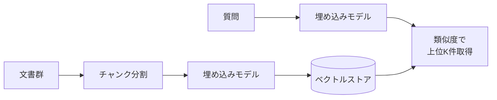

# ベクトル検索の仕組み

## このセクションで学ぶこと

- 文書とクエリを埋め込みに変換して「意味の近さ」で検索する流れ
- コサイン類似度がなぜ意味検索に使えるのか
- キーワード検索との違いと、ハイブリッドが有効な理由

## 文書を「数値の点」として並べておく

第 1 章の 01-02 で学んだとおり、文や文書は **埋め込み(エンベディング)** と呼ばれる数値ベクトルに変換できます。RAG の検索側では、この性質を直接的に使います。

事前準備として、社内文書やマニュアルを **チャンク**(後述、03-03 で詳しく扱います)に分割し、それぞれを埋め込みモデルでベクトルに変換して、専用のストア(ベクトルデータベース)に保存しておきます。これでベクトル空間の中に、社内知識が「点の集合」として配置された状態になります。

検索時には、ユーザーの質問を **同じ埋め込みモデル** でベクトルに変換し、ストアの中で「近い点」を上位 K 件取り出します。これが **ベクトル検索(意味検索)** の中身です。

## 「近さ」は何で測るのか — コサイン類似度

ベクトル同士の近さの測り方として、RAG で最もよく使われるのが **コサイン類似度** です。2 つのベクトルが同じ向きを向いているほど 1 に近づき、無関係なら 0 付近、逆向きなら −1 に近づきます。

ユークリッド距離(2 点間の物理的な距離)ではなく **向き** を見るのには理由があります。埋め込みの「長さ」は文の長さや表現の冗長さで揺れやすい一方、「向き」は意味の方向を比較的安定して表すからです。長い文書と短い質問のように長さが大きく違う組み合わせを比較するときも、向きで揃えれば公平に近さを比べられます。

実装上は、検索のたびにストア内の全ベクトルと総当たりで類似度を計算するのは現実的ではないため、**近似最近傍探索(ANN)** と呼ばれるアルゴリズム(HNSW、IVF など)で高速化します。多少の取りこぼしと引き換えに、数百万件規模でもミリ秒オーダーで上位 K 件を返せます。

## キーワード検索との違い、ハイブリッドの効きどころ

従来の全文検索(キーワード検索)は **文字列の一致** を見ます。「申請」を検索すれば「申請」を含む文書だけが当たります。これに対し、ベクトル検索は **意味の近さ** を見るので、「申請」「申込」「リクエスト」「依頼」のように表記が違っても意味が近いものを拾えます。同義語辞書を整備しなくても、ある程度の言い換えに耐えるのが大きな利点です。

一方、ベクトル検索は **固有名詞や型番、コードのような「字面そのもの」を当てるのが苦手** です。「製品コード AB-1234」をベクトル化しても、似たコードと意味的にどれだけ離れているかは曖昧になりがちです。こうしたケースは BM25 などのキーワード検索の方が確実です。

そのため実務では、ベクトル検索とキーワード検索を併用する **ハイブリッド検索** がよく採用されます。両者の結果をスコアで統合(Reciprocal Rank Fusion など)し、上位 K 件を組み合わせると、意味の言い換えにも固有名詞にも強い検索になります。

## 注意点 — 埋め込みモデルの選択と整合性

最後に、埋め込みモデルの選び方について注意点を 2 つ。1 つめは **インデックス側とクエリ側で同じ埋め込みモデルを使う** こと。違うモデルでベクトル化すると、たとえ次元数が同じでも空間そのものが揃わないので、類似度の意味がなくなります。

2 つめは、**多言語性とドメイン適合性**。日本語の社内文書を扱うなら、英語中心のモデルではなく日本語を含めた多言語モデルが安全です。専門用語の多い領域では、汎用モデルでは「医療と法律の文書が近く出てしまう」といったズレが起きることもあり、必要に応じてドメイン適応した埋め込みモデルを検討します。埋め込みモデルを途中で差し替えると、ストア全体を作り直す必要がある(再インデックス)ことも頭に入れておきましょう。

## まとめ

- 文書とクエリを同じ埋め込みモデルでベクトル化し、コサイン類似度で近い文書を取り出すのがベクトル検索の中身
- 言い換えや表記揺れに強い反面、固有名詞や型番のような字面はキーワード検索の方が確実
- 実務ではハイブリッド検索が定石。埋め込みモデルはインデックス/クエリで一致させる
