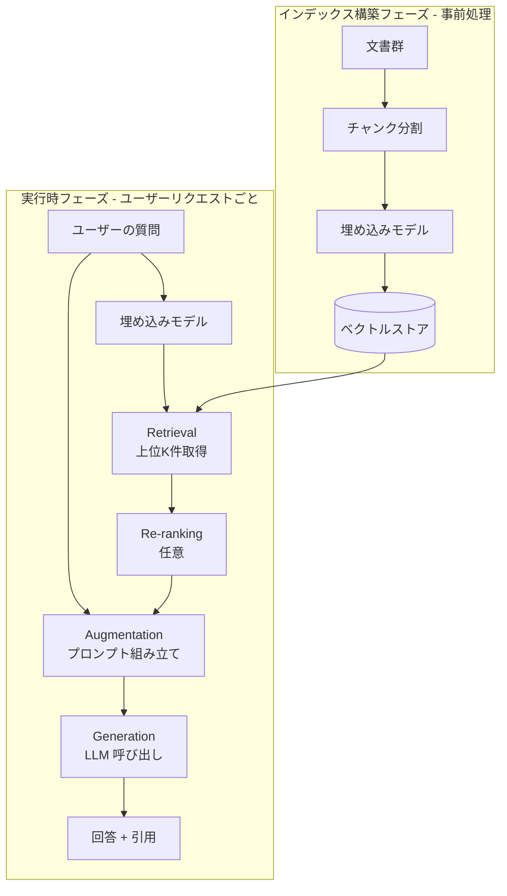

# Retrieval から Generation までのパイプライン全体像

## このセクションで学ぶこと

- インデックス構築フェーズと検索・生成フェーズの 2 段構造
- Retrieval / Augmentation / Generation の役割分担
- Re-ranking や引用整形といった現実のパイプラインに入る要素

## パイプラインは「事前処理」と「実行時処理」に分かれる

RAG のパイプラインは大きく **2 つの時間軸** で動きます。

1 つめは **インデックス構築フェーズ**。文書を集めて、チャンクに分割し、埋め込みモデルでベクトル化し、ベクトルストアに格納します。これは事前に一度走らせ、文書が追加・更新されたタイミングで差分更新するバッチ処理です。

2 つめは **実行時フェーズ(Retrieval → Augmentation → Generation)**。ユーザーから質問が来るたびに走るオンライン処理です。質問を埋め込み化して上位 K 件のチャンクを取り出し(Retrieval)、それらを指示文と組み合わせてプロンプトを組み立て(Augmentation)、LLM に渡して回答を生成させる(Generation)、という 3 段階を踏みます。



この 2 段構造を分けて理解しておくと、「どこを直せばよいか」が切り分けやすくなります。検索がズレているなら Retrieval(または事前のチャンク分割・埋め込みモデル)、回答が冗長なら Augmentation や Generation のプロンプト、という対応が見えてきます。

## Retrieval — 「関連しそう」を絞り込む

Retrieval は、ベクトルストアからクエリに近いチャンクを上位 K 件取り出す工程です。K は典型的に 3 〜 10 件程度。多すぎるとコンテキストウィンドウを圧迫し、第 1 章の lost in the middle が顕在化します。少なすぎると必要な情報を取り逃します。

精度をさらに上げたい場合は、ベクトル検索で取得した上位数十件を、より高精度な **Re-ranking(再ランキング)モデル** で並べ直し、最終的に上位 K 件を選ぶ二段構えを取ります。ベクトル検索は「近そうな候補を高速に絞る」、Re-ranking は「候補を丁寧に並べ直す」と役割を分けると、コストと精度のバランスが取りやすくなります。前節で触れたハイブリッド検索やメタデータでのフィルタリングも、この Retrieval 段階で組み合わせます。

## Augmentation — プロンプトに「引用」として埋め込む

取り出したチャンクは、そのままプロンプトに貼るのではなく、**第 2 章の 02-01 で見たプロンプトの構造に沿って組み立てます**。典型的には次のような形になります。

```
[Instruction]
あなたは社内ヘルプデスクのアシスタントです。
以下の参考資料だけに基づいて、ユーザーの質問に答えてください。
資料に書かれていないことは「資料には記載がありません」と回答してください。
回答には [doc-id] 形式で出典を明記してください。

[Context — 参考資料]
[doc-001] <チャンク1の本文>
[doc-002] <チャンク2の本文>
[doc-003] <チャンク3の本文>

[Input]
<ユーザーの質問>
```

ポイントは 3 つあります。**第 1 に、指示文と参考資料の境界を明示する**。混ざるとモデルがどれを参照すべきか迷います。**第 2 に、「資料に無いことは作らない」と明示する**。これだけでハルシネーションが目に見えて減ります。**第 3 に、出典 ID を本文に振っておく**。生成側で `[doc-001]` を引用させる運用にすると、後段で出典リンクへ展開できます。

## Generation — そして「出典付き回答」へ

Generation 工程では、組み立てたプロンプトを LLM に渡して回答を得ます。ここで意識すべきは、**LLM は受け取った資料を絶対視するわけではない** という点です。指示文で縛らないと、自分の重み(パラメトリック知識)で補完してしまい、結果として「参考資料に書かれていない情報」が混ざります。資料に絞る指示を強めに書く、引用 ID を必須にする、出力スキーマを固定する、といった工夫で抑え込みます。

仕上げに、引用 ID を実際の URL や文書ページにマッピングし、ユーザーに「出典付き回答」として提示します。ここまで含めて 1 本のパイプラインです。RAG の本質は単に検索を足すことではなく、**検索 → 引用 → 生成 → 提示** までを一連の流れとして設計することにあります。

## まとめ

- RAG はインデックス構築(事前)と実行時(Retrieval → Augmentation → Generation)の 2 段構造
- Retrieval は粗く絞る、Re-ranking は丁寧に並べ直す、と役割分担すると効率がよい
- Augmentation では指示文と参考資料を明確に分け、出典 ID を経由して引用付き回答に仕上げる
