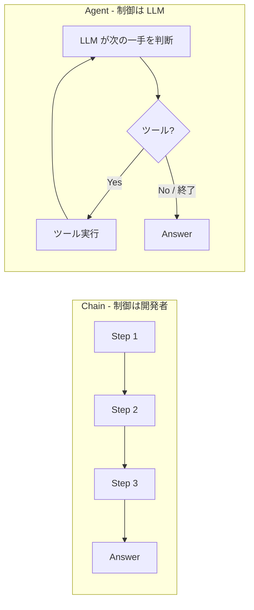

# Agent とは何か — Chain との本質的な違い

## このセクションで学ぶこと

- Chain が「事前に決まった順序」を実行するのに対し、Agent は「次に何をするか」を都度判断する
- 「制御の所在」が開発者側にあるか LLM 側にあるかが Agent と Chain を分ける本質
- Agent が向くタスクと向かないタスクの見分け方

## まずは Chain を整理する

第 3 章で学んだ RAG のパイプライン(03-04)を思い出してください。「質問を受け取る → 埋め込み化 → 検索 → プロンプト組み立て → LLM 呼び出し → 回答を返す」という流れは、**事前に決められた順序**で各ステップを実行していました。これが **Chain(チェーン)** の典型例です。

Chain の特徴は、**制御フローを開発者が固定している** ことです。何を、どの順番で、どう呼ぶかはコードに書かれている。LLM はその中の 1 ステップ(あるいは複数ステップ)を担当するだけで、「次に何をするか」を選ぶことはありません。Chain は、入力に対する処理手順が定型化できるタスクで威力を発揮します。要約、翻訳、定型 FAQ、構造化抽出など、流れが固定的なもの全般です。

## Agent は「次の一手」を LLM が決める

これに対して **Agent(エージェント)** は、**次に何をするかを LLM 自身が都度判断** しながらタスクを進める構成です。質問の内容によっては検索が要るかもしれないし、計算機が必要かもしれない、あるいは情報が十分ならその場で答える、という分岐をモデル側が選びます。

ここで決定的なのは **「制御の所在」** という考え方です。Chain では開発者がコードで分岐を書きます。Agent では「次に何をするか」を LLM が出力するテキスト(あるいは構造化された関数呼び出し)で決めます。**実行フローそのものがモデルの出力に従属する** のが Agent の本質です。

前章までで学んだ ReAct(02-04)は、まさにこのパラダイムを言語化したものでした。Thought → Action → Observation のループは、LLM が「次の一手」を選び続けるための骨組みです。第 4 章ではこの ReAct を、概念ではなく「実装として何が起きるか」のレベルで掘り下げていきます。

## Agent が向くタスク・向かないタスク

Agent は強力ですが万能ではありません。**Agent が向くのは、必要なステップ数や手順が事前に確定できないタスク** です。たとえば「社内の Q&A、コードを実行する数値分析、複数 API を組み合わせる調査」など、入力に応じて呼ぶべきツールや回数が変わるものです。

逆に、**手順が固定できるタスクは Chain で十分** です。要約や翻訳のような定型処理を Agent で動かすと、「ツールを使うかどうか」「もう一度考えるべきか」といった余計な判断ステップが入り、レイテンシ・コスト・不安定さがすべて増えます。設計時の問いはシンプルで、「処理の順序を事前に書き下せるか?」です。書き下せるなら Chain、書き下せないなら Agent を検討する、という順番が健全です。

## 注意点 — Agent は Chain より高くつく

Agent は柔軟ですが、**1 タスクあたりの LLM 呼び出し回数が増える** のが宿命です。ReAct のループは典型的に 3 〜 10 周回り、各周で LLM 呼び出しが入ります。レイテンシは秒単位で積み上がり、コストも線形に増えます。さらに、判断を LLM に委ねている以上、**同じ入力でも実行パスが揺れる** 不安定さがあります。

実務では、まず Chain で書けるかを真剣に検討し、それでも対応できない分岐の幅が出てきたときに Agent を選ぶ、というのが定石です。「とりあえず Agent」は、テストもデバッグも難しくなる選択です。

## まとめ

- Chain は順序を開発者が固定し、Agent は次の一手を LLM が選ぶ
- 「制御の所在」が開発者側か LLM 側かが両者を分ける本質
- 手順が書き下せるなら Chain、書き下せないなら Agent。Agent はコストと不安定さも引き受ける
