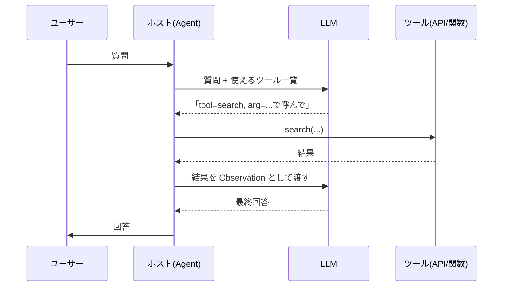

# Tool Use の概念

## このセクションで学ぶこと

- Tool Use が「LLM 自身は実行しない」ことを前提に成り立つこと
- ツールは名前・入力スキーマ・出力スキーマで定義され、外部世界との接点になる
- 何をツールにすべきかの線引きと、ツール設計の基本姿勢

## LLM は「呼びたいツール」を言葉で指定するだけ

第 3 章の最後で触れたとおり、LLM の重みにない情報や、計算・コード実行のように外部の能力が必要なタスクがあります。これを解決するのが **Tool Use(ツール使用)** です。

ここで最初に押さえるべきは、**LLM 自身はコードを実行しない** という事実です。LLM ができるのは「テキスト(あるいは構造化された出力)を生成する」ことだけ。ツールを「呼びたい」と思っても、実際にネットワークアクセスをしたりコードを走らせたりはしません。

実際に動くのは、LLM の周りにいる **ホスト(実行側)** です。ホストは「使えるツールの一覧」を LLM に提示し、LLM はそれを見て「このツールに、この引数で呼んでほしい」とテキストで指示します。ホストがそれを解釈してツールを実行し、結果を LLM に返す。この往復が Tool Use の基本構造です。



つまり Agent における LLM は、**司令塔**であって作業員ではありません。実行するのは常にホスト側のコード、というメンタルモデルを持っておくと、後で出てくる Function Calling や失敗時のデバッグが格段に分かりやすくなります。

## ツールは「名前・入力・出力」で定義する

ホストは LLM に対して、各ツールの仕様を **ツール定義** として渡します。中身は概ね次の 4 点に集約されます。

- **name**: ツール名(例 `search_docs`、`calculator`)。LLM はこの名前で指名する。
- **description**: 「何ができる」「いつ使うべきか」の自然言語説明。これが LLM の選択精度を大きく左右する。
- **input schema**: 入力引数の名前・型・必須/任意。JSON Schema で書くのが標準。
- **output schema(任意)**: 戻り値の構造。LLM が次のステップで参照しやすくなる。

たとえば社内ドキュメント検索のツールは、こんな仕様になります。

```json
{
  "name": "search_docs",
  "description": "社内のドキュメント(マニュアル・FAQ)を全文検索する。最新の手順や仕様を知りたいときに使う。",
  "input_schema": {
    "type": "object",
    "properties": {
      "query": { "type": "string", "description": "検索クエリ" },
      "top_k": { "type": "integer", "default": 5 }
    },
    "required": ["query"]
  }
}
```

LLM はこれを見て「ユーザーが社内仕様を聞いてきたから、`search_docs` を `query="休暇申請 手順"` で呼ぼう」と判断します。**description が貧弱だと、LLM は適切なツールを選べません**。「何ができる」だけでなく「いつ使うべきか」を書くのが、ツール定義の質を上げる近道です。

## 何をツールにすべきか — 線引きの基本

実務で迷うのが「どこまでツール化すべきか」という線引きです。基本姿勢は次のとおりです。

- **LLM の弱点を補うものはツール化する**: 正確な計算、最新情報の取得、社内データへのアクセス、コード実行など。
- **LLM が得意なことはツール化しない**: 要約、分類、書き換え、構造化抽出など。これらはツール経由ではなくプロンプトで直接やらせる。
- **副作用のある操作は慎重に扱う**: メール送信、ファイル削除、課金処理など、外部に影響を与える操作はツール化するが、確認ステップやドライランを挟む設計にする。

また、ツールは粒度が大事です。「**1 ツール 1 責務**」が原則で、`do_everything(action, payload)` のような万能ツールは LLM が誤用しやすくなります。逆に細かすぎても、ツール選択の選択肢が膨らんで判断ミスが増えます。読み取り系・書き込み系・計算系のような大きな括りで、5 〜 15 個程度に整えるのが現実的なバランスです。

## 注意点 — ツール一覧そのものがコンテキストを食う

ツール定義は、各リクエストで **プロンプトの一部として LLM に毎回渡されます**。第 1 章で見たコンテキストウィンドウの制約はここでも効き、ツール数や説明文が増えるほど入力トークンを消費します。30 個も 50 個も登録すると、ツール一覧だけで数千トークンに達することがあります。

対策は、**用途別にツールセットを分ける**、または **会話のフェーズに応じてサブセットだけ提示する** ことです。「最初の判断フェーズでは大きい括りのツールだけ」「掘り下げフェーズで詳細ツール群を有効化」のような切替で、コストと精度の両方を改善できます。

## まとめ

- LLM は「呼ぶ指示」を出すだけで、実際にツールを実行するのはホスト側
- ツール定義は name / description / input schema が要(output schema は任意)。説明文の質が選択精度を決める
- LLM の弱点を補い、1 ツール 1 責務で整える。ツール一覧そのものがコンテキストを食う点にも注意
