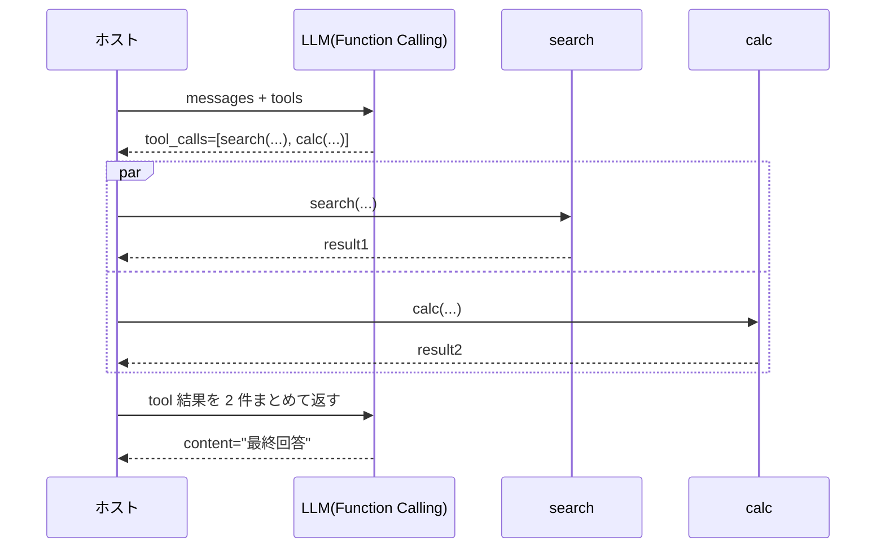

# Function Calling の仕組み

## このセクションで学ぶこと

- Function Calling が「ツール呼び出しを自然言語ではなく構造化出力で行う」仕組みであること
- 自前パースの ReAct プロンプトに対する Function Calling の優位点
- 並列ツール呼び出し・ストリーミングなど、API としての実務上の注意点

## ReAct プロンプトを「API 機能」に格上げしたもの

前節までの ReAct は、`Action: search("東京 今日 最高気温")` のような **自然言語フォーマット** をホスト側でパースしていました。これは動くものの、モデルがフォーマットを崩したとき(クォートが足りない、引数の順序が違う、余計な前置きが入る、など)に簡単に壊れます。

**Function Calling** は、この弱点を解消するために LLM プロバイダ(OpenAI / Anthropic / Google ほか)が API レベルで標準化した仕組みです。本質は単純で、**ツール呼び出しを自然言語ではなく構造化された JSON で出力させる** ようにしたものです。

API には「使えるツール一覧」を渡しておきます。すると、モデルは通常テキストを返す代わりに、専用のフィールドに次のような構造化出力を返すことができます。

```json
{
  "role": "assistant",
  "content": null,
  "tool_calls": [
    {
      "id": "call_001",
      "type": "function",
      "function": {
        "name": "search_docs",
        "arguments": "{\"query\": \"休暇申請 手順\", \"top_k\": 5}"
      }
    }
  ]
}
```

ホストはこの `tool_calls` を見て対応する関数を実行し、結果を `tool` ロールのメッセージとして API に送り返します。次の応答でモデルはまた `tool_calls` を返すか、最終回答(通常の `content`)を返すかを選びます。形は変わりましたが、流れは ReAct と同じです。

## ReAct プロンプトに対する 3 つの優位点

「同じことなら何が嬉しいのか?」を整理しておきます。Function Calling が広く使われているのは、次の 3 点が効くからです。

**1. パースが要らない**: モデルは JSON Schema で定義されたツールに対し、その Schema を守った構造化出力を返します。自然言語の `Action: ...` を正規表現でパースする苦行から解放されます。引数の型もモデル側が(おおむね)守ってくれます。

**2. 終了判定がクリーンになる**: 前節で「LLM が `Final Answer:` を返したらループ終了」と書きましたが、Function Calling では「`tool_calls` が空ならツール呼び出しをしたくない、つまり最終回答」とフラグで判定できます。文字列マッチではなく構造で判別できるので堅牢です。

**3. 並列ツール呼び出しに対応する**: 多くの API では、1 回の応答で **複数のツール呼び出しを同時に出す** ことが可能です。たとえば「東京と大阪の天気と為替を調べたい」とき、3 つの独立した検索を 1 ターンで並列に投げられます。逐次的に 3 ターン回すより、レイテンシが大きく下がります。



中身は ReAct と同型ですが、構造化されたインターフェースに乗せ替えるだけで、堅牢性・効率・実装の見通しがまとめて改善されます。

## 注意点 — 銀の弾丸ではない

便利な反面、注意も必要です。

**ツール定義の質はやはり効く**: 04-02 で書いたとおり、`description` が貧弱だとモデルはどのツールを呼ぶべきか判断できません。Function Calling だから精度が上がる、わけではありません。**「いつ使うべきか」を含む説明** が結局は精度を決めます。

**`arguments` は文字列で返ってくることがある**: API によっては `arguments` フィールドが JSON 文字列のままで、ホスト側で `JSON.parse` を通す必要があります。たまにモデルが壊れた JSON を返すことがあるため、パース失敗時のリトライ・スキーマ検証(zod / pydantic 等)は入れておくべきです。

**ストリーミング応答との相性**: ストリーミングで応答を逐次受け取る場合、`tool_calls` の各フィールドも断片で届きます。完全な JSON になるまで結合してからパースする実装が要ります。フレームワーク(LangChain、LangGraph、各 SDK)はこの面倒を吸収してくれるので、生 API より一段上のレイヤを使うのが現実的です。

**モデルによって挙動が違う**: 並列ツール呼び出しの可否、`tool_choice`(モデルにツール呼び出しを強制するか自由判断にさせるかを制御するパラメータ。`auto` / `required` / 特定ツール指定などを切り替えられる)の仕様、JSON Schema のサポート範囲などはプロバイダ・モデル世代ごとに差があります。本番採用の前に、対象モデルでの挙動確認が必要です。なお `tool_choice` で「常に必ず呼べ」と縛ると、答えが出てもツールを呼び続ける無限ループの原因になるため、強制は最初の 1 ターンに限るなどの使い分けが要ります。

## まとめ

- Function Calling は「ツール呼び出しを構造化 JSON で返す」API 機能。ReAct の自然言語パースを置き換える
- パース不要・終了判定がクリーン・並列呼び出しに対応、の 3 点が実務的な優位点
- ツール定義の質、`arguments` の検証、ストリーミングや並列の API 仕様差には引き続き注意
