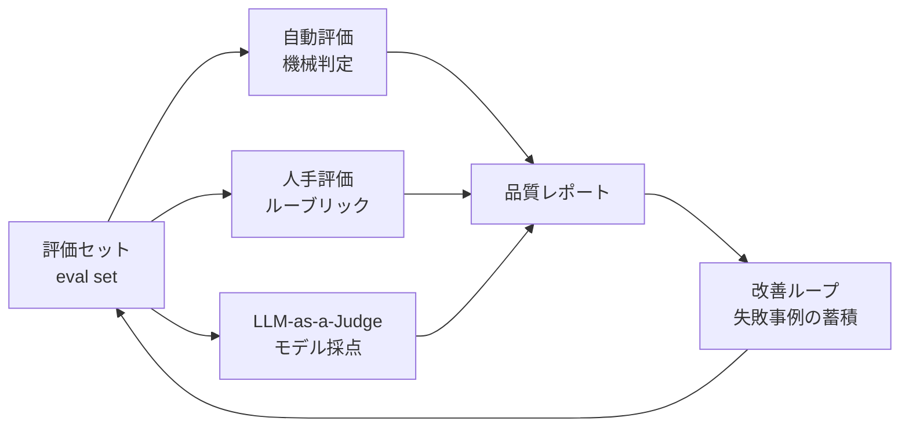

# 評価手法の地図

## このセクションで学ぶこと

- 自動評価 / 人手評価 / LLM-as-a-Judge の役割分担を俯瞰する
- それぞれの強み・弱みと、組み合わせて使う考え方
- 評価セット(eval set)を中心に据えた継続的評価の発想

## 3 つの評価手段を地図にする

LLM アプリの評価は、大きく次の 3 系統で組み立てます。どれか一つで完結する銀の弾丸はなく、**強みの違うものを重ねて使う** のが基本です。

中心にあるのは **評価セット(eval set)** です。代表的な入力と、期待する振る舞いや観点をセットで保管したデータベースで、開発の最初期から育て、リリースごとに同じ問題で再評価して品質の変化を追います。05-01 で見た「失敗事例の蓄積」は、ここに積み上がります。

## 自動評価 — 速くて再現性が高いが、捉えられる範囲は狭い

**自動評価** は、スクリプトや既存指標で機械的に採点する方式です。代表例は次のとおり。

- **完全一致 / 包含チェック**: 分類タグの一致、抽出値の集合一致、特定キーワードの有無
- **形式バリデーション**: JSON Schema 適合、引用 ID の実在チェック、文字数制限
- **数値指標**: 翻訳の BLEU、要約の ROUGE のような n-gram ベースの指標、埋め込み類似度

強みは **速さと再現性** です。CI に組み込めば、毎回同じ入力で同じスコアが出ます。05-02 の文脈逸脱(スキーマ違反、引用 ID 捏造)を弾くのにとくに向いています。

弱点は、**意味の深いズレを捉えにくい** ことです。BLEU や ROUGE は表層の一致を見るため、言い換えで正しく書けている回答を低く評価したり、逆に表現は似ているが事実を取り違えた回答を見逃したりします。要約の忠実性や応答の親切さといった軸は、自動指標だけでは捉えきれません。

## 人手評価 — 最終的な品質判断の基準点

**人手評価** は、人間がルーブリックに沿って出力を採点します。「資料に書かれていない事実が混入していないか」「ユーザーの質問の核心に答えているか」のような、自動では難しい観点を扱える唯一の手段です。

- **強み**: ニュアンスや文脈を読み取って判断できる。最終ユーザー視点での「使い物になるか」を評価できる。
- **弱み**: コストが高くスケールしにくい。評価者間でブレるため、ルーブリックの設計と評価者トレーニングに労力が要る。

実務では、**全件の評価は人手では回らない** という前提で、サンプリングして定点観測する、リリース前にだけ重点的に回す、といった運用にします。後述の LLM-as-a-Judge の **正解データ(キャリブレーション用)** としても、人手評価は不可欠です。

## LLM-as-a-Judge — モデルに評価役を任せる

**LLM-as-a-Judge** は、別の(あるいは同じ系列の)LLM に評価役を担わせ、ルーブリックを渡して自動採点させる方式です。スケールと一貫性を両立しやすく、近年の評価パイプラインの主役になりつつあります。

典型的な使い方は、05-01 で触れたルーブリックを Instruction として渡し、対象の出力と参照(必要なら)を Input に置いて、JSON で観点別スコアを返させる、というものです。Function Calling と組み合わせれば、構造化された評価結果がそのままレポートに流せます。

ただし、判定する側もまた LLM である以上、**バイアスや揺れ** を抱えます。よく知られた癖は次のとおりです。

- **位置バイアス**: 2 つの候補を並べて比較するとき、先に置かれた方を高く評価する傾向
- **長さバイアス**: 長い回答を「丁寧」と誤判定しがち
- **同系モデルへの優遇**: 同じ系列のモデルが書いた文章を好む傾向

対策として、候補の順序を入れ替えて 2 回採点する、評価モデルを生成モデルと別系列にする、人手評価で定期的にキャリブレーションする、といった工夫が要ります。02-05 の Self-Consistency と同じ発想で、複数回採点の集約を取るのも有効です。

## 3 つの組み合わせ方

実務的な順序は、**自動で弾けるものは自動で → 残りを LLM-as-a-Judge で多くカバー → 重要箇所だけ人手評価で最終確認** の階層構造です。CI で毎コミット回すのは自動評価、定期バッチで回すのが LLM-as-a-Judge、リリース前の重点チェックが人手評価、と粒度を分けて配置するイメージです。

評価セットを起点にこの 3 系統を回し、失敗事例をセットに還流させると、評価そのものが自分のアプリの「これまで起きた失敗の博物館」になっていきます。本書の続編で扱う Agent 評価でも、この骨格は変わりません。

## まとめ

- 評価は自動 / 人手 / LLM-as-a-Judge の 3 系統を、評価セットを中心に組み合わせて回す
- 自動は速さと形式チェック、人手は最終基準、LLM-as-a-Judge はスケールと一貫性が強み
- LLM-as-a-Judge のバイアスは順序入れ替え・別系列モデル・人手キャリブレーションで抑える
