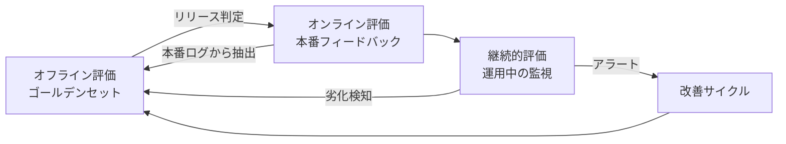

## このセクションで学ぶこと

- オフライン評価・オンライン評価・継続的評価の役割の違いを説明できる
- 3 つの評価軸がどう連携してプロダクト品質を支えるかを描ける
- 評価設計を最初から「運用前提」で考える理由を理解する

## LLM プロダクトに「単発のテスト」が通用しない理由

LLM を組み込んだプロダクトは、入力も出力も自然言語で、しかも確率的に振る舞います。従来のソフトウェアのように「期待値と実際の出力を厳密一致で比較」するテストはほぼ機能しません。さらに、ベースモデルが更新されたり、検索対象のデータが入れ替わったりするだけで、昨日まで動いていた振る舞いが翌日には変わります。

そのため LLM プロダクトの評価は、**1 回パスして終わり** ではなく、**「設計時」「リリース時」「運用中」のそれぞれに違う種類の評価を回し続ける** 必要があります。この章ではまず、その全体像を描きます。

## 3 つの評価軸

評価は大きく次の 3 つに分けて考えると整理しやすいです。

- **オフライン評価**:固定したゴールデンデータセットを使い、プロンプト変更・モデル変更の前後で品質を測る。**再現性が高く** 開発中の意思決定に使う。
- **オンライン評価**:本番にデプロイした後、ユーザーの「いいね/だめ」評価、滞在時間、再質問率、コンバージョンなどから品質を推定する。**現実の有用性** を測れる代わりに、ノイズが多くサンプル設計が難しい。
- **継続的評価**:オンライン評価のサブセット。**日次や週次でメトリクスをダッシュボードに出し続け**、モデル更新・データ変動・新しい質問パターン流入による劣化を検知する。

3 つは独立ではなく循環します。**本番ログから難しい入力を見つけてゴールデンセットに追加**し、それを再びオフライン評価で回す、というサイクルこそ実務の中心です。

## 具体例 — 社内 RAG チャットボット

社内ドキュメントに対する QA Bot を例に取ると、各軸は次のように対応します。

- オフライン評価:過去の社内問い合わせから 50 件を抜き出し、模範回答とともに保存。プロンプト変更時にこの 50 件で Faithfulness と Answer Relevancy(いずれも RAG の品質指標。詳細は 01-03 で扱う)を測る。
- オンライン評価:UI に「役に立った/役に立たなかった」ボタンを置き、週次で集計。Slack の質問チャネルでフォローアップ質問が出ていないかも見る。
- 継続的評価:Faithfulness の週次平均値をダッシュボードに固定。前週比で 10% 落ちたらアラート。検索対象ドキュメントが大量に入れ替わった週は重点的に確認。

## 注意点 — 「オフラインだけ」「オンラインだけ」は両方危険

オフライン評価だけに頼ると、ゴールデンセットには無い質問パターンで失敗していても気付けません。一方、オンライン評価だけに頼ると、変更の因果関係が追えず「先週より良くなった/悪くなった」が分かっても何が効いたか説明できません。**評価設計の第一歩は、最初から両方を回せる土台を作ることです**。

特に陥りがちな失敗は「リリースしてから評価を考える」パターンです。評価がない状態でリリースすると、ユーザーが離れる頃まで品質劣化に気付かないことが多々あります。**評価設計は要件定義と同じタイミング** で着手すべきです。

## まとめ

- LLM 評価は単発のテストでは足りず、オフライン・オンライン・継続的の 3 軸で回す
- 3 軸は循環する。本番ログがゴールデンセットを育て、ゴールデンセットがリリース判定を支える
- 評価設計はリリース後ではなく、要件定義のタイミングから着手する
