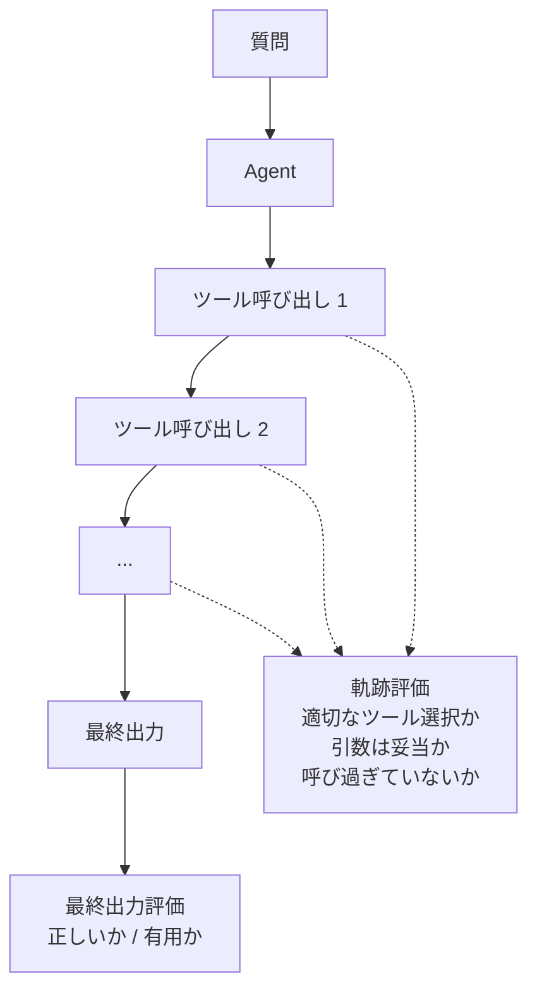

## このセクションで学ぶこと

- Agent 評価が RAG 評価より難しい理由を説明できる
- 軌跡評価と最終出力評価のトレードオフを理解する
- 実務で「どこまで軌跡を見るか」を判断する基準を持つ

## なぜ Agent 評価は RAG より難しいのか

RAG は「検索 → 生成」の 2 段固定パイプラインで、評価対象も入力・文脈・出力の 3 点で固定されています。一方 Agent は **ツールを動的に選び、必要なら何度も呼び直し、結果次第で経路を変える**。同じ質問でも実行のたびに違う経路を通り、違うツール組み合わせを使うことがあります。

そのため Agent 評価では「最終出力さえ良ければ良いのか?」「途中で危険な操作をしていないか?」「無駄な呼び出しで時間とコストを使っていないか?」という、出力以外の品質も同時に問われます。

## 軌跡評価と最終出力評価のトレードオフ

両者の比較を整理します。

| 観点 | 最終出力評価 | 軌跡評価 |
| --- | --- | --- |
| 評価コスト | 低い(出力 1 つを見るだけ) | 高い(ツール呼び出し系列まで人が読む or LLM-as-a-Judge にかける) |
| 判別できる問題 | 結果が正しいか・的を射ているか | 「正解したが無駄な手順が多い」「危険な操作を試みた」「コストがかさむ経路を選んだ」 |
| 適したフェーズ | プロトタイプ初期 / 軽量回帰テスト | 本番投入前 / 重要ユースケース / 副作用のあるツールを使う場合 |

実務での判断基準は **「副作用の有無」** です。読み取り専用のツールしか使わない Agent なら、最終出力評価だけでもかなり追えます。一方、メール送信・データ書き換え・外部 API 課金が絡むツールを使う Agent では、**「正しい結果に偶然たどり着いた」場合と「正しい手順を踏んで正しい結果に至った」場合を区別する必要があり**、軌跡評価が必須です。

## 具体例 — 経費精算 Agent

経費精算を補助する Agent を考えます。「先月の交通費の合計を教えて」という質問に対し、Agent は最終的に「12,800 円です」と答えました。最終出力は合っているように見えますが、軌跡を見ると次のようなパターンがあり得ます。

- パターン A:DB 検索ツールを 1 回呼んで集計 → 正解。
- パターン B:DB 検索ツールを 30 回呼んで全件取得 → 正解だがコスト過大。
- パターン C:DB 検索が失敗 → 自分の記憶で適当に答えた → 「正解」に見えるが実は当てずっぽう。
- パターン D:DB 検索後、誤って「データ削除ツール」を試そうとして失敗 → 出力は正しいが危険な振る舞い。

**最終出力評価ではすべて「正解」になります**。違いは軌跡を見て初めて分かります。

## 注意点 — 軌跡評価の現実的な落とし所

軌跡評価をフルにやるとコストが膨れます。実務での落とし所として次を推奨します。

- **ステップ数・ツール呼び出し回数・コストは常時メトリクス化**:軌跡全体をレビューせずとも、「呼び出し回数が想定の 5 倍」といった異常は機械的に検知できます。
- **危険ツールには明示的なチェックポイント**:書き込み系・送信系ツールは呼び出し時にログを別タグで残し、サンプリングで人手レビュー。
- **失敗ケースだけ軌跡を全部見る**:成功ケースの軌跡を全部読むのはコスト過大。失敗・低スコアのケースだけ軌跡をフル展開して原因分析する。

## まとめ

- Agent は動的に経路を選ぶため、最終出力だけ見ても品質を保証できない
- 副作用のあるツールを使う Agent では軌跡評価が必須。読み取り専用なら最終出力評価で十分なことも多い
- ステップ数やツール呼び出し回数を常時メトリクス化し、失敗ケースだけ軌跡をフル展開するのが現実的な落とし所
