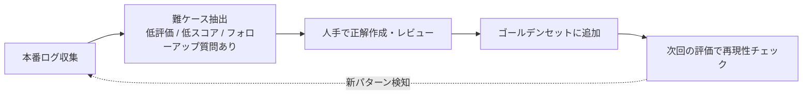

## このセクションで学ぶこと

- ゴールデンデータセットの目的と求められる要件を説明できる
- 30-50 件で開始し、本番ログから育てるアプローチの根拠を理解する
- データセット育成の運用フロー(難ケース回収・正解更新)を設計できる

## ゴールデンデータセットは「物差し」

ここまで紹介してきた Ragas や LLM-as-a-Judge も、評価対象となる **入力と期待挙動のペア集合(=ゴールデンデータセット)** がなければ動きません。プロンプトを変更したい、モデルを差し替えたい、検索戦略を変えたい——どの判断も「同じデータで前後を比べた」結果に基づくべきです。**ゴールデンデータセットはプロダクトの品質を測る物差し** であり、その質が評価全体の上限を決めます。

物差しに求められる要件は次の 3 つです。

- **代表性**:実際のユーザー入力の分布を反映している
- **多様性**:簡単なケースだけでなく、境界ケース・難ケースも含む
- **正解の妥当性**:「期待出力」が本当に正解と言えるか、レビュー済み

## 30-50 件で始めるべき理由

「ゴールデンセットを作ろう」と言うと、500-1000 件揃えてから始めようとする人が多いのですが、これはほぼ確実に失敗します。理由は次の通りです。

- 開発初期は **何が難しい入力か自体が分かっていない**。机上で 1000 件作っても、その大半は本番に存在しない質問形式になりがち。
- 規模が大きいと **正解レビューに時間がかかり、着手が遅れる**。評価が回らないまま開発が進み、リリース直前で品質が見えない事態になる。
- そもそも **モデルやプロンプトを変えるたびに全件評価するコストが上がる**。500 件のフル Ragas 評価は Judge LLM 費用も実時間も無視できない。

実務での推奨は **「最初は 30-50 件で開始し、本番ログから育てる」** です。30 件あれば次が成立します。

- 開発中の主観的な改善判断より、よほど客観的に「良くなった/悪くなった」が言える
- 1 件あたり 10 分かけて作っても、計 5-8 時間で完成する。半日で物差しが立つ
- フル評価が数十秒-数分で終わるので、CI でも回せる

## 具体例 — 育成サイクル

リリース後はゴールデンセットを **本番ログから育てる** のが核心です。次のサイクルを回します。

具体的な抽出基準の例:

- ユーザーが「役に立たなかった」を押したケース
- Ragas で Faithfulness が 0.5 未満になったケース
- Agent が最大ステップ数に達して打ち切られたケース
- カスタマーサポートに「Bot で解決しなかった」と申告が来たケース

これらを **週次や隔週で 5-10 件ずつ** 追加していけば、3 ヶ月で 100 件超の実戦的なデータセットが育ちます。

## 注意点 — ドリフトと正解の陳腐化

ゴールデンセットは作って終わりではありません。次の落とし穴に注意してください。

- **データセットドリフト**:プロダクトが扱う領域が広がる(例:Bot に新機能が追加された)と、既存セットでは新領域をカバーできません。**新機能リリース時には必ず新領域の 10-20 件を追加** します。
- **正解の陳腐化**:社内規約の改定、価格改定、製品仕様変更などで、過去の「正解」が現在の正解ではなくなることがあります。**四半期に 1 回はゴールデンセットの正解を見直す** ルーチンを置きます。
- **オーバーフィット**:同じセットだけで何度もチューニングすると、セットには合うが本番には合わないプロンプトに収束します。**ホールドアウト(評価専用に隔離した部分)** を 20% ほど確保し、本番リリース判定だけに使う運用が安全です。

## まとめ

- ゴールデンデータセットは LLM プロダクト品質の物差し。代表性・多様性・正解の妥当性が要件
- 最初は 30-50 件で始め、本番ログの難ケースから週次で育てる
- ドリフト・陳腐化・オーバーフィットに備え、新領域追加・四半期見直し・ホールドアウト運用を組み込む
