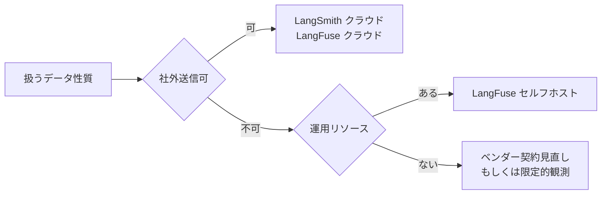

## このセクションで学ぶこと

- LangFuse の特徴(OSS、セルフホスト可能、フレームワーク非依存)を理解する
- LangSmith と LangFuse の選定軸を「データ取扱い × 運用負荷」で整理できる
- 「優劣」ではなく「組織制約に合わせて選ぶ」スタンスを身につける

## LangFuse とは

LangFuse は、LLM アプリ向けの観測性プラットフォームのうち、OSS として公開されているものの代表格です。クラウド版とセルフホスト版の両方が提供され、SDK は Python / TypeScript を中心にフレームワーク非依存で設計されています。LangChain だけでなく、OpenAI SDK 直叩き、LlamaIndex、独自の Agent フレームワークからもトレースを送れます。

機能としては、トレース可視化、データセット管理、評価実行、プロンプト管理、コスト集計など、LangSmith とほぼ同じカードを揃えてきています。2025-2026 年時点では、UI の使い勝手や評価機能の細部で差はあるものの、必要機能を満たすかという観点での選定では、ほぼ同じ土俵で比較できます。

## 選定軸: データ取扱い × 運用負荷

LangSmith と LangFuse を「どちらが優れているか」で比較すると判断を誤ります。実務では次の 2 軸で見るのが現実的です。

クラウド版を選べばどちらも導入は速く、データは外部に送られます。社内データや個人情報を扱う場合は、まず契約と地域要件をクリアできるかを確認します。クリアできない、または避けたい場合は、LangFuse のセルフホストが現実解になりやすい一方、運用負荷(コンテナ運用・DB バックアップ・アップグレード)を引き受ける覚悟が要ります。

## 具体例: 教育系スタートアップでの選定

学習データを扱う教育系サービスを想定します。コーチや学習者の発話、学習履歴、テキストの中身がトレースに乗ります。これらは契約上「社外への持ち出し不可」とされていることが多く、クラウド SaaS の利用そのものに制約がかかります。

このとき LangFuse をセルフホストする選択肢が立ち上がります。一方、運用エンジニアが少ない初期フェーズでは、まずクラウド版で観測性のフィードバックループを回し、運用が固まったタイミングでセルフホストに移すという段階的な戦略も合理的です。「最初から完璧」を狙うと、観測性そのものが導入されないまま本番が走り続ける、という最悪の状態に陥ります。

## 注意点: 機能比較表で選ばない

ベンダー比較を機能のチェックリストで埋めると、ほとんど差が見えなくなり判断できません。決定要素は「自社が扱うデータと運用体制」であって、機能差ではないことが多いのが実情です。3 ヶ月後に振り返ったとき、「機能が足りない」より「データガバナンス上問題があった」「運用が回らなかった」で苦しむほうがはるかに多い、という事実を念頭に置いてください。

## まとめ

- LangFuse は OSS、セルフホスト可能、フレームワーク非依存が特徴
- 選定は「データ取扱い × 運用負荷」の 2 軸で行うのが実務的
- 機能比較表ではなく、組織の制約から逆算して選ぶ
