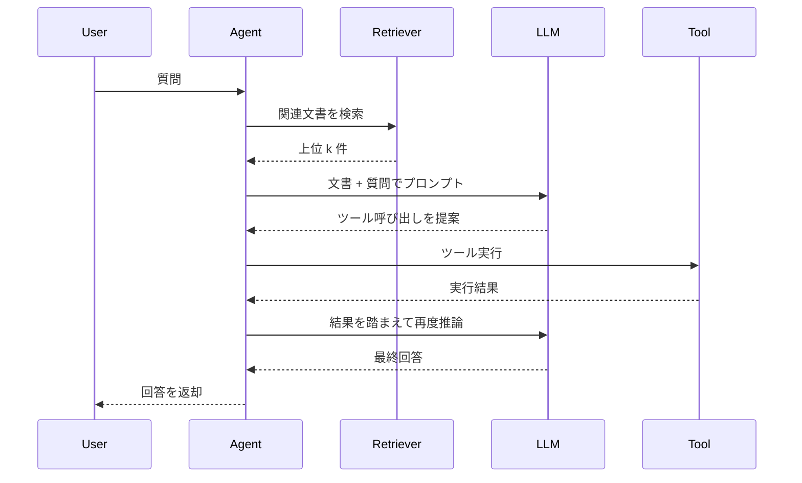

## このセクションで学ぶこと

- トレースから読み取る 4 つの観点(レイテンシ・トークン・分岐分布・エラー位置)を理解する
- 典型的な RAG + Agent のトレース構造を時系列ツリーとしてイメージできる
- 観測した数値から「次の打ち手」を引き出す思考フローを身につける

## 典型的なトレースの構造

RAG を含む Agent の 1 リクエストを、時系列で見てみます。次の sequenceDiagram は、ユーザーが質問してから回答が返るまでの代表的な流れです。

LangSmith や LangFuse のトレースビューでは、これが Span のツリー(縦に親子、横にレイテンシ)として表示されます。最初は「何が並んでいるか」を把握するのに集中し、慣れてきたら次の 4 観点で読み取る目を養います。

## 観点 1: レイテンシのボトルネック

全体応答時間のうち、どの Span が支配的かを見ます。多くの場合、LLM 呼び出しが最も長く、続いてリトリーバルです。ただし「ベクトル検索 → 再ランキング → 文書読み込み」と細かい Span に分かれる構成では、再ランキングだけが突出しているケースもあります。

クリティカルパスを特定したら、そこから打ち手を選びます。LLM が支配的なら streaming や軽量モデルの併用、リトリーバルが支配的ならインデックス見直しや上位件数の削減、というように具体的に動けます。

## 観点 2: トークン使用量

Span ごとの入出力トークン数を見ると、思っているより遥かに長いコンテキストを LLM に渡している、というケースに頻繁に出会います。リトリーバルした文書を全文そのまま流し込んでいる、過去会話を全部入れている、システムプロンプトが肥大化している、といった原因が見えてきます。

コストの大半は入力トークンで決まることが多く、トークン削減はコストとレイテンシの両方を同時に改善する打ち手になります。

## 観点 3: Conditional Edge の分岐分布

LangGraph のような Agent では、状態に応じて次のノードを選ぶ Conditional Edge が随所に現れます。トレースを多数集計し、「どの分岐に何割進んでいるか」を見ると、設計の前提と実態のズレに気づけます。

「滅多に通らないはずの分岐」が 4 割発火していたら、入力傾向の理解か分岐条件が間違っています。逆に「ツール呼び出しに進むつもりで設計したのに 5% しか到達していない」なら、プロンプト設計を見直すサインです。

## 観点 4: エラー発生位置

エラーが起きた Span に色がつくため、「ツール呼び出しの引数が JSON として壊れていた」「外部 API が 429 を返した」「Conditional Edge で想定外の値に遭遇した」といった原因を素早く切り分けられます。再現テストを書く前に、トレースを見ることが最初の一手になります。

## 注意点: 数値だけ眺めて満足しない

ダッシュボードを開いて「平均レイテンシ 3 秒、悪くないですね」で終わるのが最悪のパターンです。観測性の価値は、平均ではなく外れ値や分布の偏りに気づき、次の改善アクションに繋げられるかで決まります。「気になるトレースを 1 つ深掘りする習慣」を週次で組み込むことを推奨します。

## まとめ

- トレースは「レイテンシ・トークン・分岐分布・エラー位置」の 4 観点で読む
- クリティカルパスを特定してから打ち手を選ぶ
- 平均だけ眺めず、外れ値と分岐の偏りに踏み込む
