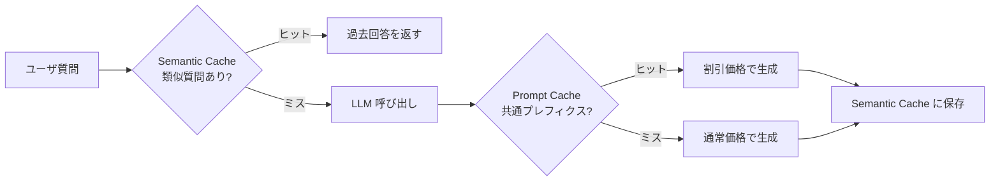

## このセクションで学ぶこと

- Prompt Cache はプロバイダ側の入力 KV キャッシュで、同じ System Prompt を再利用すると大幅に割引される
- Semantic Cache は意味的に近い質問への過去回答を再利用する仕組みで、レイテンシも下がる
- Semantic Cache はニュアンス違いによる誤再利用が起きやすく、適用範囲の見極めが命

## 二種類のキャッシュ — レイヤが違う

「キャッシュ」と一口に言っても、LLM アプリでは性質が大きく違う 2 つを区別する必要があります。Prompt Cache はプロバイダのサーバ側で動く入力 KV キャッシュ、Semantic Cache はアプリ側で持つ意味類似性ベースのキャッシュです。両者は競合せず、組み合わせて使います。

## Prompt Cache — System Prompt の長さを資産にする

Prompt Cache は OpenAI・Anthropic・Google などが提供している機構で、リクエストの入力の前方部分が完全一致していれば、その部分の入力単価を大幅に割り引いてくれます(プロバイダにより 5 割引から 9 割引程度)。割引が効くのは「前方一致」している部分だけなので、可変要素は必ず末尾に置くのが鉄則です。

設計上のコツは次のとおりです。

- 不変部分(System Prompt・出力フォーマット指示・Few-shot 例)を最前に固定する
- 可変部分(ユーザ質問・直近の検索結果)はその後ろに置く
- System Prompt をムダに更新しない(細かい改訂で Cache が無効化される)
- TTL(Cache 保持時間)はプロバイダによって数分から 1 時間程度。連続アクセスで温め続ける運用にする

長大な System Prompt は一見コストの敵に見えますが、Prompt Cache が効く前提なら「不変部分が長いほど、繰り返しでコスト効率が上がる」という反転が起きます。

## Semantic Cache — 意味の近さで再利用する

Semantic Cache は、ユーザ質問を埋め込みベクトルに変換し、過去の質問ベクトル群と類似度を取って、しきい値を超える過去回答をそのまま返す仕組みです。LLM を呼ばないので、コストはほぼゼロ、レイテンシも数百ミリ秒から数十ミリ秒に短縮されます。FAQ 的な性質の強いユースケース、たとえばカスタマーサポート・社内ヘルプデスクで効果が大きく出ます。

実装は単純で、Redis や専用ベクトル DB に質問埋め込みと回答をペアで蓄積し、新規質問のたびに最近傍検索をかけるだけです。ライブラリでは GPTCache や LangChain の `RedisSemanticCache` が知られています。

## Semantic Cache の落とし穴 — 誤再利用

ここで最大の注意点は **ニュアンス違いによる誤再利用** です。「2024 年の有給休暇制度は?」と「2025 年の有給休暇制度は?」は埋め込み空間で極めて近く、しきい値を緩めると同じ回答を返してしまいます。同様に否定形の取り違え(「できる」「できない」)や、ユーザのロール違い(「管理職向け」「一般社員向け」)も埋め込みでは区別しづらいケースが多いです。

対策は次の三段構えが現実的です。

- 類似度しきい値を高めに設定する(0.95 以上などタイトに)
- 質問だけでなく、ユーザロール・テナント ID などのコンテキストもキャッシュキーに混ぜる
- 時系列・年度・固有名詞を含む質問はそもそも Semantic Cache 対象から外す

## まとめ

- Prompt Cache はプロバイダ側、Semantic Cache はアプリ側で動き、両者は組み合わせて使う
- Prompt Cache は不変部分を最前に固定し、可変部分は末尾に置くのが鉄則
- Semantic Cache はコストもレイテンシも劇的に下げるが、誤再利用のリスクを設計で抑える
