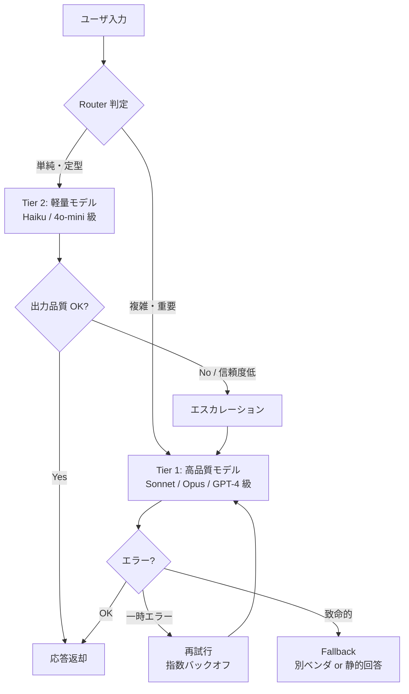

## このセクションで学ぶこと

- モデル選定は「タスクの難しさ × 求める品質 × コスト」の三項関係で決める
- 軽量モデル(Tier 2)で大半を捌き、難問だけ高品質モデル(Tier 1)に上げる Router 設計が定石
- 失敗時のフォールバック(再試行・上位エスカレーション)を必ず組み込む

## 三項関係としてのモデル選定

モデル選定は「常に最高のモデルを使う」「常に最安のモデルを使う」のどちらも実務では破綻します。判断軸は次の三項です。

- タスクの難しさ:単純抽出か / 複雑な推論か / 創造性が要るか
- 求める品質:多少間違っても良いか / 業務に直接影響する一発勝負か
- コスト:1 リクエスト単価と QPS から見たビジネス上の許容範囲

3 章までで扱ってきた評価設計と観測性が、ここで効いてきます。「どの質問でどのモデルの精度がどれくらい」「平均レイテンシは」「失敗時に何が起きたか」が見えていれば、選定は推測ではなく計測に基づいて行えます。

## Tier 1 / Tier 2 の二段構え

実務で広く使われるのが、軽量モデルと高品質モデルを使い分ける二段構えです。前章のキャッシュと同じく、ここでも「安いほうで先に捌き、難しいものだけ上に回す」発想を取ります。

Router の実装には三つの流派があります。

- ルールベース:正規表現や文字数、タグなどで決め打ち。最速で確実、ただし表現力に限界
- 分類器:軽量な分類モデル(LogisticRegression や小型 LLM)で難易度を予測
- LLM-as-Router:軽量モデル自体に「これは難しい質問か」を判定させる。柔軟だが Router 自体のコストとレイテンシに注意

最初はルールベースから始め、観測データが溜まったら分類器に置き換える、という進化が現実的です。

## フォールバックを設計する

本番運用では「LLM API が落ちる」「レートリミットに当たる」「特定のプロンプトで延々と長い出力を返す」など、想定外の事態が日常的に起こります。フォールバックを設計せずに 1 つのモデルだけに依存すると、そのモデルが落ちた瞬間にサービス全体が停止します。

基本パターンは次の通りです。

- 一時的エラー:同一モデルで指数バックオフ再試行(2 - 3 回まで)
- 品質不足:Tier 2 の出力を簡易チェック(構造化失敗・空回答・低信頼スコア)し、Tier 1 に再投入
- ベンダ障害:別プロバイダの同等モデルに切り替え(マルチベンダ構成)
- 全滅時:静的な定型回答に落とし、「現在 AI 応答を停止しています」とユーザに明示する

## 注意点 — Router 自身を最適化対象にする

ここで陥りがちなのが、Router を作りっぱなしにしてしまうことです。Router 判定の精度が悪いと、簡単な質問まで Tier 1 に流れてコストが膨らんだり、難しい質問が Tier 2 で誤回答になったりします。Router の判定ログ・最終的にどちらの Tier で解けたかを必ずトレース(2 章参照)に残し、定期的に判定精度を見直してください。最適化は推測でなく計測から、はここでも変わりません。

## まとめ

- モデル選定は「難しさ × 品質 × コスト」の三項関係で決める一発勝負ではなく継続的な調整作業
- Tier 1 / Tier 2 + Router の二段構えで、安いほうに大半を流し難問だけ上に回す
- フォールバック(再試行・エスカレーション・別ベンダ・静的応答)を最初から織り込む
