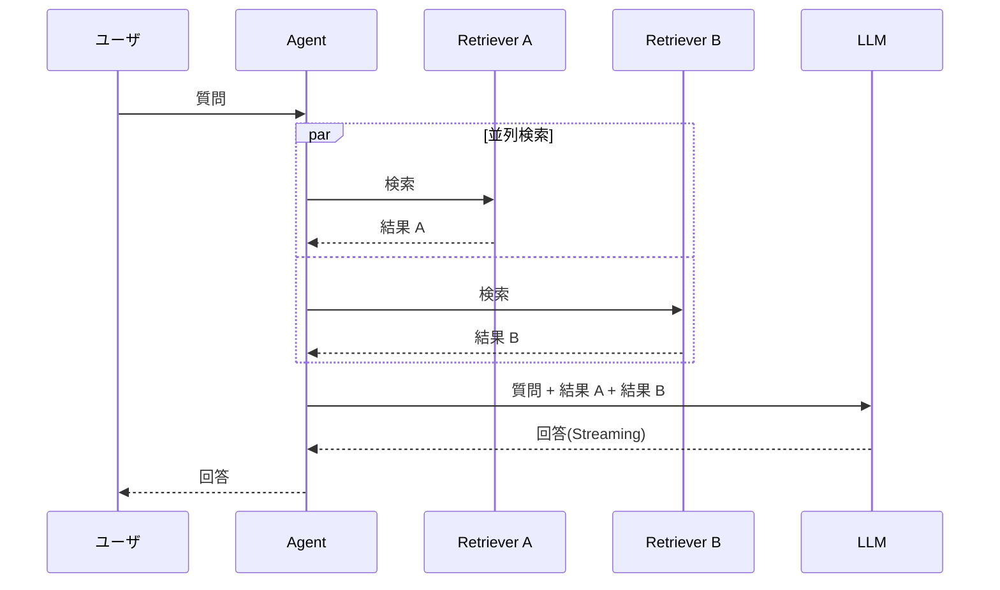

## このセクションで学ぶこと

- Streaming は実時間を変えず体感レイテンシを劇的に改善する
- 独立処理(複数 Retriever・Multi-Query)は並列化でトータル時間を短縮できる
- 軽量モデルで先行レスポンスを返し、高品質モデルで確認・改稿する二段構えが有効

## レイテンシは二種類ある

「レスポンスが遅い」と言ったとき、実は二つの異なる指標を混同しがちです。一つは TTFT(最初のトークンが返るまでの時間)、もう一つは総生成時間(レスポンスが全部出揃うまで)。ユーザの体感を支配しているのは前者で、後者はあくまでバックエンドのスループットに効く指標です。最適化の打ち手も、この二つで方向が変わります。

| 指標 | ユーザ体感への影響 | 主な改善策 |
| --- | --- | --- |
| TTFT | 大(待ち画面の長さ) | Streaming・軽量モデル先行・Cache |
| 総生成時間 | 中(全文表示まで) | 出力長の抑制・並列化・モデル選定 |

## Streaming — 体感のための定番

Streaming は LLM の出力を 1 トークンずつ逐次クライアントへ流す方式です。総生成時間そのものは変わりませんが、TTFT は数百ミリ秒程度まで縮み、ユーザは「すぐ反応した」と感じます。チャット UI なら最初の数文字が見えただけで体験は大きく変わります。実装としては OpenAI / Anthropic の SDK で `stream=True` 相当のオプションを有効にし、SSE か WebSocket でクライアントへ転送するだけです。

ただし注意点もあります。

- 出力をパースしてから返す UI(JSON 構造化応答)では、そのままでは Streaming の恩恵が薄い
- Streaming 中は途中で打ち切りができる代わりに、最終結果のバリデーションは出力完了後にしか行えない
- ガードレールでの後段フィルタリング(3 章 03-03)と相性が悪いので、設計時に切り分ける

## 並列化 — 独立処理を待たせない

RAG や Agent では「複数の Retriever に同じ質問を投げる」「Multi-Query で複数クエリを生成して並列検索する」「複数の外部 API を順番に呼ぶ」など、本来は独立して動かせる処理が多くあります。これらを直列に書くと、それぞれの応答時間が単純に足し算で積み上がります。並列化すれば最も遅いものに律速されるだけになり、トータル時間は劇的に縮みます。

Python なら `asyncio.gather`、TypeScript なら `Promise.all` で素朴に書けます。注意点として、外部 API の同時実行数はレートリミットに当たりやすいので、並列度には上限を設けてください。

## 軽量モデル先行 + 確認用フォールバック

体感速度を極限まで上げたい場合の応用パターンが、軽量モデルで暫定回答を即返し、その裏で高品質モデルが本格回答を準備する二段構えです。たとえば検索結果が返ってきた瞬間に Tier 2 で「お調べした内容ですと、こちらのドキュメントが該当しそうです」と要約だけ流し、続けて Tier 1 で詳細回答を生成して追加する、という流れです。

これは UX 上の効果が大きい一方で、二つのモデル出力の整合性を取らないとユーザが混乱します。後段の Tier 1 の回答が前段と矛盾しないよう、前段の応答内容を Tier 1 のプロンプトに含めて「先に出した内容を否定しない」と明示するか、前段を「下調べ表明」程度の控えめな文面に固定する設計が安全です。

## 注意点 — まず計測、推測で最適化しない

本章を貫いてきた原則をここでも繰り返します。レイテンシの最適化はチューニングのドラマがあるぶん、「なんとなく速くなった気がする」で満足しがちです。観測性(2 章)で TTFT・各 Span の所要時間・並列化の効果を必ずダッシュボード化し、最適化前後の数字で語ってください。

## まとめ

- TTFT と総生成時間を区別し、ユーザ体感に効く Streaming を最優先で導入する
- 独立処理は `asyncio.gather` / `Promise.all` で並列化し、最遅処理に律速させる
- 軽量モデル先行 + 高品質モデル確認の二段構えは強力だが、整合性設計とセットで使う
