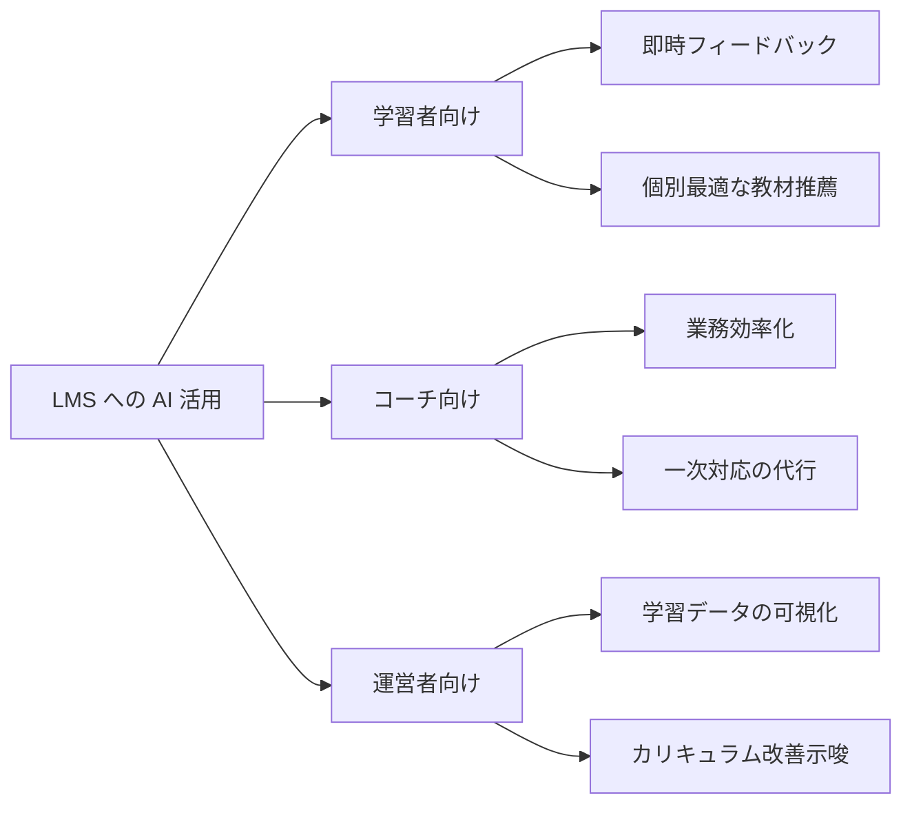

## このセクションで学ぶこと

- LMS における AI 活用を 3 つのステークホルダーで地図化できる
- 各ステークホルダーで「価値の出方」が異なることを説明できる
- ユースケース検討の最初に「誰のために作るのか」を固める意義を理解する

## なぜ「誰のために」から始めるのか

AI を LMS に導入する際、最初にやりがちなのは「LLM で何ができるか」から発想することです。しかしこれは順序が逆で、まず「誰のどんな課題を解くか」から入らないと、技術ありきの便利機能が散発的に増えるだけで、運用負荷とコストだけが積み上がります。

LMS のステークホルダーは大きく **学習者 / コーチ(指導者・メンター)/ 運営者** の 3 つに分けられます。同じ AI 機能でも、どの軸に置くかで価値の出方も、求められる品質も、許容される失敗の形も変わります。

## 3 つの軸で地図化する

### 学習者向け — 即時フィードバックが軸

学習者にとっての価値は **「待たずに返ってくる」「自分の文脈に合っている」** の 2 点に集約されます。たとえば、提出した課題に対して即座に観点別フィードバックが返ってくる、わからない箇所を質問するとその場で答えが得られる、といった体験です。

ここでの失敗の許容度は中程度です。多少ぼやけた答えでも「待つよりは早い」価値がありますが、誤った内容を断定的に返すと学習を歪めるため、根拠提示や「自信がない」表明が重要になります。

### コーチ向け — 業務効率が軸

コーチや指導者にとっては **「自分の代わりに一次対応してくれる」「過去のやり取りを要約してくれる」** といった、業務時間を圧縮する方向の価値が中心です。学習者からの定型質問に AI が一次回答し、複雑なものだけコーチに上げる、といった分業設計が典型例です。

ここでは AI の出力をコーチが確認してから学習者に届く運用にすれば、品質ハードルは比較的下げられます。

### 運営者向け — データ可視化が軸

運営者にとっては **「学習データから何が起きているかを言語化する」** ことが価値の中心です。進捗が遅れている学習者の傾向、つまずきが多い章、カリキュラム間の難度ギャップなど、生データを見ても気づきにくいパターンを AI に要約・抽出させます。

ここでは即時性より、出力の再現性と監査可能性が問われます。週次レポートで AI の出力が日によって大きく変わると、運営判断の信頼性が損なわれるためです。出力結果は人間が確認・編集してから配布される運用が現実的で、AI は「下書きを早く出す」役回りになります。

## 軸ごとの違いをまとめる

| 軸 | 価値の中心 | 許容される失敗 | 重視する非機能要件 |
| --- | --- | --- | --- |
| 学習者向け | 即時フィードバック | ぼやけた回答(断定的な誤答は NG) | レスポンス速度、根拠提示 |
| コーチ向け | 業務時間の圧縮 | 一次案レベルの粗さ | コーチが直しやすい出力形式 |
| 運営者向け | データ可視化と要約 | 即時性は不要 | 再現性、監査可能性 |

この表を見ると、同じ「文章を生成する AI」でも、軸が違えば求める性質が大きく異なることが分かります。コスト・モデル選定・評価指標もこの軸に合わせて変えていきます。

## 注意点 — 軸をまたぐ機能は分割して考える

1 つの機能が複数のステークホルダーに価値を出すこともありますが(例: 自動採点は学習者にも運営者にも効く)、設計時には **一度それぞれの軸に分解** してから統合した方が、要件と評価指標が明確になります。「学習者にとっての自動採点」と「運営者にとっての自動採点」では、許される誤答率も、求められるログ粒度も変わるからです。

## まとめ

- LMS の AI 活用は「学習者 / コーチ / 運営者」の 3 軸で地図化する
- 軸ごとに価値の出方と許容される失敗が違うため、要件も別々に定義する
- 「何ができるか」より「誰のために」から始めると、機能の散発化を防げる
