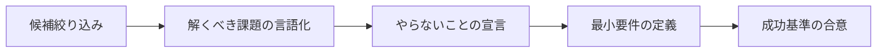

## このセクションで学ぶこと

- マトリクスから 1 ユースケースに絞り込むプロセスを理解する
- 「やらないことの宣言」をスコープ確定の必須要素として書ける
- 最初のリリースに含める最小要件を定義できる

## なぜ 1 つに絞るのか

評価マトリクスで左上に複数の候補が残っていても、**最初のリリースは 1 ユースケースに絞ります**。AI を組み込んだプロジェクトは、評価設計・観測性・ガードレール・コスト管理など、見えない構築コストが大きく、複数を並走させると 1 つあたりの品質が中途半端になります。

絞る基準は「インパクト × 実現難度」上の位置だけではなく、**そのチームが今すぐ動かせるか** という現実的な制約も加味します。コーチの合意形成が必要なユースケースを選ぶなら、合意形成のリードタイムがそのままプロジェクト期間に乗ります。

## 選定後のプロセス — 4 ステップ

### ステップ 1: 解くべき課題の言語化

「AI でやる」前に、**そのユースケースが解こうとしている学習上の課題** を 1 文で書きます。例えば「学習者が教材に関する疑問を抱えたまま放置し、離脱につながっている」のように、AI を一切使わずに書ける文章が出てくるはずです。これが書けないなら、まだユースケースが煮詰まっていません。

### ステップ 2: やらないことの宣言

選定したユースケースの周辺で **明示的にスコープ外にすること** を列挙します。質問応答 Bot を作る場合の例:

- 教材外の一般知識の質問には答えない(範囲外と返す)
- 学習者の個別履歴は今回は使わない(別ユースケースで扱う)
- リアルタイム翻訳機能は作らない
- 採点や評価は行わない(別ユースケースの責務)

やらないことを書かないと、開発中に「ついでにこれも」が積み重なってスコープが膨らみます。ステークホルダー間の合意文書としても機能します。

### ステップ 3: 最小要件の定義

最初のリリースに **必ず含めるべき要件** を 5 件前後に絞ります。質問応答 Bot の例:

- 教材コンテンツを根拠にした回答ができる
- 根拠となった教材箇所を出典として表示する
- 回答できない質問は「分からない」と返す(無理に答えない)
- 全質問・回答ログが記録され後から確認できる
- 不適切な質問・回答を運営者がブロックできる

「あったら良い」機能は最小要件には含めません。それらは次フェーズの候補リストに別途記録しておきます。

### ステップ 4: 成功基準の合意

リリース後 1 〜 3 ヶ月で **何をもって成功とするか** をステークホルダーで合意します。指標は定量(回答精度 X%、利用率 Y%)と定性(コーチからの主観評価)の両方を置きます。

## 注意点 — AI を入れることが目的化していないか

スコープ確定の最終チェックは「もし AI を使わずに同じ問題を解けるなら、そちらを選ぶか?」と自問することです。**Yes と言える** ユースケースは、AI である必然性が薄い可能性があります。AI を入れるためのプロジェクトではなく、解くべき学習課題を起点に選ぶ姿勢を最後まで保ちます。

## まとめ

- 最初のリリースは必ず 1 ユースケースに絞る
- 「やらないことの宣言」と「最小要件」をセットで定義する
- AI を入れること自体が目的化していないかを最後に必ず点検する
