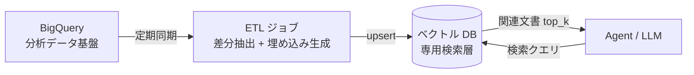

## このセクションで学ぶこと

- BigQuery を RAG 対象に組み込む 2 つのアプローチ(ネイティブ検索 / 外部ベクトル DB 同期)を比較できる
- データ更新頻度・データ規模・既存ワークロードとの分離から選択基準を引ける
- BigQuery ↔ 検索層 ↔ Agent の構成を図で説明できる

## なぜデータ基盤を RAG に組み込むのか

多くの組織では、社内ドキュメントや業務データの相当部分が **既存のデータ基盤(BigQuery、Snowflake、Redshift など)に集約済み**です。RAG を新規導入するときに最初に直面する設計判断は、「検索対象データを既存基盤にとどめるのか、別途ベクトル DB を立てるのか」という分岐です。ここを誤ると、データの二重管理・鮮度のずれ・コストの跳ね上がりが後から効いてきます。

本セクションでは、BigQuery を RAG の検索対象にする代表的な 2 アプローチを取り上げ、選び方の軸を整理します。

## アプローチ A — BigQuery でネイティブに検索する

BigQuery には `ML.GENERATE_EMBEDDING` でテキストをベクトル化し、`VECTOR_SEARCH` で近傍検索を行う仕組みが揃っています。**データを動かさずに、SQL の世界の中で RAG の検索層を完結させる**設計です。

```sql
SELECT base.doc_id, base.content, distance
FROM VECTOR_SEARCH(
  TABLE `proj.dataset.docs_with_embedding`,
  'embedding',
  (SELECT ml_generate_embedding_result AS embedding
   FROM ML.GENERATE_EMBEDDING(
     MODEL `proj.dataset.embed_model`,
     (SELECT @query AS content))),
  top_k => 5
)
```

向いているのは、検索対象がもともと BigQuery にあり、データ量が大きく、別系統に持ち出すと同期コストが重いケースです。**既存の権限境界(行レベルセキュリティ、データセット単位の IAM)を踏襲できる**のも実務上のメリットです。

一方で注意点もあります。ベクトル検索のレイテンシはミリ秒級のベクトル DB と比べて秒〜数十秒級になることがあり、対話 UI の応答性に直接効いてきます。さらに、検索のたびに BigQuery のスロット(計算リソース)を消費するため、**分析ワークロードと同じプロジェクトに同居させると、月末締めの集計バッチと検索クエリがリソースを取り合う**事故が起きます。

## アプローチ B — ETL でベクトル DB に同期する

もうひとつは、BigQuery から定期的に対象データを抽出し、専用のベクトル DB(Pinecone、Weaviate、pgvector など)に書き出す **ETL 同期** のパターンです。検索層を分析基盤から切り離すことで、**レイテンシ要件・スケール特性・コスト構造を独立に最適化**できます。



このパターンが効くのは、検索対象が比較的小さく(数百万行以内)・更新頻度が低く(日次以下)・対話 UI のレイテンシ要件が厳しい場面です。**ベクトル DB 側でメタデータフィルタやハイブリッド検索(BM25 + ベクトル)を活用**したい場合にも向きます。

ただし、同期パイプラインそのものが運用負債になりやすい点に注意します。スキーマ変更・削除レコードの伝搬・埋め込みモデルのバージョン更新時の再生成など、**「データ鮮度の SLO」を最初に決めて運用設計に落とす**ことが欠かせません。

## 選択軸の整理

実務では、次の 4 軸でアプローチを切り分けると判断が早くなります。

- **データ規模**: 数千万行を超えるなら BigQuery ネイティブが現実的。
- **更新頻度**: 秒〜分単位の鮮度が要るならネイティブ寄り、日次バッチで足りるなら同期パターン。
- **レイテンシ要件**: 対話 UI で 1 秒以内の応答が必要ならベクトル DB 側に寄せる。
- **ワークロード分離**: 分析バッチと干渉させたくないなら、専用 BigQuery プロジェクトに切るか、外部ベクトル DB に逃がす。

## まとめ

- BigQuery を RAG 対象にする選択肢は「ネイティブ検索」と「ベクトル DB 同期」の 2 系統
- データ規模・更新頻度・レイテンシ・ワークロード分離の 4 軸で選ぶと迷わない
- どちらを選んでも、データ鮮度と権限境界の設計を最初に決めることが運用安定の鍵
