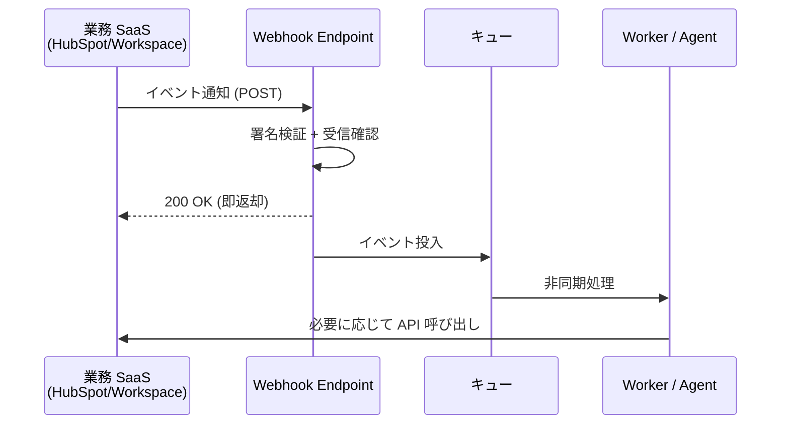

## このセクションで学ぶこと

- API / Webhook / 中間プラットフォームの 3 つの接続パターンの違いを説明できる
- レート制限と認証スコープの最小化を実装観点で考慮できる
- 業務 SaaS と Agent をつなぐ際の信頼境界を意識できる

## 業務システムを Agent につなぐとは何をすることか

Agent が単なるチャットを超えて価値を出すのは、業務システム(CRM・グループウェア・チケット管理など)を**読み書きできるとき**です。問い合わせ履歴を CRM から引いてきて回答に反映する、提案メールを下書きまで生成する、といったユースケースは、SaaS との接続なしには成立しません。

ここでは HubSpot や Google Workspace を題材に、Agent と業務 SaaS をつなぐ 3 つの代表パターンを整理します。どれを選ぶかは「データの方向」「鮮度要件」「運用コスト」で決まります。

## パターン A — API ベース(Pull / Read & Write)

最も基本的なのは、SaaS が提供する公開 API を Agent の Tool として呼び出すパターンです。HubSpot CRM API や Gmail API、Calendar API などが該当します。Agent からは「コンタクトを検索する」「メールの下書きを作る」といった粒度の Tool として見えます。

実装で必ず詰まるのが **レート制限** です。HubSpot は秒間リクエスト数とデイリーコールの両方に上限があり、Google Workspace 系も API ごとに別建てのクォータを持ちます。Agent は LLM の推論結果次第で同じ Tool を連打することがあるため、**Tool 実装側にリトライ・バックオフ・冪等性チェック**を必ず仕込みます。

```python
# 概念例: バックオフ付きの呼び出しラッパー
def call_hubspot(endpoint, params, max_retries=3):
    for attempt in range(max_retries):
        res = http.get(endpoint, params=params, headers=auth_header())
        if res.status_code == 429:
            sleep(2 ** attempt)  # 指数バックオフ
            continue
        return res.json()
    raise RateLimitExceeded(endpoint)
```

向いているのは、Agent 側の能動的な操作(検索・作成・更新)が中心のユースケースです。

## パターン B — Webhook ベース(Push / Event-driven)

「コンタクトが作成されたら通知してほしい」「メールを受信したらサマリを残したい」のように、**SaaS 側のイベントを起点に処理を走らせたい**場合は Webhook が向きます。Agent 側にはイベントを受け取る Endpoint を立て、SaaS 側で購読を登録します。



ポイントは、**Webhook の受信処理は短時間で 200 を返し、重い処理はキューに逃がす**ことです。SaaS 側はタイムアウトすると再送するため、同期処理を長引かせると同じイベントが何度も走り、データ重複の原因になります。署名検証(HubSpot の `X-HubSpot-Signature` や Google の検証用ヘッダ)も必須です。

## パターン C — iPaaS / コネクタ経由

Workato や Zapier のような iPaaS を中間に置くと、SaaS 側の API 仕様変更を吸収してくれて、認証・レート制御・リトライも基盤側でめんどうを見てくれます。**接続先 SaaS が多く・要件が定型的**な場合、自前で全 SaaS と API 連携するより圧倒的に早く立ち上がります。

一方で、iPaaS 側に独自のレート制限・実行回数課金があり、月次のレコード件数が増えると一気にコストが跳ねます。さらに、データが iPaaS をいったん経由するため、**機密データの所在(どこに何が一時的に置かれるか)を契約・DPA で確認**しておく必要があります。

## 認証スコープは最小化する

どのパターンを選ぶ場合も、OAuth 2.0 で取得するスコープは**業務上必要な最小集合**に絞ります。HubSpot なら「Contacts Read」だけで足りるユースケースに「Contacts Read/Write + Deals Read/Write」を要求しない、Google Workspace なら `gmail.send` ではなく `gmail.compose` で足りるなら後者を選ぶ、といった具合です。

スコープを絞ると、**事故時のブラスト半径(影響範囲)が小さく**なります。Agent のプロンプトインジェクションで予期しない Tool が呼ばれても、そもそも権限がなければ被害は出ません。

## まとめ

- API は能動操作、Webhook はイベント駆動、iPaaS は多 SaaS 連携の高速立ち上げに向く
- レート制限・署名検証・冪等性は実装側の必須チェック項目
- OAuth スコープは最小化し、事故時の影響範囲を物理的に絞っておく
