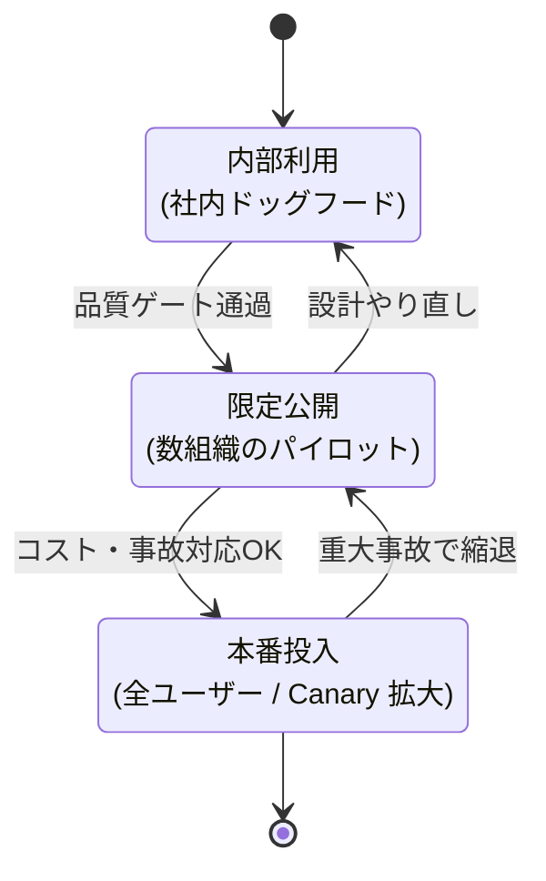

## このセクションで学ぶこと

- 内部利用 / 限定公開 / 本番投入の 3 段階で見るべき指標を切り分けられる
- Feature Flag / Shadow Mode / Canary Release を場面ごとに使い分けられる
- 段階移行の Go/No-Go 判断基準を事前に明文化できる

## なぜ Agent は段階リリースが必須なのか

LLM ベースの Agent は、**事前テストで全ケースを網羅することが原理的に不可能**です。プロンプトの微妙な言い回し、ユーザーの想定外の入力、外部 API の不調などで挙動が変わります。だからこそ、「本番に投入してから初めて分かる問題」を**小さい範囲で先に踏む**段階リリースが要ります。

ここでは 3 段階のフェーズと、各段階で見る指標・使うリリース技法を整理します。



## フェーズ 1 — 内部利用(社内ドッグフード)

最初の段階は、**作っているチームと近接部門だけ**で日常業務に使ってみる期間です。ここで見るのは品質に集約します。

- **回答の正しさ**: 自分の業務領域で「これは違う」と即座に気づける人が使う段階。質的フィードバックを集めるのが目的。
- **致命的な振る舞いの不在**: 機密情報を漏らす、想定外の Tool を呼ぶ、暴走してコストを焼く、といった「絶対に外に出してはいけない挙動」をここで潰す。
- **観測性の確認**: トレース・ログ・コスト計測が**実際に欲しい粒度で取れているか**を、運用する側として確かめる。

この段階で有効なのは **Shadow Mode** です。既存の問い合わせフロー(人間の対応や旧システム)と並走させ、Agent の出力を直接ユーザーに返さずログにだけ残します。**正解との突き合わせができる状態を、ユーザー影響ゼロで作れる**のが利点です。

## フェーズ 2 — 限定公開(数組織パイロット)

社内で許容範囲に入ったら、**協力的な少数の顧客・組織**に絞って公開します。ここで見る軸は内部利用よりも広くなります。

- **品質**: ユーザー満足度、回答採用率、フィードバックの解約直結度。
- **コスト**: 1 ユーザーあたりの月次推論コスト、想定モデル / 想定ユーザー単価で持続可能か。
- **事故対応**: インシデント発生時に**何分で縮退できるか**を実地で訓練する。

このフェーズで主役になるのが **Feature Flag** です。テナント単位・ユーザー単位で機能を ON/OFF できるようにしておくと、問題が出た瞬間に対象テナントだけ無効化して、影響範囲を最小化できます。

```python
# Feature Flag 利用の概念例
if feature_flags.is_enabled("agent_v2", tenant_id=ctx.tenant_id):
    return await agent_v2.run(ctx)
return await agent_v1.run(ctx)
```

「全テナント一律オフ」「特定テナントだけオン」「N% にオン」のような切り替えがコードデプロイなしでできる状態にしておくのが要件です。

## フェーズ 3 — 本番投入(Canary 拡大)

限定公開で品質・コスト・事故対応の見立てがついたら、**Canary Release** で本番投入を進めます。最初は 1% → 5% → 25% → 100% のように、**移行率と各段階での観察期間を事前に決めて**、自動で段階を進めます。

各 Canary 段階では、次のメトリクスを**前段階と統計的に比較**します。

- 応答エラー率(5xx / タイムアウト / Tool 失敗)
- レイテンシ p50 / p95
- ユーザーの肯定的フィードバック率
- 1 リクエストあたりの推論コスト

**事前に Go/No-Go の閾値を数値で決めておく**のが肝心です。「p95 レイテンシが前段階比 +30% を超えたら自動ロールバック」「エラー率が 2% を超えたら停止」のように、リリース中に議論しなくて済む状態にします。議論しているうちに被害は広がります。

## 段階移行の Go/No-Go を明文化する

3 段階の境界は、**「次に進むために満たすべき条件」を事前にチェックリスト化**しておきます。例えば次のような粒度です。

- 内部 → 限定: 致命的事故ゼロが 2 週間、観測ダッシュボードが運用担当に渡せている、ロールバック手順を 1 回演習済み。
- 限定 → 本番: 解約理由に Agent 起因の不満が連続出現していない、月次コスト想定が単価モデルで黒字、インシデント対応の Runbook がレビュー済み。

「感覚で進める」「リリース日が決まっているから進める」を排除するための仕組みです。

## まとめ

- フェーズごとに「品質 / コスト / 事故対応」のどこを重点的に見るかを切り替える
- Shadow Mode・Feature Flag・Canary を場面に応じて重ね掛けする
- 段階移行の Go/No-Go は数値と手順で事前に明文化し、当日の判断負荷を下げる
