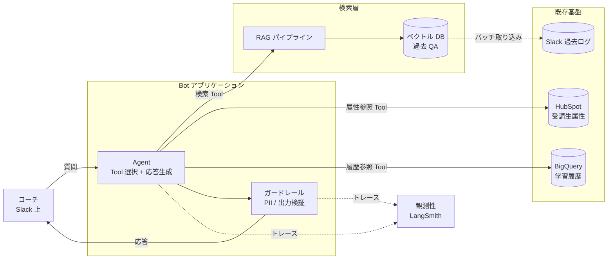

## このセクションで学ぶこと

- ユースケース図とコンポーネント図を分けて描く理由を説明できる
- Agent / RAG / 既存基盤の関係を 1 枚の図に整理できる
- Mermaid で実用的なアーキ図を描ける

## 1 枚に詰め込まず、抽象度で分ける

AI プロジェクトのアーキテクチャ図でよく起きる失敗は、**1 枚にすべてを詰め込んでしまう** ことです。Slack も BigQuery も LLM プロバイダもベクトル DB もガードレールも、全部矢印で結ぶと、ステークホルダーごとに必要な情報が埋もれます。経営層には複雑すぎ、エンジニアには情報が足りない、という両側に失敗します。

そこで本書では、抽象度を変えた **2 枚** を描き分けることを推奨します。

- **ユースケース図(高抽象)**:「誰が」「何のために」「どのシステムを通じて」価値を受け取るかを示す。業務オーナー・経営層との合意形成に使う。アクターと主要機能だけを置く。
- **コンポーネント図(低抽象)**:Agent / RAG / 既存基盤の実装単位と、それらの間のデータフローを示す。エンジニアの設計判断・コードレビュー・運用設計に使う。

1 枚目で「何のためのシステムか」、2 枚目で「どう組み立てるか」を分担させるイメージです。

## サンプル — コーチ支援 Bot のコンポーネント図

実際に Ch05 で選定した「コーチ支援 Bot」のコンポーネント図を、Mermaid で描いてみます。教材としての「こう描く」のサンプルです。

ポイントは 3 つあります。

1. **境界を `subgraph` で示す**:Bot アプリ・検索層・既存基盤を分けると、責任範囲・障害影響範囲・セキュリティ境界が一目で分かります。
2. **取り込みは破線**:Slack からベクトル DB へのデータ取り込みはリアルタイムではなくバッチである、ということを線種で区別しています。
3. **観測性は別レイヤ**:LangSmith のような横断的な関心事は脇に置き、点線で接続します。本流のデータフローと混ぜないのがコツです。

## 注意点 — 抽象度を保つ・実装詳細は別の場所に

コンポーネント図に「OpenAI API のバージョン」「ベクトル DB の埋め込みモデル名」まで書くと、図がすぐ古くなり、本来の役割を果たさなくなります。**「実装が変わっても変わらない情報」だけを図に置く** のが原則です。具体的なライブラリ・モデル名は別表(技術選定表)に切り出します。

逆にユースケース図に「ベクトル DB」「ガードレール」のような技術用語を書くと、業務オーナーは読めません。**読み手が誰かを意識して、語彙を分ける** ことが、図を設計書の合意形成ツールとして機能させる鍵です。

## まとめ

- アーキ図は 1 枚にまとめず、ユースケース図(高抽象)とコンポーネント図(低抽象)に分ける
- コンポーネント図では subgraph で境界を示し、バッチや観測性は線種で区別する
- 実装詳細(モデル名・バージョン)は図に書かず、別表に逃がす
