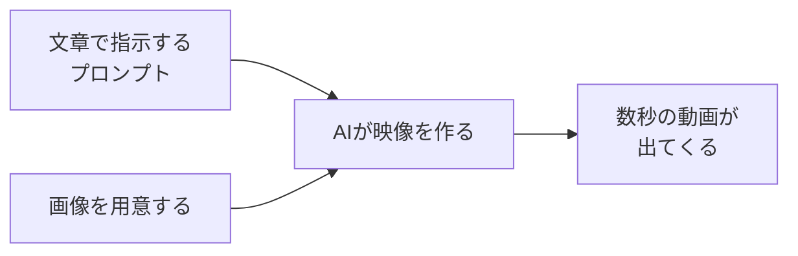

## このセクションで学ぶこと

- 編集ソフトを使わなくても、文章や画像から動画が作れること
- 「指示を入れる → AIが映像を作る」という大きな流れ
- AI動画生成が得意なこと・まだ苦手なこと

## 編集ソフトはいりません

「動画を作る」と聞くと、難しそうな編集ソフトを思い浮かべて身構えてしまうかもしれません。タイムラインに素材を並べて、つなぎ目を調整して……と覚えることが多そうに見えますよね。でも、このカリキュラムで最初に体験するのは、まったく違うやり方です。

ここで扱う **AI動画生成** は、「こんな映像がほしい」という指示を文章で書くだけで、AIがその映像を作ってくれる仕組みです。カメラも、撮影場所も、編集の技術もいりません。たとえば「夕焼けの海辺を、ゆっくり歩く一匹の白い犬」と書くと、それらしい数秒の動画が出てきます。撮影に出かけなくても、頭の中のイメージをそのまま映像にできるのが、いちばん大きな魅力です。

このとき書く指示文のことを **プロンプト** と呼びます。これからこの言葉は何度も出てきますが、難しく考える必要はありません。「AIにお願いするときのメモ書き」くらいの気持ちで大丈夫です。検索窓に言葉を打ち込むのと同じくらい気軽なもの、とイメージしてください。

これまで動画作りといえば、機材をそろえ、現場で撮影し、長い時間をかけて編集する――専門の人の仕事でした。AI動画生成は、その入り口のハードルをぐっと下げてくれます。絵を描くのが苦手でも、撮影に慣れていなくても、頭の中のイメージを言葉にできれば、それを映像の形で取り出せるようになったのです。

たとえばこんな使い方が考えられます。お店の紹介に添える数秒の雰囲気映像、SNSに投稿するちょっとした動くイラスト、プレゼン資料の合間に挟むイメージ映像。どれも「撮影しに行く」となると大変ですが、AI動画生成なら言葉から作れます。完璧な作品を一発で作る道具というより、「思いついたイメージを、まず形にしてみる」ための気軽な道具だと考えると、肩の力が抜けるはずです。

## 入れたものから、映像が出てくる

仕組みをおおまかに描くと、次のような一本道の流れになります。入力は「文章」だけでも、「用意した1枚の画像」でも構いません。それを {{tool:動画生成}} のようなツールに渡すと、AIが映像を組み立てて、数秒の動画として返してくれます。

途中で何が起きているのかは、今は分からなくて大丈夫です。「入れたものをもとに、AIが映像をひねり出してくれる」――まずはこの一行だけ持っていれば十分です。仕組みの話は、必要になったタイミングで少しずつ差し込んでいきます。

## 得意なこと、まだ苦手なこと

AI動画生成は、雰囲気のある短い映像や、現実には撮れない空想のシーンを作るのがとても得意です。一方で、まだ苦手なこともあります。長い物語をきれいにつなぐこと、文字を正確に表示すること、同じ人物を何度も寸分たがわず登場させること――こうした場面では、思った通りにならないこともあります。

ただ、これは「失敗」ではなく、最初は誰もが通る普通のことです。うまくいかないときは指示文を少し変えたり、もう一度作り直したりすれば直っていきます。直し方そのものは、このあとの章でじっくり扱うので、今は「思い通りにならない日もある」と気楽に構えておいてください。

## まとめ

- AI動画生成は、文章や画像で指示するだけで映像を作れる仕組みです。
- 流れは「指示を入れる → AIが作る → 動画が出てくる」というシンプルな一本道です。
- 苦手な場面もありますが、それは前提。直し方はあとで学ぶので心配いりません。
