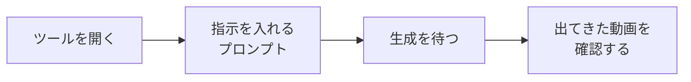

## このセクションで学ぶこと

- ツールを開いて指示を入れ、動画を1本出力するまでの最小手順
- 待ち時間や思った通りにならないことは普通だと知っておくこと
- うまくいかないときの、いちばん簡単な直し方

## まずは作ってみましょう

前のセクションで流れはつかめたので、ここでは実際に1本作ってみます。読むだけでなく、できれば手元で同じことをやってみてください。最初の1本が出てきたときの「作れた!」という感覚が、いちばんの教材になります。

使うのは {{tool:動画生成}} のようなツールです。やることはとても少なく、大きく4つのステップに分かれます。

順番に見ていきます。

1. **ツールを開く**: {{tool:動画生成}} のようなツールを開きます。多くはブラウザやスマホアプリで使えるので、特別な準備はいりません。
2. **指示を入れる**: 入力欄に作りたい映像を文章で書きます。最初は欲張らず、たとえば「雨上がりの street を歩く猫、ゆっくり」くらいの短い一文で十分です。
3. **生成を待つ**: 「作る」ボタンを押すと、AIが映像を **生成** し始めます。出てくるまで少し時間がかかります。この待ち時間は普通のことなので、慌てずに待ちましょう。
4. **出てきた動画を確認する**: できあがった数秒のクリップを再生して眺めます。これで記念すべき1本目の完成です。

## 思った通りにならなくても大丈夫

再生してみると、「あれ、思っていたのと少し違う」と感じることがよくあります。猫が変な動きをしたり、背景がぼやけたり、雰囲気がイメージと違ったり。これはまったく失敗ではなく、最初はほぼ毎回起きることだと思ってください。

そんなときの、いちばん簡単な直し方は次の2つです。

- **もう一度作り直す**: 同じ指示でも、作るたびに違う映像が出てきます。気に入らなければ、まず1〜2回作り直してみましょう。それだけで当たりが出ることもよくあります。
- **指示の言葉を少し足す**: 「ゆっくり」「明るい昼間に」「横から見た」のように、ほしい様子を一言足すと近づきます。逆に、最初からあれもこれもと詰め込むと崩れやすいので、少しずつ足すのがコツです。

指示の書き方をもっと整える方法は、次の章でていねいに扱います。今は「気に入らなければ作り直す・一言足す」だけ覚えておけば十分です。

ひとつだけ気持ちの面で大事なことがあります。最初の数本は、誰が作ってもイメージ通りにはなりません。プロでも、納得のいく1本を出すまでに何回も作り直しています。ですから「自分には向いていないのかも」と思う必要はまったくありません。むしろ、失敗作をいくつも眺めるうちに「AIはこういう言葉に反応するんだな」という感覚が育っていきます。最初の1本は、その感覚をつかむための練習だと思ってください。

## 無料で作るときの注意

無料の範囲で作る場合、作れる映像にいくつか制限があります。1本の長さは {{spec:無料尺}} までだったり、画質が {{spec:無料解像度}} までだったり、出力に {{spec:透かし}} が入ったりします。これは「お試し」だからこその制限で、最初の練習にはまったく問題ありません。練習を重ねて本格的に使いたくなったら、有料の枠を検討すればよく、その判断は後の章で扱います。

## まとめ

- 手順は「開く → 指示を入れる → 待つ → 確認する」のたった4ステップです。
- 思い通りにならないのは普通。作り直す・一言足す、で十分に直せます。
- 無料枠には尺・画質・透かしの制限がありますが、練習には十分です。
