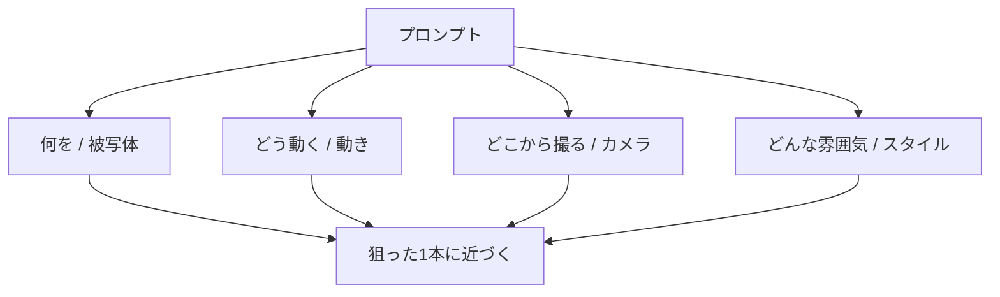

## このセクションで学ぶこと

- プロンプトは「何を・どう動く・どこから撮る・どんな雰囲気」の4要素で組み立てられること
- 曖昧な指示より、4要素をそろえた指示のほうが結果が安定する理由
- まずは型に沿って一文ずつ言葉を足していけばよいこと

## プロンプトには「型」がある

第1章では、短い指示文(これを **プロンプト** と呼びます。AIに「こういう動画を作って」と伝える指示文のことです)を入れて、5秒のクリップを1本作りました。「とりあえず出た」状態から、ここからは「狙ったものを出す」段階に進みます。

そのための一番の近道が、プロンプトの **型** を覚えることです。型といっても難しいものではありません。次の4つの要素を順番に書くだけです。

1. **何を**(被写体) ― 映したい主役。「子猫」「街並み」など。**被写体** とは、動画の中心に映したい対象のことです。
2. **どう動く**(動き) ― 被写体やカメラの動き。「ゆっくり歩く」「振り向く」など。
3. **どこから撮る**(カメラ) ― 寄りか引きか、角度はどうか。「正面のアップで」など。
4. **どんな雰囲気**(スタイル) ― 画風・時間帯・色味。「夕暮れ・あたたかい色合い」など。

この章の02-02から02-04までは、この4要素を1つずつ丁寧に言葉にする練習だと思ってください。今は「4つの引き出しがある」とだけ覚えれば十分です。順番も難しく考える必要はありません。上から「何を → どう動く → どこから撮る → どんな雰囲気」と書いていけば、自然と読みやすいプロンプトになります。慣れてきたら順番を入れ替えても問題ありませんが、最初は型の順番に沿うのが迷いません。

## 曖昧な指示と、型に沿った指示を比べる

同じ「猫の動画」でも、書き方で結果は大きく変わります。まずは曖昧な例です。

> 猫

これだけだと、AIは「猫の何を、どう映せばいいのか」を自分で勝手に決めます。座っているのか走っているのか、寄りなのか引きなのか、明るいのか暗いのか、毎回バラバラになりがちです。出てくるたびに違うものになり、狙いが定まりません。

次に、4要素をそろえた例です。

> 白い子猫(何を)が、毛糸玉をゆっくり転がして遊ぶ(どう動く)。正面からのアップ(どこから撮る)。やわらかい朝の光、あたたかい色合い(どんな雰囲気)。

どこを映し、どう動き、どんな空気感かが言葉で決まっています。AIが迷う余地が減るぶん、思い描いたものに近い動画が出やすくなります。

ここで大切なのは、4要素を「箇条書き」ではなく **ふつうの一文** としてつなげて書いてよいということです。上の例も、かっこ書きを外せば「白い子猫が、毛糸玉をゆっくり転がして遊ぶ。正面からのアップ。やわらかい朝の光、あたたかい色合い。」という、誰が読んでも意味の分かる文章になっています。専門用語も特別な記号も要りません。日本語の説明文がそのままプロンプトになる、と考えてください。

## 型に沿うと結果が「安定する」理由

なぜ型に沿うと安定するのでしょうか。AIは、指示で **埋まっていない部分** を毎回その場で推測して埋めます。空欄が多いほど推測も増え、出力のブレが大きくなります。4要素を書いておくと空欄が減り、AIの推測する余地が小さくなる ― だから結果が安定するのです。

最初から完璧な4要素を書こうとしなくて大丈夫です。まず「何を」だけ書いて出してみて、物足りない要素を一文ずつ足していく。これがいちばん失敗の少ない進め方です。

よくあるつまずきは、最初から全部を細かく書き込もうとして、かえって何を直せばよいか分からなくなることです。例えば一発目から「何を・どう動く・どこから撮る・どんな雰囲気」を全部盛り込んで、出てきた動画がイメージと違ったとき、4要素のどれが原因なのか切り分けられません。これに対して、1要素ずつ足していれば「動きの言葉を足したらこう変わった」と、原因と結果が一対一で見えます。直すべき場所がはっきりするので、上達も早くなります。

もし出力がイメージと大きくずれたら、要素を増やすのではなく、まず一度減らしてみるのも有効です。書きすぎた言葉どうしが互いに矛盾していて、AIが板挟みになっていることがあるからです。「足してもダメなら、いったん引く」と覚えておくと、行き詰まりにくくなります。

## まとめ

- プロンプトの型は「何を・どう動く・どこから撮る・どんな雰囲気」の4要素。
- 4要素をそろえるとAIの推測する余地が減り、結果が安定する。
- 完璧を狙わず、まず1要素から書いて一文ずつ足していけばよい。
