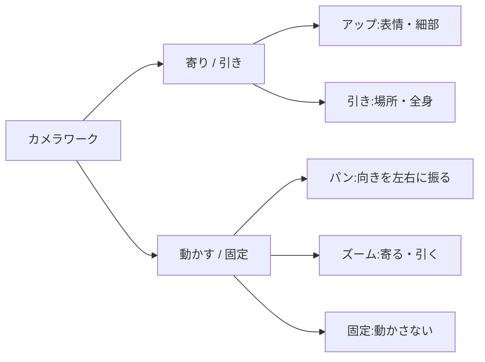

## このセクションで学ぶこと

- カメラワークとは「どこから・どう動かして撮るか」のことだと分かる
- アップ/引き、固定/パン・ズームの違いと使いどころが分かる
- カメラの動きも1クリップに1つだけ指定すると安定すること

## カメラワークって何?

4要素の3つめは「どこから撮るか」、つまり **カメラワーク** です。カメラワークとは、カメラをどこに置き、どう動かして撮るかという撮影のしかたのことです。同じ被写体・同じ動きでも、カメラワークが変わると印象はがらりと変わります。

未経験のうちは「カメラのことまで指定するの?」と感じるかもしれませんが、むしろ逆です。指定しないとAIが勝手にカメラ位置を決めてしまい、思っていた構図と違うものが出てきます。ここを一言添えるだけで、ぐっと狙いに近づきます。

身近な例で考えてみましょう。スマホで友達を撮るとき、顔をはっきり残したいなら近づいて撮り、景色と一緒に思い出を残したいなら少し離れて撮りますよね。カメラワークの指定とは、まさにこの「近づくか・離れるか」「どう構えるか」を、言葉でAIに伝えることです。特別な機材の知識は必要ありません。普段スマホで無意識にやっている判断を、文章にするだけだと考えてください。

## まず覚える2軸:寄り引きと、動かす/動かさない

カメラワークは、最初は次の2つの軸だけ押さえれば十分です。

**1つめ:寄り(アップ)か、引きか。** どのくらいの範囲を画面に入れるかです。

- **アップ(寄り)**:被写体を大きく映す。表情や細部を見せたいとき。
- **引き(ワイド)**:まわりも広く映す。場所の雰囲気や全身を見せたいとき。

**2つめ:カメラを固定するか、動かすか。** 動かす場合の代表が次の2つです。

- **パン**:カメラの位置はそのままで、向きだけを左右(または上下)に振ること。景色を見渡すような動きです。
- **ズーム**:映像上で被写体に寄ったり引いたりして、写る範囲の広さを変えること。「ぐっと近づく」「すっと引く」動きです。

## 言葉での書き方

プロンプトでは、難しい撮影用語を使わなくてかまいません。次のように普通の言葉でだいじょうぶです。

> 子犬の顔を正面からアップで。(寄り・固定)

> 街並みを左から右へゆっくりパンしながら。(引き・パン)

> 人物の全身から、顔へゆっくりズームインしていく。(引き→寄り・ズーム)

「アップで」「引きで」「パンしながら」「ズームインして」といった一言を、被写体と動きの後ろに添えるだけです。

迷いやすいのが、パンとズームの違いです。**パンは「首を振る」、ズームは「近づく・離れる」** と覚えると区別しやすくなります。立ったまま顔だけ左右に向けて部屋を見渡すのがパン、その場から動かずにレンズだけで対象を拡大して大きく見るのがズームのイメージです(自分が相手に歩み寄って近づくのは、ズームとは別の動きです)。どちらも「動かす」カメラワークですが、見る人に与える印象は別物です。パンは景色や状況を見せたいとき、ズームは注目してほしいものへ視線を誘導したいときに向いています。最初はこの2つを言葉で言い分けられれば十分です。

## 注意点:カメラの動きも1つに絞る

02-02で「被写体の動きは1つに」と言いましたが、カメラの動きも同じです。「パンしながらズームして上下にも振って……」と重ねると、画面が酔ったように崩れがちです。

迷ったら、まずは **固定** で撮るのがいちばん安定します。それで物足りなければ、パンかズームを **どちらか1つ** だけ足す。これで十分に映像らしい動きが出ます。落ち着いた1本にしたいなら、無理に動かさないのも立派な選択です。

## まとめ

- カメラワークは「どこから・どう動かして撮るか」。指定しないとAIが勝手に決める。
- まずは「寄り/引き」と「固定/パン・ズーム」の2軸だけ押さえる。
- カメラの動きも1クリップ1つに絞る。迷ったら固定が安定。
