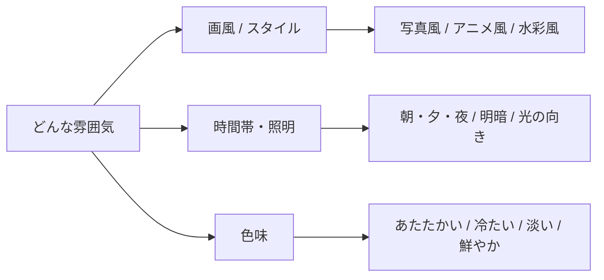

## このセクションで学ぶこと

- 雰囲気は「画風・時間帯と照明・色味」の3つで言葉にできること
- 同じ被写体でも雰囲気の指定で印象がまったく変わること
- 雰囲気の言葉は感覚的な形容詞で十分伝わること

## 4要素の最後は「どんな雰囲気か」

ここまでで、何を(被写体)・どう動く(動き)・どこから撮る(カメラ)を言葉にしてきました。型の最後は「どんな雰囲気か」です。これは映像全体の空気感を決める部分で、ここが決まると一気に「狙った1本」らしくなります。

雰囲気というと漠然としていますが、次の3つに分けて考えると言葉にしやすくなります。

1. **画風(スタイル)** ― 写真風か、アニメ風か、水彩画風か。**スタイル** とは、映像全体の見た目の方向性のことです。同じ「公園を歩く人」でも、実写の写真風と手描きのアニメ風とではまったく別の作品になります。
2. **時間帯と照明** ― 朝・昼・夕方・夜、明るいか暗いか、光がどこから当たっているか。光は雰囲気を左右する一番大きな要素で、同じ場所でも朝と夜で印象が大きく変わります。
3. **色味** ― あたたかい色か、青っぽく冷たい色か、鮮やかか、淡いか。色は気分を直接つくります。あたたかい色は親しみを、青っぽい色は静けさやクールさを生みます。

## 同じ被写体でも雰囲気で別物になる

例として、02-01でも使った子猫を、雰囲気だけ変えて比べてみます。被写体・動き・カメラは同じです。

> 白い子猫が毛糸玉で遊ぶ。正面からのアップ。**やわらかい朝の光、あたたかい色合い、写真風。**

> 白い子猫が毛糸玉で遊ぶ。正面からのアップ。**夜の室内、青みがかった暗めの照明、少し寂しい雰囲気。**

同じ「子猫が遊ぶ」でも、前者はほのぼのと明るく、後者は静かで落ち着いた印象になります。被写体や動きを変えなくても、雰囲気の言葉だけでここまで変わるのです。逆に言えば、雰囲気を指定しないと、AIが毎回ばらばらの空気感を選んでしまいます。

## 雰囲気は感覚の言葉でいい

ここで安心してほしいのは、雰囲気を伝えるのに専門用語はいらないということです。「あたたかい」「冷たい」「やわらかい」「くっきり」「淡い」「鮮やか」「夕暮れの」「曇り空の」――こうした日常の形容詞で十分に伝わります。

照明も「逆光で」「やわらかい自然光で」「ネオンの光で」くらいの言い方でかまいません。色も「セピア調」「モノクロ」「鮮やかな原色」のように、思い浮かぶ言葉をそのまま置けばよいです。

迷ったら、自分が好きな映像や写真を思い出して、その印象を言葉にしてみるのがおすすめです。「あの映画の夕暮れみたいに」と頭に浮かんだら、それを「夕暮れの逆光、あたたかいオレンジ色」と分解して書く。こうすると、ふわっとしたイメージが具体的な指示に変わります。

## 注意点:雰囲気の言葉どうしがケンカしないように

気をつけたいのは、雰囲気の言葉どうしが矛盾しないことです。「明るく華やかで、でも暗くて寂しい」のように反対方向の言葉を並べると、AIはどちらに寄せればいいか迷い、中途半端な絵になりがちです。

雰囲気は「ひとつの気分」にまとめるのがコツです。あたたかい1本にしたいのか、クールな1本にしたいのか、まず方向を1つ決めてから、画風・照明・色をその方向にそろえる。こうすると言葉どうしが助け合い、ねらった空気感が出やすくなります。

もし出てきた動画の雰囲気がいまひとつなら、被写体や動きはそのままにして、雰囲気の言葉だけを差し替えて出し直してみてください。「夜・青み」を「朝・あたたかい色」に変えるだけで、別の作品のように生まれ変わります。雰囲気は一番手軽に印象を調整できる引き出しです。

## まとめ

- 雰囲気は「画風・時間帯と照明・色味」の3つで言葉にする。
- 被写体や動きが同じでも、雰囲気の指定だけで印象は大きく変わる。
- 専門用語は不要。感覚の形容詞でよいが、方向はひとつにそろえる。
