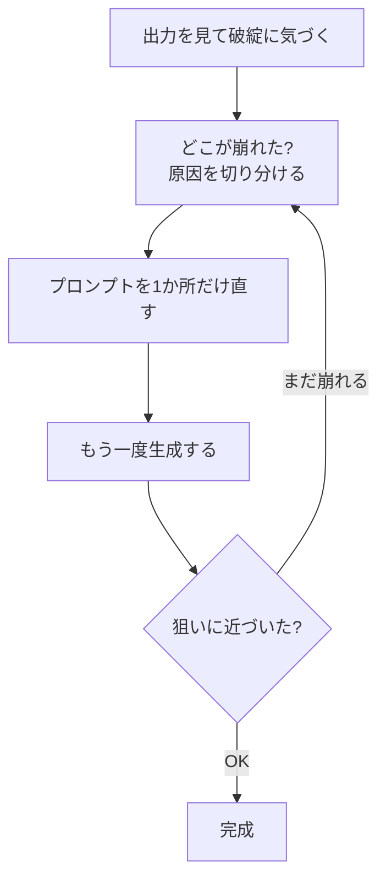

## このセクションで学ぶこと

- 動画が破綻する代表的な理由を知る
- 崩れたら「原因を切り分けてプロンプトを直す」ループで対処すること
- 典型的な失敗例ごとの、具体的な直し方の言葉

## 崩れるのは普通のこと

AI動画生成では、思った通りに出ないこと、いわゆる **破綻** がよく起こります。破綻とは、動画の中で形が崩れたり、ありえない動きをしたりして、見て不自然になってしまう状態のことです。指が6本になる、人物が途中で別人になる、物がすっと消える――こうした現象です。

まず知ってほしいのは、これは **あなたの書き方が下手だからではない** ということです。AIは動画全体のつじつまを完全には保てないことがある、というイメージで捉えてください。コマ同士の整合が取りきれないと崩れます。プロのクリエイターでも何度も出し直します。崩れたら直す、を前提にすれば気が楽になります。

大事なのは、1回でうまくいくことを期待しないことです。AI動画生成では、何本か出して気に入った1本を選ぶのが普通の使い方です。崩れた動画は失敗作ではなく、「次にどこを直せばいいか」を教えてくれるヒントだと考えてください。

## なぜ崩れるのか:3つのよくある原因

破綻の原因は、ざっくり次の3つに分けられます。

1. **一貫性の崩れ** ― 途中で顔・服・色が変わる。AIがコマ同士のつじつまを保ちきれないと起きます。
2. **物理法則の崩れ** ― 物が宙に浮く、影の向きがおかしい、足が地面にめり込む。現実のルールを知らないために起きます。
3. **細かい部分の崩れ** ― 手指・文字・歯など、細かくて動くものが苦手で崩れやすい。

どれが起きているかを見分けると、直す方向が決まります。

## 直し方は「切り分けて、1つだけ直す」ループ

崩れたとき、プロンプト全体を書き直すのは得策ではありません。何が効いたか分からなくなるからです。次のループで、原因を切り分けて1つずつ直すのがコツです。

ポイントは、一度に複数いじらず **1か所だけ** 直して出し直すことです。これなら、どの言葉が効いたかが分かります。

## 典型的な失敗例と、その場での直し方

よくある崩れと、プロンプトでの直し方を並べます。

- **顔や服が途中で変わる(一貫性)** → 被写体の特徴を具体的に固定する。「白いワンピースの女性」のように見た目を1〜2語足すと、ぶれにくくなります。さらに同じ見た目を保ちたいときは画像から動かす方法が有効です(02-06)。
- **動きがカクつく・人が二重になる** → 動きを詰め込みすぎているサイン。02-02のとおり動きを1つに絞ります。「走って振り向いて手を振る」→「ゆっくり振り向く」だけに。
- **手や指が崩れる** → 手を画面の主役にしない。「正面のアップ」で手元を大きく映していたなら、少し引いて手を目立たせない構図にします。
- **画面が酔ったように崩れる** → カメラを動かしすぎ。02-03のとおりカメラの動きを1つに、迷ったら固定にします。
- **暗すぎる・色が濁る** → 02-04の雰囲気の言葉が矛盾していないか確認し、「明るい自然光で」のように照明を1つはっきり指定します。

どれも「足し算」ではなく「絞り込み」で直ることが多いのが特徴です。崩れたら、まず減らす――これを覚えておいてください。

それでも直らないときは、いったんそのプロンプトに見切りをつけて、同じ指示でもう一度出し直すのも手です。AIは毎回少しずつ違うものを作るので、運悪く崩れただけのこともあります。2〜3回出して一番マシな1本を選ぶ、という気軽さも、うまく付き合うコツです。

## まとめ

- 破綻は普通に起きる。原因は一貫性・物理法則・細部(手指など)の3つが代表的。
- 全部書き直さず、原因を切り分けて1か所だけ直して出し直すループで対処する。
- 多くの崩れは「足す」より「絞る」ことで直る。
