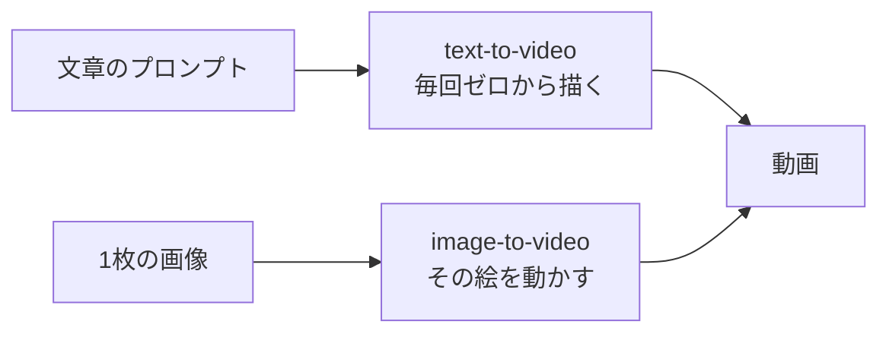

## このセクションで学ぶこと

- text-to-video と image-to-video の違いと、画像から動かす利点が分かる
- 元画像を用意して動かす流れを説明できる
- 参照画像やシードで、同じキャラ・雰囲気を保つ考え方が分かる

## 文章から作るか、画像から作るか

これまでは、文章のプロンプトだけから動画を作ってきました。これを **text-to-video**(テキストから動画)と呼びます。手軽ですが、毎回ゼロから描くので、見た目が前回と変わりやすいという弱点があります。

もう1つのやり方が **image-to-video** です。これは、用意した1枚の画像を出発点にして、それを動かす形で動画を作る方法のことです。最初の見た目が画像で固定されるため、「この絵のまま動かしたい」「同じキャラで何本も作りたい」というときに強いやり方です。02-05で出てきた「顔や服が途中で変わる」一貫性の崩れにも効きます。

## 画像から動かす流れ

image-to-video の手順はシンプルです。

1. **元になる画像を1枚用意する。** 自分で撮った写真でもよいですし、{{tool:画像生成}} で作った画像でもかまいません。
2. **その画像を {{tool:画像から動画}} に読み込む。**
3. **「どう動かすか」を文章で添える。** ここは02-02で練習した動きの言葉そのままです。「髪が風で揺れる」「ゆっくり振り向く」など、動きを1つだけ。

ポイントは、被写体や雰囲気はもう画像で決まっているので、プロンプトでは **動き** に集中すればよいことです。4要素のうち「何を」「どんな雰囲気」を画像が担当し、「どう動く」を言葉で足す、という分担になります。

## 同じキャラ・雰囲気を保つ2つの考え方

何本も作るうちに「さっきと同じ雰囲気でそろえたい」場面が必ず出てきます。一貫性を保つ代表的な方法が2つあります。

**1つめ:参照画像を使う。** 同じ元画像(または同じ人物・同じ場所の画像)を毎回の出発点にすれば、見た目が大きくぶれません。キャラの正面・横顔など複数枚を参照に渡せるツールもあり、「この子をこのまま動かして」という指示が通りやすくなります。

**2つめ:シードをそろえる。** **シード** とは、AIが生成するときの「くじの番号」にあたる数値です。同じシード番号を使うと、結果が似た方向に揃いやすくなります。気に入った1本のシードを控えておき、次もその番号を指定すると、雰囲気を保ちつつ少しだけ変えた動画が作りやすくなります。ツールによってはシードを指定・固定できる欄があります。

## 注意点:画像が出発点を決める

便利な反面、注意もあります。image-to-video は元画像の出来にかなり引っぱられます。元画像がぼやけていたり構図が窮屈だったりすると、動かしても同じ弱点を引きずります。動かす前に、まず元画像そのものを納得いくものにするのが近道です。

また、シードや参照を使っても完全に同じにはなりません。あくまで「ぶれを小さくする」ための道具です。それでも揃わないときは、02-05の直し方ループに戻り、被写体の特徴を言葉でも固定してみてください。画像・シード・言葉を合わせて使うと、一貫性はぐっと上がります。

最初のうちは、シードまで意識しなくても大丈夫です。まずは「気に入った1枚の画像を出発点にして動かす」だけでも、text-to-video よりずっと安定します。慣れてきて「もっとそろえたい」と思ったときに、参照画像やシードを少しずつ試していけば十分です。

## まとめ

- text-to-video は文章から、image-to-video は1枚の画像を動かして作る。後者は見た目を固定しやすい。
- 画像から動かすときは、被写体・雰囲気は画像に任せ、プロンプトは動きに集中する。
- 一貫性は「参照画像」と「シードをそろえる」で高められる。完全一致ではなくぶれを減らす道具。
