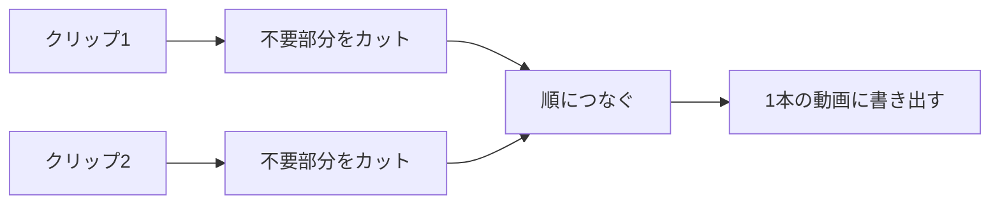

## このセクションで学ぶこと

- 「クリップ」と「カット」という言葉の意味を知る
- 動画の不要な部分を切り取って短くまとめられる
- 複数のクリップを順番につないで1本の動画にできる

## クリップとカット ― まず言葉から

AIで動画を作ると、たいてい数秒の短い動画がいくつもできあがります。この1つひとつの短い動画を **クリップ** と呼びます。料理でいえば、切りそろえた食材のようなものです。仕上げとは、このクリップを並べたり切ったりして、1本の動画にまとめる作業のことです。

そのときによく使うのが **カット** です。カットとは、動画の不要な部分を切り取って取り除くことをいいます。たとえば最初の1秒だけ動きが変だったり、最後に余計な間があったりするときに、その部分だけを削ります。

ここで覚えておいてほしいのは、難しい編集ソフトを使う必要はないということです。{{tool:仕上げ}} のような軽い編集ツール、あるいは {{tool:動画生成}} の中に仕上げ機能が付いていれば、その場でカットとつなぎ合わせができます。スマホのアプリでも十分です。

## やってみる ― 切ってから、つなぐ

実際の流れはとてもシンプルです。まず1つのクリップを画面に置き、いらない部分を **カット** します。多くのツールでは、動画を表す細長い帯(タイムラインと呼びます)の端をつまんで内側にドラッグするだけで、その分が切り取られます。前を削れば頭が、後ろを削ればお尻が短くなります。

短くしたクリップが用意できたら、次のクリップをそのうしろに置きます。こうしてクリップを左から順に並べると、再生したときに1本の動画として続けて流れます。これが **連結(つなぐこと)** です。順番を入れ替えたいときは、クリップをつかんで左右に動かすだけです。気に入らなければ何度でも並べ替えられるので、まずは思いついた順に置いてみて、見ながら直していくのがおすすめです。

並べる順番に決まりはありませんが、初めのうちは「見せたいものを先に、説明やおまけを後に」と考えると組み立てやすくなります。短い動画ほど、最初の1〜2秒で何の動画かが伝わるかどうかが大切だからです。

最後に、つないだ動画を1本のファイルとして保存します。この保存のことを「書き出し」と呼びますが、くわしくは 03-03 で扱います。ここでは「切って、つないで、最後に1本にする」という大きな流れがつかめれば十分です。

## つまずいたときは

うまくいかなくても心配いりません。よくあるのは「切りすぎてしまった」というケースです。ほとんどのツールには元に戻す(取り消し)機能があるので、操作を1つ前に戻せばやり直せます。切る位置は何度でも調整できるので、最初から完璧を狙わなくて大丈夫です。

もう1つ多いのが「つなぎ目が急に感じる」というものです。これはカットの位置を少し前後にずらすだけで自然になることが多いです。動きが落ち着いた瞬間で切ると、つなぎ目がなめらかになります。逆に、動きの途中でぶつ切りにするとガクッとした印象になりやすいので、いったん止まった瞬間や、画面が静かになったところを探して切ってみてください。

「どこで切ればいいか分からない」というときは、まずクリップを最後まで再生してみて、不要だと感じた部分にあたりを付けるとよいです。完璧な位置を一発で当てる必要はありません。切って、再生して、気になったら戻す。この繰り返しだけで、つなぎ目は少しずつ自然になっていきます。

## まとめ

- クリップは1つひとつの短い動画、カットは不要部分を切り取る操作です。
- いらない部分を切り、クリップを左から順に並べると1本の動画になります。
- 切りすぎても取り消しでやり直せるので、気軽に試して大丈夫です。
