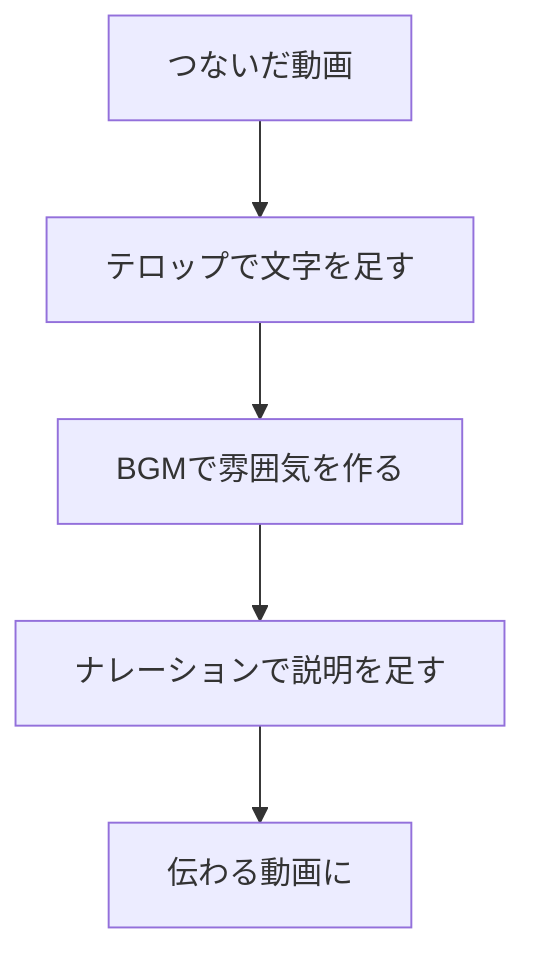

## このセクションで学ぶこと

- テロップ(画面に出す文字)の入れ方と読みやすくするコツを知る
- BGMとナレーションの役割と、足すときの注意点を知る
- 音源の権利について最低限の注意を払えるようになる

## テロップ ― 文字を足すだけで伝わりやすくなる

切ってつないだ動画ができたら、次は「足す」作業です。まず取り組みやすいのが **テロップ** です。テロップとは、画面の上に重ねて表示する文字のことです。タイトルを出したり、何の映像かを説明したり、セリフの字幕を付けたりするのに使います。

入れ方は簡単で、{{tool:仕上げ}} のような編集ツールで文字を追加し、出したい場所と時間に置くだけです。文字は画面のどこにでも置けますが、迷ったら中央か下のあたりに置くと安定します。表示する長さは、読み終えられるくらい(目安として2〜3秒)あれば十分です。一瞬で消えると読めず、長すぎると間延びするので、自分で再生して読み切れるかを確かめながら調整しましょう。

読みやすくするコツは2つあります。1つめは **短くすること**。一度に出す文字は一行に収まるくらいが目安で、長い文章は分けて表示します。2つめは **背景と区別すること**。明るい映像に白い文字を置くと読めなくなるので、文字に縁取りを付けたり、半透明の帯を文字の下に敷いたりすると、ぐっと読みやすくなります。文字の大きさも、スマホの小さな画面で見ても読めるくらいを目安にすると失敗しません。

## BGMとナレーション ― 音で印象が決まる

文字の次は音です。音には大きく2つの足し方があります。

1つは **BGM**(背景に流す音楽)です。BGMがあると動画の雰囲気が決まり、ぐっと作品らしくなります。注意点は音量で、映像のセリフや効果音をかき消さない程度に、控えめに下げておくのが基本です。

もう1つは **ナレーション**(語りの声)です。自分の声を録音して説明を入れたり、ツールの読み上げ機能で文章を音声にしたりできます。声に自信がなくても、読み上げ機能を使えば原稿を打ち込むだけで自然な音声が作れるので、まずはそちらから試すと気軽です。ナレーションを入れるなら、BGMはさらに小さくして、声が主役になるようにします。声と音楽が同じくらいの音量だと、どちらも聞き取りづらくなってしまうからです。

全部を入れる必要はありません。テロップだけ、BGMだけでも十分伝わります。足しすぎると情報が多くてうるさくなるので、迷ったら少なめにしておきましょう。

## 注意点 ― 音源の権利に気をつける

ここで1つだけ大事な注意があります。音楽には **権利** があります。好きな曲やテレビで流れている曲を勝手に使うと、特に動画を公開する場合にトラブルになることがあります。

安全なのは、ツールに最初から入っている音楽や、「自由に使ってよい」と明記された音源を使うことです。多くの編集ツールには、そのまま使えるBGMが用意されています。まずはそこから選べば安心です。自分の声で録ったナレーションは、自分のものなので問題ありません。権利の話はくわしくは別の章でも触れますが、ここでは「拾ってきた曲をそのまま使わない」とだけ覚えておけば大丈夫です。

## まとめ

- テロップは短く、背景と区別すると読みやすくなります。
- BGMは控えめに、ナレーションを入れるなら声を主役にします。
- 音楽には権利があるので、ツール内蔵や自由に使える音源を選びましょう。
