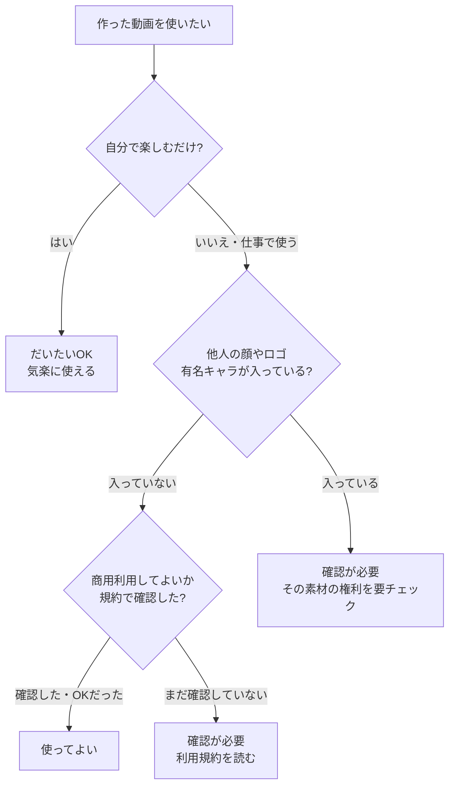

## このセクションで学ぶこと

- 作った動画を仕事やお金につなげる「商用利用」という考え方
- アップロードした素材がAIの学習に使われ得るという確認ポイント
- 「やってよい / 確認が必要」を切り分ける、安心して使うための判断のしかた

## まず「商用利用」という言葉から

AIで動画を作れるようになると、「これ、仕事の宣伝に使ってもいいのかな?」と気になってくると思います。ここで出てくるのが **商用利用** という言葉です。これは、作った動画を仕事やお金もうけにつなげて使うこと――たとえば広告に出す、商品として売る、お店の宣伝に使う、といった使い方を指します。逆に、自分で見て楽しむだけ、家族に見せるだけ、といった使い方は「個人利用」と呼ばれ、商用利用とは区別されます。

この区別が大事なのは、ツールによって「個人利用ならOK、商用利用は有料プランだけ」のように扱いが分かれることがあるからです。たとえば「無料で作った動画は個人で楽しむぶんには自由だけれど、お店の宣伝に使うなら有料プランへの加入が前提」といった具合に、線が引かれていることがあります。とはいえ、ここで身構える必要はありません。最低限おさえるべきことは、実はとてもシンプルです。

## 押さえるのは「規約を確認する」という習慣だけ

法律の細かい話を全部覚える必要はまったくありません。AI動画の権利のルールは国や時期によって変わりますし、ここで「これは合法/違法」と言い切ることもしません。代わりに持っておきたいのは、たったひとつの習慣です。それは、**使うツールの利用規約を確認する** こと。

**利用規約** とは、そのツールを「どう使ってよいか」をサービス側が決めて文章にしたものです。たいてい次のようなことが書かれています。

- 作った動画を商用利用してよいか(無料プランでも可能か)
- アップロードした写真や画像が、AIの学習に使われることがあるか
- 他人が写った写真や、有名なキャラクター・ロゴを入れてよいか

とくに二つ目は見落としがちです。自分が用意した素材をアップロードすると、それがサービス側でAIの性能向上(=学習)に使われることがあります。学習に使われること自体は珍しいことではなく、多くの無料サービスで起こり得ます。とはいえ、人の顔が写った写真や、社外に出せない資料などは、アップロードする前に「これは学習に使われても困らないか」を一度立ち止まって考える、という意識だけ持っておきましょう。気になる場合は、規約のなかに「学習に使わない」設定や法人向けの選択肢が用意されていないか、あわせて確認しておくと安心です。

そして大前提として、**最終的な責任は使う私たち利用者にある** という点も覚えておいてください。だからこそ、迷ったら確認する。これさえ習慣にできれば大丈夫です。

## 「やってよい / 確認が必要」を切り分ける

とはいえ毎回すべてを調べるのは大変です。ざっくりした判断の地図を持っておくと、ぐっと気が楽になります。

この図のポイントは、「自分で楽しむだけ」なら気楽に使えること、そして仕事で使うときだけ「他人の権利が混ざっていないか」「規約で商用利用が認められているか」の二つを確かめれば足りる、という点です。迷ったら「確認が必要」の側に倒しておけば、それだけで大きなトラブルはかなり避けられます。すべてを完璧に把握しようとせず、この地図のぶんだけ意識しておけば、未経験のうちは十分です。

## まとめ

- 商用利用(仕事・お金につなげる使い方)は、ツールごとに扱いが違うので規約で確認します。
- アップロードした素材はAIの学習に使われ得るので、人の顔や社外秘のものは一度立ち止まって考えます。
- 「自分で楽しむだけ」はだいたいOK、迷ったら「確認が必要」に倒す。それだけ覚えれば安心です。
