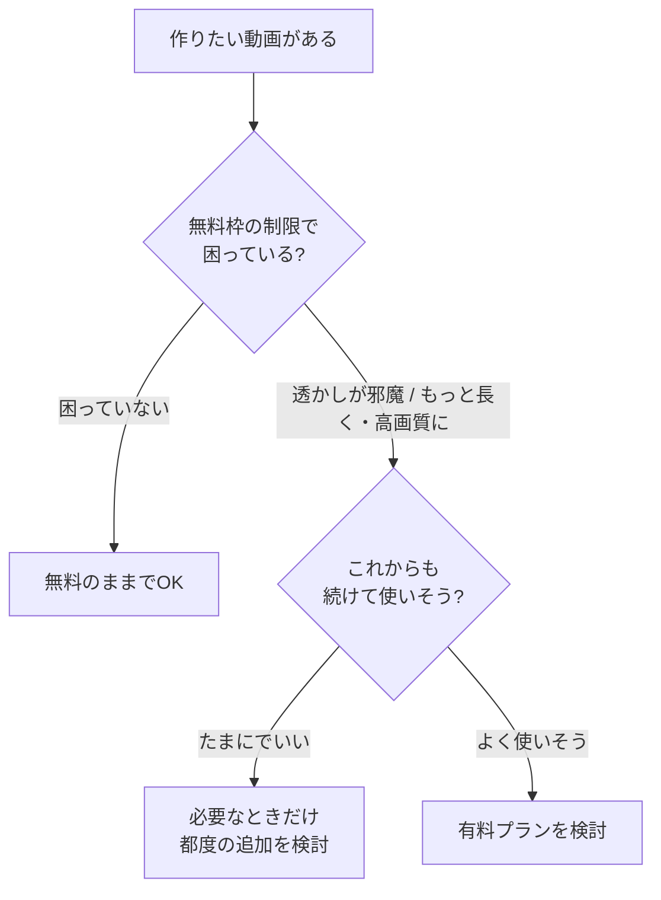

## このセクションで学ぶこと

- 動画生成でよくある「クレジット制」という料金の仕組み
- 無料枠でありがちな制限(透かし・尺・解像度)
- お金を払うかどうかを、あわてず判断するための考え方

## 「クレジット」は回数券のようなもの

AI動画生成のツールでは、料金が「月額いくら」だけでなく、**クレジット** という単位で管理されていることがよくあります。クレジットは、動画を1本作るごとに消費される「回数券」のようなポイントだと思ってください。たとえば手元に100クレジットあって、1本作るのに20クレジット必要なら、5本作ると使い切る、という具合です。

長い動画や高画質の動画ほど、多くのクレジットを消費する傾向があります。逆に、短くて画質も控えめなクリップなら消費は少なく済みます。最初のうちは「作るたびにちょっとずつ減っていくポイントがある」とだけ知っていれば十分です。残りが少なくなったら、追加で買い足すか、無料分が回復するのを待つか、という選択になります({{price:1本あたり}} の目安はツールによって違います)。多くのツールでは、いまの残りクレジットが画面のどこかに表示されているので、ときどき確認しておくと「気づいたらゼロだった」という事態を防げます。

なぜこの仕組みなのかというと、AIが動画を作るにはコンピュータの大きな計算力が必要で、サービス側にも費用がかかるからです。「作るほどコストがかかる」ので、回数で区切る料金になっている、と理解しておくと納得しやすいと思います。

## 無料枠でありがちな3つの制限

多くのツールには、お金を払わずに試せる **無料枠** が用意されています。まず無料で触ってみるのは、とてもよい入り口です。ただし無料には、たいてい次のような制限がついてきます。

- **透かし**: 作った動画の隅などに、サービス名やロゴが薄く表示されます({{spec:透かし}})。これが入っていると、人に見せる作品としては少し使いにくくなります。
- **尺(動画の長さ)**: 一度に作れる長さに上限があります({{spec:無料尺}})。短いクリップを試すぶんには困りません。
- **解像度(画質)**: 出力できる画質に上限が設けられていることがあります({{spec:無料解像度}})。

ここで言う **透かし** とは、無料で作った動画に入る、サービス名やロゴの薄い文字・絵のことです。「タダで使わせてもらっている印」くらいに考えておけば大丈夫で、これ自体は悪いものではありません。練習やお試しの段階なら、透かしが入っていてもまったく問題ありませんし、操作に慣れるという目的は無料枠だけで十分に達成できます。透かしが気になり始めるのは、人に見せる作品や仕事で使う動画を作りたくなったとき――つまり、ある程度先の段階です。

## お金を払うかは、あわてて決めない

「制限があるなら早く有料にしないと」と焦る必要はありません。判断はシンプルです。

まずは無料でいくつか作ってみて、「透かしが邪魔になった」「もっと長い動画がほしくなった」と **実際に困ってから** 有料を考える、で十分間に合います。続けて使いそうなら有料プラン({{price:有料プラン}})、たまにでよいなら必要なときだけ、という順番で考えれば、無駄なくお金を使えます。

## まとめ

- クレジットは「動画を1本作るごとに減る回数券」のようなもの。長く・高画質なほど多く消費します。
- 無料枠には透かし・尺・解像度の制限がつくことが多いですが、試すぶんには困りません。
- 有料化は焦らず、実際に制限で困ってから・続けて使いそうなら、で判断すれば大丈夫です。
