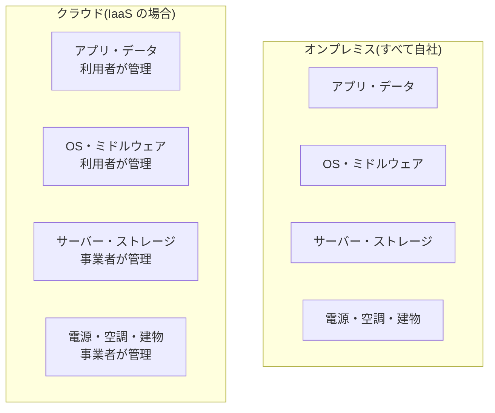

## このセクションで学ぶこと

- オンプレミスとクラウドの違いを費用・調達・運用の観点で説明できる
- 「所有から利用へ」という発想の転換を理解する
- 誰が機材を管理するかという責任範囲の違いを把握する

## オンプレミスとクラウド

**オンプレミス**とは、サーバーなどの機材を自社で購入・所有し、自社の施設(オンプレミス=構内)に設置して運用する形態です。クラウドが普及する前は、システムを動かすにはこのやり方が当たり前でした。クラウドへの移行は、ひとことで言えば **「所有から利用へ」** という発想の転換です。機材を買って持つのではなく、事業者のものを必要な分だけ借りて使うわけです。

両者の違いは、次の 3 つの観点で整理すると分かりやすくなります。

- **費用**: オンプレミスは機材購入という大きな**初期費用(CapEx)**が先に発生します。クラウドは初期費用を抑え、使った分を払う**運用費用(OpEx)**が中心です。
- **調達**: オンプレミスは発注から設置まで数週間から数か月の**調達リードタイム**がかかります。クラウドは操作画面から数分でサーバーを用意できます。
- **運用**: オンプレミスは故障対応・電源・空調・物理セキュリティまで自社で面倒を見ます。クラウドはこうした物理層を事業者が引き受けます。

## 具体例: 急な負荷増にどう備えるか

たとえば、あるサービスにキャンペーンで一時的にアクセスが集中するとします。オンプレミスなら、ピークに合わせてサーバーを買い増しておく必要があり、キャンペーンが終わればその機材は遊んでしまいます。先に大きな投資をして、しかも余らせるリスクを抱えるわけです。

クラウドなら、混雑する期間だけサーバーを増やし、終われば減らせます。支払いも使った時間分だけです。「必要なときに必要なだけ」を費用面でも実現できるのが、クラウドの大きな利点です。

## 誰が何を管理するか

オンプレミスとクラウドの最も本質的な違いは、**機材を管理する責任が誰にあるか**です。下の図は、物理的な機材から上位の設定までを、誰が管理するかで比べたものです。

クラウドでは、電源や建物といった**物理層を事業者が肩代わり**してくれるため、利用者はその上のアプリやデータに集中できます。どこまでを事業者が管理し、どこからが利用者の責任かは、次のセクションで扱うサービス形態によって変わります。

## 注意点

クラウドは万能ではありません。長期間ずっと一定量を使い続ける用途では、買い切りのオンプレミスの方が総額で安くなることもあります。「クラウドだから常に安い」と思い込まず、費用・調達・運用のどこにメリットが効くのかを見極めることが大切です。

## まとめ

- オンプレミスは「所有」、クラウドは「利用」。発想の転換がポイント。
- 違いは費用(初期費用 vs 従量)・調達(数か月 vs 数分)・運用(自社 vs 事業者)で整理できる。
- クラウドは物理層を事業者が管理するため、利用者は上位層に集中できる。
