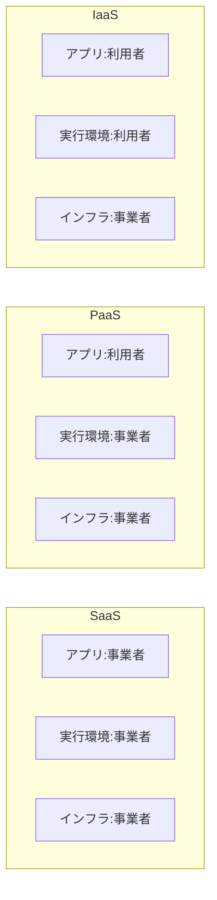

## このセクションで学ぶこと

- IaaS / PaaS / SaaS の 3 つのサービス形態を区別できる
- 各形態で「事業者が管理する範囲」と「利用者が管理する範囲」の違いを説明できる
- 代表的なサービス例から自分の用途に合う形態を選べる

## 3 つのサービス形態

クラウドのサービスは、**どこまでを事業者が用意し、どこからを利用者が自分で扱うか**によって、大きく 3 つの形態に分けられます。頭文字の「IaaS / PaaS / SaaS」は、すべて「○○ as a Service(サービスとして提供される○○)」を意味します。

- **IaaS(Infrastructure as a Service)**: 仮想サーバーやストレージといった**インフラ部品**を借ります。OS のインストールやアプリの構築は利用者が行います。自由度が高い反面、管理する範囲も広くなります。
- **PaaS(Platform as a Service)**: アプリを動かすための**実行環境(OS やミドルウェア)まで事業者が用意**します。利用者はアプリのコードとデータに集中できます。
- **SaaS(Software as a Service)**: **完成したソフトウェア**をそのまま使います。利用者は機材も実行環境も意識せず、画面から機能を使うだけです。

前のセクションで見た「物理層は事業者が管理する」という話を、上位の層までどこまで事業者に任せるかで段階分けしたもの、と捉えると理解しやすくなります。

## 管理範囲の比較

下の図は、同じ構成要素を 3 形態で並べ、それぞれ誰が管理するかを比べたものです。IaaS から SaaS に近づくほど、利用者が管理する範囲が狭くなります。

図の上から下へ IaaS → PaaS → SaaS と並んでおり、下にいく(SaaS に近づく)ほど、事業者が管理する範囲が広がっていきます。

IaaS では「インフラだけ」事業者管理、PaaS では「インフラ+実行環境」、SaaS では「すべて」事業者管理になります。任せる範囲が広いほど運用は楽になりますが、自由にカスタマイズできる余地は狭まります。

## 具体例: それぞれの代表例

- **IaaS**: AWS の EC2(仮想サーバー)。OS を選んで自分でアプリを構築したいときに向きます。本コースで中心的に扱うのはこの IaaS 寄りのサービスです。
- **PaaS**: アプリのコードを置くだけで動く実行環境サービス。サーバーの保守をせずアプリ開発に集中したいときに向きます。
- **SaaS**: ブラウザで使うメールやチャット、会計ソフトなど。導入してすぐ使いたい業務用途に向きます。

## 注意点

3 形態は「どれが優れているか」ではなく、**用途に対する適切さ**で選ぶものです。自由度が欲しければ IaaS、運用負担を減らしたければ SaaS 寄り、というように、管理したい範囲と任せたい範囲のバランスで判断します。また、実際のシステムは複数の形態を組み合わせて構成するのが一般的で、「全部 IaaS」「全部 SaaS」と単純に決まるわけではありません。

## まとめ

- IaaS / PaaS / SaaS は、事業者が管理する範囲の広さで分かれる。
- IaaS=インフラのみ、PaaS=実行環境まで、SaaS=ソフトすべてを事業者が管理。
- 自由度と運用負担のバランスで、用途に合う形態を選ぶ。
