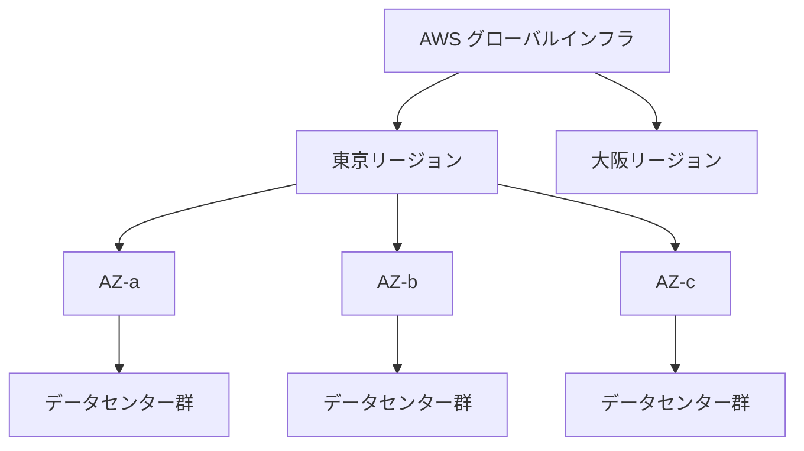

## このセクションで学ぶこと

- リージョンが世界各地に分散した拠点であることを理解する
- アベイラビリティーゾーン(AZ)がリージョン内の独立したデータセンター群であることを説明できる
- リージョンと AZ の階層関係を図で説明できる

## リージョン — 世界各地に分散した拠点

AWS のサービスは、世界中に置かれた **リージョン** と呼ばれる拠点で動いています。リージョンは「東京」「大阪」「バージニア北部」「フランクフルト」のように地理的なまとまりで分かれており、利用者は自分のシステムをどのリージョンで動かすかを選べます。

なぜ場所を選べることが重要なのでしょうか。理由は大きく 3 つあります。1 つ目は **遅延** です。利用者の近くのリージョンを選べば、データの往復時間が短くなり、応答が速くなります。日本のユーザー向けサービスなら東京リージョンが自然な選択です。2 つ目は **法規制やデータの所在** です。「データを国外に出してはいけない」といった要件があるとき、リージョンの選択が決め手になります。3 つ目は **料金** で、リージョンごとに価格が異なる場合があります。

重要なのは、**リージョンは互いに独立している** という点です。あるリージョンで作ったデータやサーバーは、明示的に設定しない限り別のリージョンには複製されません。これは裏を返せば、1 つのリージョンに障害が起きても他のリージョンには影響しにくい、ということでもあります。

## アベイラビリティーゾーン(AZ)— リージョンの中の独立した区画

各リージョンの内部は、さらに **アベイラビリティーゾーン(AZ)** という単位に分かれています。AZ は、物理的に離れた場所にある 1 つ以上の **データセンター** のまとまりです。1 つのリージョンには通常 3 つ前後の AZ があります。

ポイントは、同じリージョン内の AZ どうしが「十分に離れているが、十分に近い」という絶妙な距離に置かれていることです。

- **十分に離れている**: 地震・停電・火災などの障害が、1 つの AZ から別の AZ に連鎖しないように、電源や物理拠点が分離されています。
- **十分に近い**: AZ 間は高速な専用ネットワークで結ばれているため、複数の AZ にまたがってシステムを組んでも通信は高速です。

この性質のおかげで、「同じリージョン内の複数 AZ にサーバーを分散して置く」と、片方の AZ が落ちてももう片方で動き続ける、という構成が作れます。これが次のセクションで扱う可用性設計の土台になります。

## 階層構造を図で見る

リージョン・AZ・データセンターの関係を図にすると次のようになります。

「AWS 全体 → リージョン → AZ → データセンター」という入れ子の階層になっていることが分かります。利用者がふだん意識するのは主にリージョンと AZ の 2 階層です。

### 注意点

AZ は利用者ごとに割り当てが異なります。たとえばあなたの「AZ-a」と別の利用者の「AZ-a」が、物理的には別のデータセンターを指していることがあります。これは特定の AZ に負荷が集中しないようにする仕組みで、設計上はあまり気にする必要はありませんが、知っておくと混乱を避けられます。

## まとめ

- リージョンは世界各地に分散した独立した拠点で、遅延・法規制・料金を考えて選ぶ。
- AZ はリージョン内の物理的に分離されたデータセンター群で、障害が連鎖しにくい。
- 「AWS → リージョン → AZ → データセンター」の階層を押さえることが可用性設計の土台になる。
