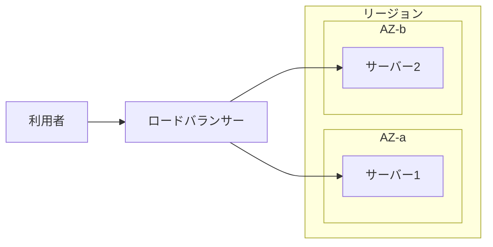

## このセクションで学ぶこと

- エッジロケーションが利用者の近くにコンテンツを届ける拠点であることを理解する
- 単一障害点を避けるという可用性設計の基本的な発想を説明できる
- 複数 AZ にまたがって構成する「マルチ AZ」の考え方を理解する

## エッジロケーション — 利用者のすぐ近くの拠点

前のセクションではリージョンと AZ を学びました。AWS にはもう 1 つ、**エッジロケーション** という拠点があります。これはリージョンとは別物で、世界中の主要都市に数百か所単位で設置された、利用者にぐっと近い小さな拠点です。

エッジロケーションの主な役割は、画像や動画などの **コンテンツを利用者の近くから配信する** ことです。たとえば東京リージョンにある動画を世界中のユーザーが見る場合、毎回東京まで取りに行くと遠い地域のユーザーほど遅くなります。そこで、よくアクセスされるデータをエッジロケーションに一時的に置いておき、近くの拠点から届けることで応答を速くします。この仕組みは CDN(コンテンツ配信ネットワーク)と呼ばれ、AWS では CloudFront というサービスが担います。

ここでは「リージョン/AZ は処理やデータの本拠地、エッジロケーションは配信を速くするための前線基地」という役割の違いを押さえておけば十分です。

## 可用性 — 止まらないシステムを作るという発想

ここからが本章の核心です。グローバルインフラを理解する目的は、**可用性** の高いシステムを作るためにあります。可用性とは「システムが止まらずに使い続けられる度合い」のことです。

可用性を考えるときの出発点は **単一障害点** をなくすことです。単一障害点とは、そこが 1 つ壊れただけで全体が止まってしまう箇所を指します。たとえばサーバーを 1 台だけで運用していると、その 1 台が壊れた瞬間にサービス全体が停止します。これがまさに単一障害点です。

対策の基本は「重要な部分を複数用意して、片方が壊れても残りで動かす」ことです。前のセクションで学んだ AZ が、ここで効いてきます。

## マルチ AZ — 複数 AZ に分散する

AZ どうしは物理的に分離され、障害が連鎖しにくいのでした。この性質を使い、**同じシステムを複数の AZ に分散して配置する** のが **マルチ AZ** という構成です。

この構成では、サーバーを AZ-a と AZ-b の両方に置き、手前のロードバランサーが両方に処理を振り分けます。仮に AZ-a 全体が停電などで止まっても、AZ-b のサーバーが処理を引き継ぐため、利用者から見るとサービスは止まりません。1 台運用に潜んでいた単一障害点が解消されているわけです。

### 注意点

可用性を上げるほど、サーバーの台数や構成が増えてコストも上がります。すべてのシステムを最初から最高の可用性で作る必要はありません。「このシステムは何分止まると困るのか」を考え、必要なレベルに合わせて AZ の使い方を選ぶ、という費用対効果の視点が実務では重要です。

## まとめ

- エッジロケーションは利用者の近くからコンテンツを配信して応答を速くする拠点。
- 可用性設計の基本は単一障害点をなくすこと。
- マルチ AZ で複数の AZ に分散すれば、1 つの AZ が止まってもサービスを継続できる。
