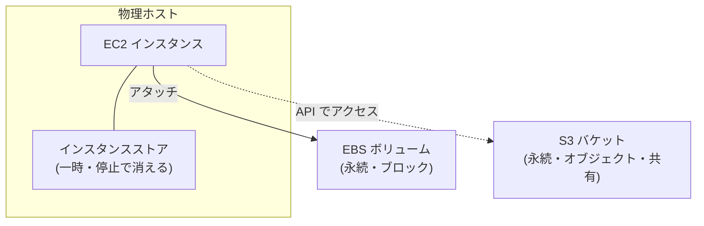

## このセクションで学ぶこと

- ブロックストレージとオブジェクトストレージの違いを理解する
- EBS・インスタンスストア・S3 の役割と永続性の違いを区別できる
- EC2 にどのストレージを組み合わせるかの基本的な考え方をつかむ

## ストレージには「種類」がある

EC2 でサーバーを動かすとき、データをどこに置くかは別の選択になります。AWS のストレージは大きく **ブロックストレージ** と **オブジェクトストレージ** に分かれ、性格が異なります。

- **ブロックストレージ**: データを固定長のブロックに分けて扱い、OS からは「ディスク(ハードディスクや SSD)」として見えます。OS のインストール先やデータベースの保存先のように、**頻繁に細かく読み書きする用途**に向きます。
- **オブジェクトストレージ**: ファイル(オブジェクト)を丸ごと 1 つの単位として、識別キーとメタデータをつけて扱います。OS からディスクとしては見えず、API 経由で読み書きします。画像・動画・バックアップなど**大量のファイルを置く用途**に向きます。

## EC2 に紐づく 3 つのストレージ

EC2 とよく一緒に使う代表的なストレージは次の 3 つです。

- **EBS(Elastic Block Store)**: インスタンスに接続して使う**永続的なブロックストレージ**。インスタンスを停止・再起動してもデータは残り、OS の起動ディスク(ルートボリューム)やデータ領域として使います。スナップショットでバックアップも取れます。
- **インスタンスストア**: 物理ホストに直接付いた**一時的なストレージ**。高速ですが、インスタンスを停止・終了すると中身が消えます。キャッシュや一時ファイル向けです。
- **S3**: オブジェクトストレージ。EC2 の外にある独立したサービスで、複数のインスタンスから共有でき、容量も実質無制限です(詳細は次のセクション)。

## 使い分けの注意点

選び方のポイントは「**消えてよいか**」と「**ディスクとして使うか / ファイル置き場として使うか**」です。

- OS やデータベースを置くなら、永続する **EBS**。インスタンスを止めても消えてはいけないからです。
- 計算の途中だけ使うキャッシュなど、消えても困らない高速領域は **インスタンスストア**。
- 画像・ログ・バックアップなど大量のファイルや、複数サーバーで共有したいデータは **S3**。

よくある失敗が、消えては困るデータをインスタンスストアに置いてしまうことです。インスタンスを停止しただけでデータが失われるため、**永続性が必要なら必ず EBS か S3 を選ぶ**と覚えておきましょう。

## まとめ

- ストレージにはディスクとして使うブロック型と、ファイル単位のオブジェクト型があります。
- EBS は永続ブロック、インスタンスストアは一時的、S3 は共有可能な永続オブジェクトです。
- 「消えてよいか」「ディスクかファイル置き場か」で使い分けるのが基本です。
