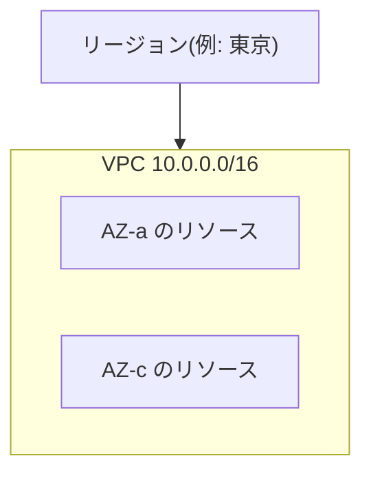

## このセクションで学ぶこと

- VPC が AWS 内に確保される「自分専用のネットワーク空間」であることを理解する
- VPC に割り当てる CIDR ブロック(IP アドレス範囲)の考え方を理解する
- VPC がリージョン単位で作られ、その中に複数の AZ をまたいで構成できることを理解する

## VPC は AWS の中に区切る「自分の土地」

EC2 や RDS といった AWS のリソースは、何もないところに浮かんで動いているわけではありません。それらは必ず何らかのネットワークの中に置かれます。その「ネットワークの入れ物」が **VPC(Virtual Private Cloud)** です。

VPC は、AWS という広大なデータセンター群の中に、論理的に区切られた **利用者専用のネットワーク空間** を作り出す仕組みです。物理的には他の利用者と同じ設備を共有していても、ネットワークとしては完全に分離されており、自分の VPC の中のリソース同士は外から勝手にアクセスされません。マンションの一室を借りるイメージに近く、建物は共用でも、自分の部屋の中は自分専用です。

VPC を理解するうえで重要なのは、**VPC はリージョン単位で作られる** という点です。第 2 章で学んだリージョンとアベイラビリティーゾーン(AZ)の関係を思い出してください。1 つの VPC は 1 つのリージョンの中に作られ、その VPC の内部に、複数の AZ をまたいでリソースを配置できます。これにより、AZ をまたいだ冗長構成を 1 つのネットワークの中で実現できます。

## CIDR ブロックで使える IP アドレスの範囲を決める

VPC を作るときにまず決めるのが、その VPC が使う **IP アドレスの範囲** です。これを **CIDR ブロック** という表記で指定します。

例えば `10.0.0.0/16` と指定すると、`10.0.0.0` から `10.0.255.255` までの約 6.5 万個のプライベート IP アドレスがその VPC で使えるようになります。`/16` の数字は「先頭 16 ビットがネットワーク部として固定」という意味で、数字が小さいほど使えるアドレスが多くなります。

ここで割り当てるのは **プライベート IP アドレス** です。インターネットに直接公開されるアドレスではなく、VPC 内部での通信に使う住所だと考えてください。実務では `10.0.0.0/16` や `172.16.0.0/16` のような、十分な余裕を持った範囲を選ぶのが一般的です。

## 注意点 — 後から広げにくいので最初に余裕を持つ

CIDR ブロックの設計でつまずきやすいのが、**範囲を小さく取りすぎる** ことです。`/24`(256 個)のような狭い範囲で作ってしまうと、リソースが増えたときにアドレスが足りなくなります。後からの拡張には制約があるため、最初から `/16` 程度の余裕を持たせておくのが安全です。

また、社内ネットワークや他の VPC と接続する予定がある場合、**アドレス範囲が重複しないように** あらかじめ調整しておく必要があります。同じ `10.0.0.0/16` 同士を接続しようとすると、通信先が判別できず接続できません。

## まとめ

- VPC は AWS の中に区切る「自分専用の仮想ネットワーク空間」で、リージョン単位に作られる。
- VPC が使う IP アドレスの範囲は CIDR ブロック(例 `10.0.0.0/16`)で指定する。
- アドレス範囲は後から広げにくいので、最初から余裕を持ち、他ネットワークと重複しないよう設計する。
