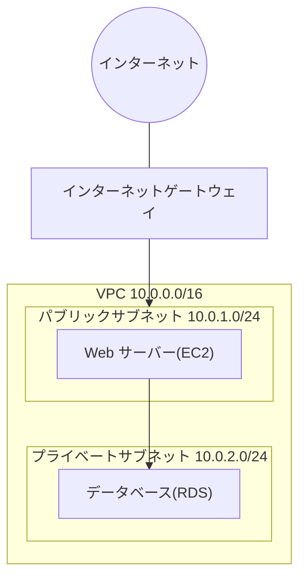

## このセクションで学ぶこと

- サブネットによって VPC を「公開する区画」と「隠す区画」に分けられることを理解する
- ルートテーブルとインターネットゲートウェイで通信経路が決まる仕組みを理解する
- セキュリティグループによる通信の許可/拒否の考え方を理解する

## サブネットで VPC を区画に分ける

前のセクションで作った VPC は、いわば広い土地です。その土地をそのまま使うのではなく、用途ごとに区画に分けて使います。この区画が **サブネット** です。

サブネットは VPC の CIDR ブロックをさらに小さく区切ったもので、例えば VPC が `10.0.0.0/16` なら、その中に `10.0.1.0/24` や `10.0.2.0/24` といったサブネットを作ります。重要なのは、**1 つのサブネットは 1 つの AZ に属する** という点です。複数の AZ にまたがって冗長化したい場合は、AZ ごとにサブネットを用意します。

サブネットは役割で 2 種類に分けて考えます。インターネットからアクセスを受ける Web サーバーなどを置く **パブリックサブネット** と、データベースのように外部に公開したくないリソースを置く **プライベートサブネット** です。この使い分けが、安全なネットワーク設計の基本になります。

## ルートテーブルとインターネットゲートウェイで経路を決める

サブネットが「パブリック」か「プライベート」かを決めているのは、実は **ルートテーブル** です。ルートテーブルは「この宛先への通信はどこへ送るか」を書いた経路表で、各サブネットに紐づきます。

VPC をインターネットとつなぐには **インターネットゲートウェイ(IGW)** を VPC に取り付けます。そのうえで、あるサブネットのルートテーブルに「インターネット向け(`0.0.0.0/0`)の通信は IGW へ送る」という経路を書くと、そのサブネットは **パブリックサブネット** になります。(本教材で扱う範囲では)IGW への経路がないサブネットはインターネットと直接やり取りできないため、結果的にプライベートサブネットになります。なお、プライベートサブネットから外向きの通信だけ通したい場合は NAT ゲートウェイという仕組みを使いますが、本章では扱いません。

## セキュリティグループで通信を許可する

ネットワークの経路が通っていても、それだけで通信できるわけではありません。リソース単位の「鍵」として **セキュリティグループ** が働きます。

セキュリティグループは EC2 などのリソースに割り当てる仮想ファイアウォールで、「どこからの・どのポートへの通信を許可するか」を設定します。例えば Web サーバーには「インターネットからの 443 番ポート(HTTPS)を許可」、データベースには「Web サーバーからの 3306 番ポートだけ許可」と設定します。

注意点として、セキュリティグループは **許可したものだけを通す**(デフォルトはすべて拒否)方式です。明示的に許可したルールがなければ通信は遮断されます。「拒否ルール」を書くのではなく「許可ルールを足していく」発想で設計する点を押さえてください。

## まとめ

- サブネットは VPC を区切る区画で、ルートテーブルの経路次第でパブリック/プライベートが決まる。
- インターネットゲートウェイ + `0.0.0.0/0` の経路があるサブネットがパブリックサブネットになる。
- セキュリティグループはリソース単位の仮想ファイアウォールで、許可したものだけを通す。
