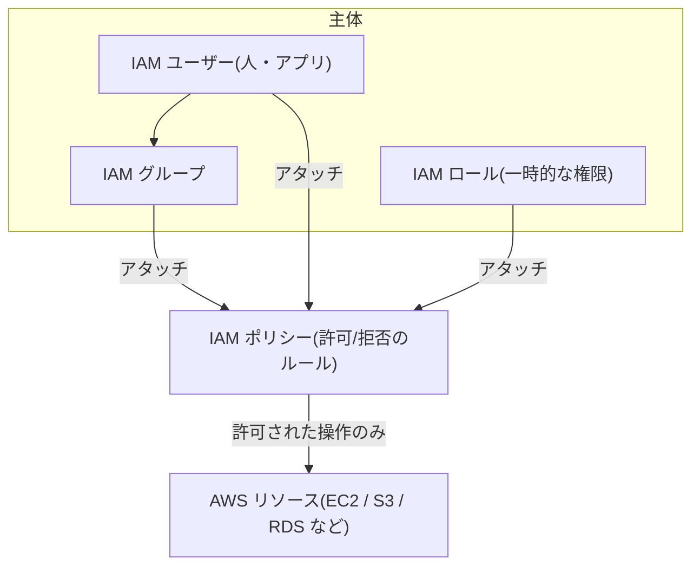

## このセクションで学ぶこと

- IAM が「誰が・何に・何をできるか」を制御する仕組みであることを理解する
- ユーザー・グループ・ロール・ポリシーの役割と関係を区別できる
- 最小権限の原則と、ルートユーザーを日常使いしない理由を理解する

## IAM は AWS の「誰が何にアクセスできるか」を決める

VPC がネットワークの境界を守るのに対して、**IAM(Identity and Access Management)** は「操作する人やプログラムの権限」を守ります。AWS では、EC2 を起動する・S3 のデータを読む・RDS を削除する、といったあらゆる操作に対して「その操作を許可されているか」が常にチェックされます。その許可を管理するのが IAM です。

IAM の役割は、ひとことで言えば **「誰が・何に・何をできるか」を定義すること** です。この「誰が」「何を」を組み立てるために、IAM にはいくつかの構成要素があります。

## ユーザー・グループ・ロール・ポリシーの関係

IAM の中心的な要素は次の 4 つです。

- **IAM ユーザー**: 個々の人やアプリケーションに対応する認証主体です。「田中さん」「経理アプリ」のように、操作する主体ごとに作ります。
- **IAM グループ**: 複数のユーザーをまとめる入れ物です。「開発者グループ」のようにまとめ、グループに権限を付ければ、所属ユーザー全員に一括で権限が行き渡ります。
- **IAM ポリシー**: 「S3 の読み取りを許可」「EC2 の削除を拒否」といった権限のルールを JSON で定義したものです。実際の許可/拒否はすべてこのポリシーが決めます。
- **IAM ロール**: 一時的に権限を引き受ける仕組みです。ユーザーのように固定のパスワードを持たず、必要なときだけ権限を「借りる」点が特徴です。

ポリシーは、ユーザーやグループ、ロールに **アタッチ(割り当て)** して使います。つまり「主体(ユーザー/グループ/ロール)」と「権限のルール(ポリシー)」を分けて管理し、それらを結びつけることでアクセス制御が成り立ちます。

## ロールが活きる場面と、最小権限の原則

ロールが特に役立つのは、**AWS サービス自身に権限を渡す** 場面です。例えば EC2 上のアプリが S3 にアクセスしたいとき、パスワードやアクセスキーを EC2 の中に保存するのは危険です。代わりに「S3 読み取りを許可するロール」を EC2 に割り当てれば、キーを持たせずに一時的な権限でアクセスできます。キーの漏洩リスクを避けられるのが大きな利点です。

権限を設計するときの基本方針が **最小権限の原則** です。これは「業務に必要な最小限の権限だけを与える」という考え方で、念のためと広い権限を付けると、誤操作や乗っ取りの被害が大きくなります。最初は狭く許可し、必要に応じて足していくのが安全です。

## 注意点 — ルートユーザーは日常使いしない

AWS アカウントを作ると、すべての権限を持つ **ルートユーザー** が作られます。これは最も強力な存在ですが、強力すぎるため **日常の作業には使わない** のが鉄則です。

ルートユーザーは課金情報の変更やアカウント全体の操作など、本当に必要なときだけ使い、普段の作業は権限を絞った IAM ユーザーやロールで行います。さらにルートユーザーには多要素認証(MFA)を設定し、万一パスワードが漏れても操作されないようにしておくことが推奨されます。

## まとめ

- IAM は「誰が・何に・何をできるか」を制御する仕組みで、ユーザー/グループ/ロールにポリシーを割り当てて使う。
- ロールはキーを持たせず一時的に権限を渡せるため、AWS サービスへの権限付与に向く。
- 最小権限の原則を守り、全権限を持つルートユーザーは日常使いせず MFA で保護する。
