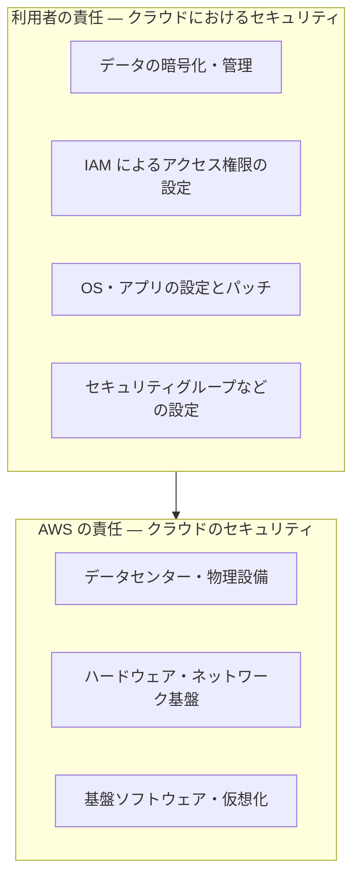

## このセクションで学ぶこと

- 責任共有モデルにおける AWS と利用者の責任分界
- 「クラウドのセキュリティ」と「クラウドにおけるセキュリティ」の違い
- 利用者が担うべき基本的なセキュリティ対策

## 責任共有モデルとは

クラウドを使うとき、「AWS を使えばセキュリティはすべて任せられる」と考えるのは危険です。AWS のセキュリティは **責任共有モデル** という考え方に基づいており、AWS と利用者で責任を分担します。どちらか一方がすべてを担うのではありません。

ざっくり言うと、境界線は次のように引かれます。

- **AWS の責任**: データセンター、サーバーやネットワークのハードウェア、それらを動かす基盤ソフトウェアなど、**クラウドそのものの安全**(「クラウドのセキュリティ」)。
- **利用者の責任**: その基盤の上で利用者が作ったもの——OS やアプリの設定、保存するデータ、アクセス権限の管理など、**クラウドの中で利用者が扱う部分の安全**(「クラウドにおけるセキュリティ」)。

## 具体例で見る分界

たとえば S3 にデータを保存する場合を考えます。S3 を動かすデータセンターやストレージ機器の物理的な安全は AWS が守ります。しかし、そのバケットを誤って「誰でも閲覧可能」に設定して情報を漏らしてしまえば、それは **利用者の責任** です。基盤がいくら堅牢でも、設定ミスは利用者側の問題なのです。

同じく、第 4 章で扱った IAM のアクセス権限の設定や、セキュリティグループでどの通信を許可するかも、すべて利用者が責任を持つ範囲です。実際のセキュリティ事故の多くは、基盤の破られ方ではなく、こうした **利用者側の設定ミス** が原因で起きています。

なお、責任の分界は使うサービスの形態によっても変わります。前章までに触れた IaaS / PaaS / SaaS の違いを思い出すと分かりやすく、EC2 のように OS から自分で扱うサービスでは利用者の責任範囲が広く、RDS のようなマネージドサービスでは OS やパッチの管理を AWS が肩代わりする分、利用者の責任は中身(データやアクセス権限)に寄っていきます。「自分が何を任せ、何を持つのか」はサービスごとに確認するのが安全です。

## 利用者が担うべき基本

初学者がまず押さえるべき、利用者側の基本的な対策は次のとおりです。

- **最小権限の原則**: IAM では必要な権限だけを与え、不要な強い権限を配らない。
- **公開設定の確認**: S3 バケットなどを意図せず公開していないか確認する。
- **データの暗号化**: 保存データや通信を暗号化する設定を有効にする。
- **認証情報の保護**: アクセスキーをコードに直書きせず、ルートユーザーには多要素認証(MFA)を設定する。

責任共有モデルを理解することは、「どこまで AWS に任せられて、どこからが自分の仕事か」を見極める出発点です。この線引きを誤ると、守られていると思い込んでいた部分が実は無防備だった、という事態を招きます。

## まとめ

- AWS のセキュリティは責任共有モデルに基づき、AWS と利用者で責任を分担する
- AWS は基盤(クラウドのセキュリティ)、利用者は設定・データ・権限(クラウドにおけるセキュリティ)を担う
- 事故の多くは利用者側の設定ミスが原因。最小権限・公開設定の確認・暗号化・認証情報の保護が基本
