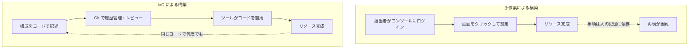

## このセクションで学ぶこと

- IaC がインフラの構成をコードとして定義する手法であることを理解する
- 宣言的アプローチと手続き的アプローチの違いを説明できる
- コード化によって再現性・履歴・レビューが得られる仕組みを把握する

## IaC — インフラの「あるべき姿」をコードに書く

前のセクションで見た手作業の課題は、構成が人の操作の中に閉じていることに原因がありました。これを解決するのが **Infrastructure as Code(IaC)** です。IaC とは、サーバーやネットワークといったインフラの構成を、ブラウザのクリックではなく **テキストのコードとして記述し、そのコードからインフラを作る** 手法です。

コードになると何が嬉しいのか。まず、同じコードを実行すれば何度でも同じ構成が再現できます。開発環境と本番環境で同じコードを使えば、環境差異は原理的に起きにくくなります。さらにコードは Git などで **バージョン管理** できるので、「いつ・誰が・なぜ変えたか」が履歴として残り、変更前にレビュー(コードの確認)を挟むこともできます。手作業では失われていた再現性・履歴・レビューが、コード化によって一気に手に入るのです。

## 手作業と IaC のワークフローの違い

手作業と IaC では、インフラができあがるまでの流れが根本的に異なります。次の図は両者を比較したものです。

手作業では作業が担当者の操作で終わってしまうのに対し、IaC ではコードが残り、それを繰り返し使える点が決定的に違います。

## 宣言的アプローチと手続き的アプローチ

IaC のコードの書き方には大きく 2 つの流派があります。

- **手続き的アプローチ**: 「EC2 を 1 台起動する → セキュリティグループを作る → 紐づける」というように、**実行する手順を順番に** 書く方式です。シェルスクリプトに近い発想で、何をするかが明確な反面、すでに作ったものがある場合の扱いを自分で考える必要があります。
- **宣言的アプローチ**: 「EC2 が 1 台あり、こういうセキュリティグループが紐づいている状態にしたい」という **最終的なあるべき状態だけ** を書く方式です。そこへ至る手順(新規作成なのか変更なのか)はツールが現状と見比べて自動的に判断します。

## 注意点 — 宣言的だからこそ「現状との差分」で動く

宣言的アプローチでは、コードは手順書ではなく「ゴールの設計図」です。ツールは毎回、設計図と実際のインフラを突き合わせ、足りないものだけを作り、不要なものを消します。つまり同じコードを 2 回実行しても、すでにゴールに到達していれば何も変更しません。この「現状との差分で動く」性質が、宣言的 IaC の安全性と再現性を支えています。次のセクションで扱う Terraform は、この宣言的アプローチを採用した代表的なツールです。

## まとめ

- IaC はインフラ構成をコードで記述し、再現性・履歴・レビューを得る手法。
- 手作業は人の操作で終わるが、IaC はコードが残り繰り返し使える。
- 宣言的アプローチは「あるべき状態」を書き、手順はツールが差分から判断する。
