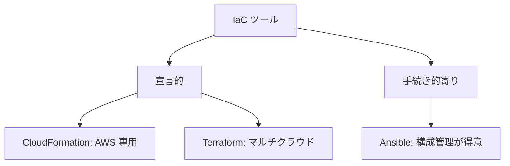

## このセクションで学ぶこと

- Terraform が宣言的・マルチクラウド対応の IaC ツールであることを理解する
- CloudFormation や Ansible など他ツールとの違いを説明できる
- Terraform の特徴(HCL・provider・state)の全体像をつかむ

## Terraform とは — 宣言的でマルチクラウドな IaC ツール

**Terraform** は HashiCorp 社が開発する IaC ツールで、前のセクションで学んだ宣言的アプローチを採用しています。コードに「あるべき状態」を書くと、Terraform が現状との差分を計算してインフラを作成・変更・削除します。

Terraform の大きな特徴は、特定のクラウドに縛られない **マルチクラウド** 対応です。AWS だけでなく Google Cloud や Azure、さらには多数の SaaS まで、同じ書き方・同じワークフローで扱えます。これは **provider** と呼ばれるプラグインで対象サービスとの通信を切り替える仕組みによるものです。本コースでは AWS provider を使って AWS のリソースを扱っていきます。

## IaC ツールの中での位置づけ

IaC ツールは数多くありますが、初学者がよく比較するものとの違いを押さえておきましょう。

- **CloudFormation(AWS 公式)**: AWS に特化した宣言的 IaC サービスです。AWS との統合は強力ですが、AWS 専用であり他クラウドには使えません。Terraform は同じく宣言的でありながら、複数クラウドを横断できる点が異なります。
- **Ansible**: もともとサーバー内部の構成管理(ソフトのインストールや設定)に強いツールで、手続き的な色合いが濃いです。インフラそのものの構築より、構築後のサーバーへの設定配布が得意分野です。
- **Terraform**: クラウド上の **インフラリソースそのもの**(ネットワーク・仮想マシン・権限など)を宣言的に組み立てることに最も向いています。

つまり Terraform は「宣言的」「マルチクラウド」「インフラ構築そのものが主戦場」という座標に位置づくツールだと理解してください。

## Terraform を支える 3 つの要素

Terraform を学ぶうえで、これから繰り返し登場する 3 つの要素を先に名前だけ押さえておきます。

- **HCL(HashiCorp Configuration Language)**: 構成を記述する専用言語です。人間が読み書きしやすいよう設計されており、次章で文法を学びます。
- **provider**: AWS など対象サービスとやり取りするプラグインです。どのクラウドを操作するかを決めます。
- **state**: Terraform が「自分が今管理しているリソースの現状」を記録するファイルです。宣言的に差分を計算するために不可欠で、第 3 章で詳しく扱います。

## 注意点 — Terraform は万能の置き換えではない

Terraform はインフラ構築に強い一方で、サーバー内部のアプリ設定やデプロイの細かな制御は Ansible のような構成管理ツールの方が得意な領域もあります。実務では「インフラの土台は Terraform、その上のサーバー設定は別ツール」のように役割分担することも珍しくありません。**Terraform がすべてを置き換える銀の弾丸ではない**ことを念頭に置きつつ、まずはその得意分野であるインフラ構築を本コースでしっかり身につけていきましょう。

## まとめ

- Terraform は宣言的でマルチクラウド対応の IaC ツール。
- CloudFormation は AWS 専用、Ansible は構成管理寄りという違いがある。
- HCL・provider・state という 3 要素が Terraform の土台になる。
