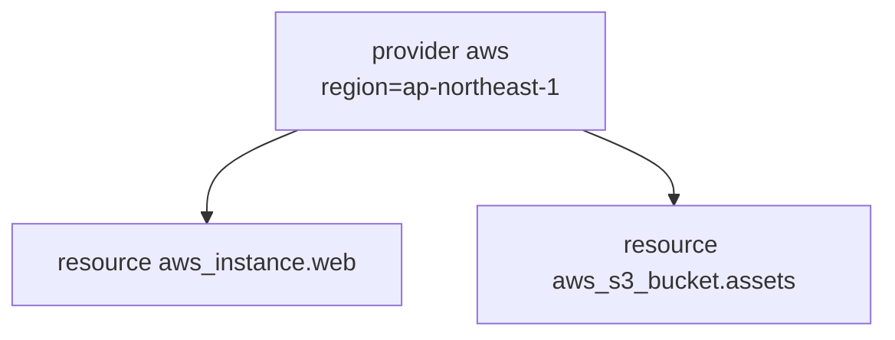

## このセクションで学ぶこと

- provider が果たす役割と認証情報の渡し方を理解する
- resource block の構造(タイプ・名前・引数)を読み書きできる
- provider と resource の関係を説明できる

## provider — プラットフォームへの橋渡し

Terraform 自体は AWS のことを直接は知りません。AWS や他のクラウドを操作する能力は **provider** というプラグインが提供します。AWS を扱うなら AWS provider を宣言し、どのリージョンを使うか、どの認証情報で接続するかを設定します。

```hcl
provider "aws" {
  region = "ap-northeast-1"
}
```

この `provider "aws"` block が「これから AWS を、東京リージョン(`ap-northeast-1`)で操作します」という宣言です。認証情報はこの block に直接書くこともできますが、**コードに鍵を書くのは避け**、環境変数や AWS CLI の設定ファイル(`~/.aws/credentials`)から読ませるのが安全です。Terraform は AWS CLI と同じ仕組みで認証情報を探すため、CLI が使える環境ならそのまま動きます。

## resource — 管理したいインフラ部品

provider を橋渡しとして、実際に作りたいインフラ部品を表すのが **resource** block です。前のセクションで見たとおり、`resource "タイプ" "名前"` という構造を持ちます。

```hcl
resource "aws_instance" "web" {
  ami           = "ami-0abcdef1234567890"
  instance_type = "t3.micro"
  tags = {
    Name = "web-server"
  }
}
```

- `aws_instance` が **リソースタイプ**で、前半の `aws_` が AWS provider を、後半の `instance` が EC2 インスタンスを指します。
- `"web"` が **このコード内での名前**で、後で他の設定から `aws_instance.web` のように参照するときに使います。AWS 上のリソース名ではありません。
- `ami` や `instance_type` は、そのインスタンスを定義するための argument です。

## provider と resource の関係

整理すると、provider が「どのプラットフォームをどう操作するか」を決め、resource が「そのプラットフォーム上に何を作るか」を宣言します。1 つの provider のもとに複数の resource がぶら下がる、という関係です。



## 注意点

リソースタイプと argument の名前は provider のドキュメントで定義されており、覚えるのではなく **公式ドキュメントを引く** のが基本です。`ami` のような値はリージョンごとに異なるため、別リージョンの値をコピーすると起動に失敗します。リソースタイプの前半(`aws_`)が provider 名と対応していることを意識すると、ドキュメントも探しやすくなります。

## まとめ

- provider は対象プラットフォームを操作するプラグインで、リージョンや認証を設定する。
- resource は作りたいインフラ部品を `resource "タイプ" "名前"` で宣言する。
- 認証情報はコードに書かず、環境変数や AWS CLI の設定から読ませる。
