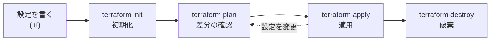

## このセクションで学ぶこと

- init・plan・apply の各コマンドの役割を説明できる
- plan で差分を確認してから apply する流れの意味を理解する
- destroy を含む基本ワークフロー全体を把握する

## 基本ワークフローの全体像

Terraform の操作は、いくつかのコマンドを決まった順番で実行する流れに集約されます。設定を書いたら **init → plan → apply** の順に進み、不要になったら **destroy** で片付けます。まず全体の流れを図でつかみましょう。



このうち init は最初の一度(と provider 構成を変えたとき)だけ、plan と apply は設定を変えるたびに繰り返す、という使い分けになります。

## terraform init — 作業ディレクトリの初期化

最初に実行するのが `terraform init` です。このコマンドは設定ファイルを読み、必要な provider プラグイン(前のセクションの AWS provider など)をダウンロードして、実行できる状態を整えます。

```bash
terraform init
# Terraform has been successfully initialized!
```

init はディレクトリに `.terraform/` フォルダなどを作ります。provider を追加・変更したときも再度実行が必要ですが、毎回のように打つコマンドではありません。

## terraform plan — 適用前に差分を見る

`terraform plan` は、**設定を実際のインフラに適用したら何が起きるかを、実行せずに表示する** コマンドです。Terraform は現在の状態と設定を突き合わせ、「何を新しく作るか・何を変更するか・何を削除するか」を計算して見せてくれます。

```bash
terraform plan
# Plan: 1 to add, 0 to change, 0 to destroy.
```

記号の意味は次のとおりで、ここを読めると安心して次に進めます。

- `+` … 新しく作成される(add)
- `~` … 既存のものが変更される(change)
- `-` … 削除される(destroy)

plan は何も変更しないため、何度実行しても安全です。「いきなり作らず、まず plan で確認する」のが Terraform の作法です。

## terraform apply — 変更を適用する

差分に納得できたら `terraform apply` で実際に適用します。apply はもう一度 plan を表示し、`yes` と入力すると初めてインフラが変更されます。

```bash
terraform apply
#   Enter a value: yes
# Apply complete! Resources: 1 added, 0 changed, 0 destroyed.
```

このワンクッションがあるおかげで、意図しない変更を直前で止められます。

## 注意点

plan の結果と apply の結果は、必ずしも完全には一致しません。plan から apply までの間に誰かが手作業でリソースを変えると、差分がずれることがあります。チームで運用するときは、plan を見てから時間を空けず apply する、あるいは plan の結果をファイルに保存して apply に渡す、といった工夫で食い違いを防ぎます。

## まとめ

- 基本の流れは init(初期化)→ plan(差分確認)→ apply(適用)→ destroy(破棄)。
- plan は実行せずに変更内容を見せるので、何度でも安全に確認できる。
- apply は確認を挟んでから適用するため、意図しない変更を直前で止められる。
