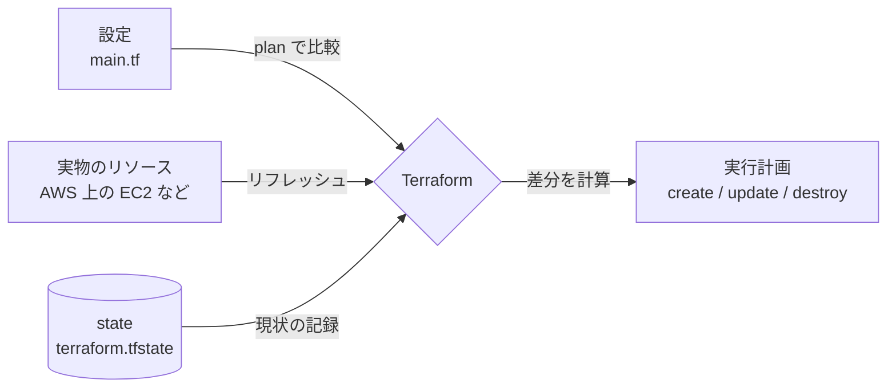

## このセクションで学ぶこと

- state ファイルが「設定」と「実物」を結ぶ対応表であることを理解する
- Terraform が state を使って差分(plan)を計算する仕組みを説明できる
- state を消したり手で書き換えたりすると何が起きるかを把握する

## state は「設定」と「実物」を結ぶ対応表

第 2 章で `apply` を実行すると、Terraform はカレントディレクトリに `terraform.tfstate` というファイルを作りました。これが **state ファイル** です。

Terraform が扱う情報は大きく 2 つあります。1 つは私たちが書いた **設定(`.tf` ファイル)**、もう 1 つは AWS などに実際に作られた **実物のリソース** です。この 2 つを結びつけているのが state です。state には、コード上の `aws_instance.web` という名前が、実際の EC2 インスタンス `i-0abc123...` に対応する、といった **対応表** が JSON 形式で記録されています。

なぜこの対応表が必要なのでしょうか。AWS の API には「このコードに対応するリソースはどれか」を問い合わせる機能はありません。Terraform は自分が作ったリソースの ID を覚えておかなければ、次回以降に「どれを更新し、どれを消すか」を判断できないのです。その記憶が state です。

## plan は state を起点に差分を計算する

`terraform plan` を実行すると、Terraform はまず state を読み込み、そこに記録された各リソースの現状を AWS に問い合わせて最新化します(**リフレッシュ**)。そのうえで「設定が求める状態」と「state が示す現状」を比較し、差分だけを実行計画として提示します。

たとえば設定でインスタンスタイプを `t3.micro` から `t3.small` に変えたとします。state には `t3.micro` と記録されているため、Terraform は「この 1 台を更新する」という差分を出します。すでに設定どおりのリソースには触れません。**state があるからこそ、毎回ゼロから作り直さずに「変わった分だけ」を適用できる** のです。

## state を壊すと整合性が崩れる

state はただのファイルなので、消すことも手で書き換えることもできてしまいます。しかしこれは危険です。state を削除すると、Terraform は実物の存在を忘れます。次の `apply` で「まだ何も作られていない」と判断し、**すでに存在するリソースをもう一度作ろうとして衝突したり、二重に課金されたり** します。

逆に、AWS コンソールから手作業でリソースを変更すると、state と実物がずれます(これを「ドリフト」と呼びます)。次の plan でその差分が検出され、Terraform が設定どおりに戻そうとします。state は手で編集せず、`terraform state` コマンド経由で慎重に扱うのが原則です。

## まとめ

- state は「設定」と「実物のリソース」を結ぶ対応表で、`terraform.tfstate` に記録される。
- plan は state を起点にリフレッシュし、設定との差分だけを計算する。
- state を消す・手で書き換えると整合性が崩れるため、慎重に扱う。
