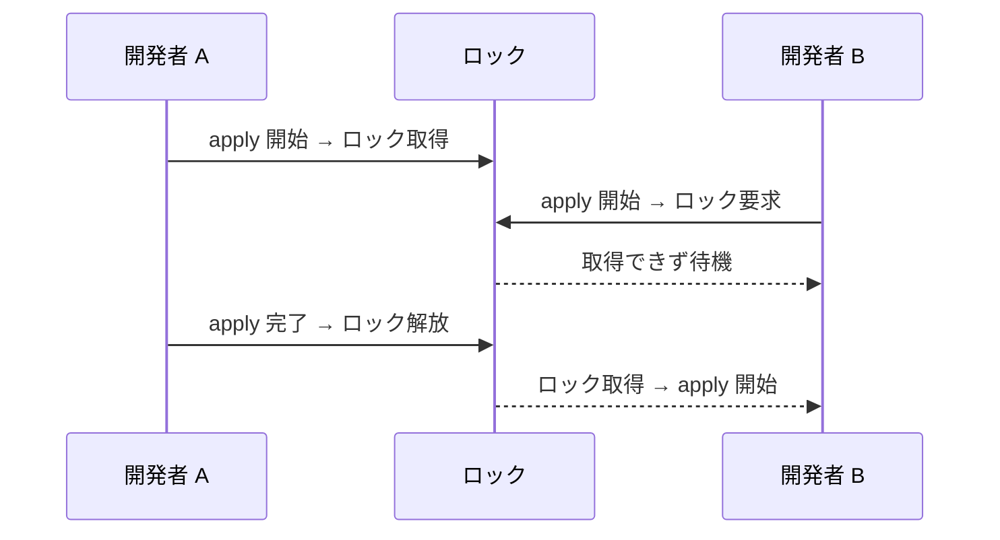

## このセクションで学ぶこと

- リモート state が state を共有ストレージに置く仕組みであることを理解する
- S3 バックエンドの設定方法を書ける
- state ロックが同時実行による破壊を防ぐ役割を説明できる

## リモート state は共有ストレージに置く

前のセクションで見たローカル state の弱点 ―― 共有できない・排他制御がない・喪失しやすい ―― を解決するのが **リモート state** です。state をチーム全員がアクセスできる共有ストレージに置き、各自のローカルには持たないようにします。AWS であれば保存先として **S3** を使うのが定番です。

S3 は耐久性が高く、バージョニングを有効にすれば過去の state を世代管理できます。誤った apply で state が壊れても、前のバージョンに戻せるのが利点です。

## S3 バックエンドを設定する

保存先は **`backend` ブロック** で指定します。`terraform` ブロックの中に書きます。

```hcl
terraform {
  backend "s3" {
    bucket       = "my-terraform-state-bucket"
    key          = "prod/network/terraform.tfstate"
    region       = "ap-northeast-1"
    encrypt      = true
    use_lockfile = true
  }
}
```

`bucket` は state を保存する S3 バケット名、`key` はバケット内のパスです。複数の構成を同じバケットで管理するときは `key` を分けて衝突を避けます。`encrypt = true` で保存時に暗号化され、秘匿情報が平文のまま残るリスクを下げられます。

バックエンドを追加・変更したら、`terraform init` で初期化し直します。すでにローカル state がある場合は、リモートへ移行するか確認されます。

```bash
terraform init
# Do you want to copy existing state to the new backend? と聞かれたら yes
```

## ロックが同時実行による破壊を防ぐ

共有ストレージに置くだけでは、二人が同時に apply する問題は残ります。これを防ぐのが **state ロック** です。誰かが apply を始めると state にロックがかかり、その間は他の人の plan / apply が待たされます。これにより、同じ state を同時に書き換えて壊すことを防ぎます。

上の例の `use_lockfile = true` は、S3 自体のロック機能を使う設定です(新しめの Terraform で利用可能)。従来は DynamoDB テーブルを併用してロックを実現していました。いずれの方式でも、ロックを取得できなければ Terraform はエラーで止まり、先に実行中の作業が終わるのを待ちます。



## まとめ

- リモート state は S3 などの共有ストレージに state を置き、チームで唯一の state を共有する。
- `backend "s3"` ブロックで保存先・暗号化を指定し、`terraform init` で初期化する。
- state ロックが同時実行を直列化し、state の破壊を防ぐ。
