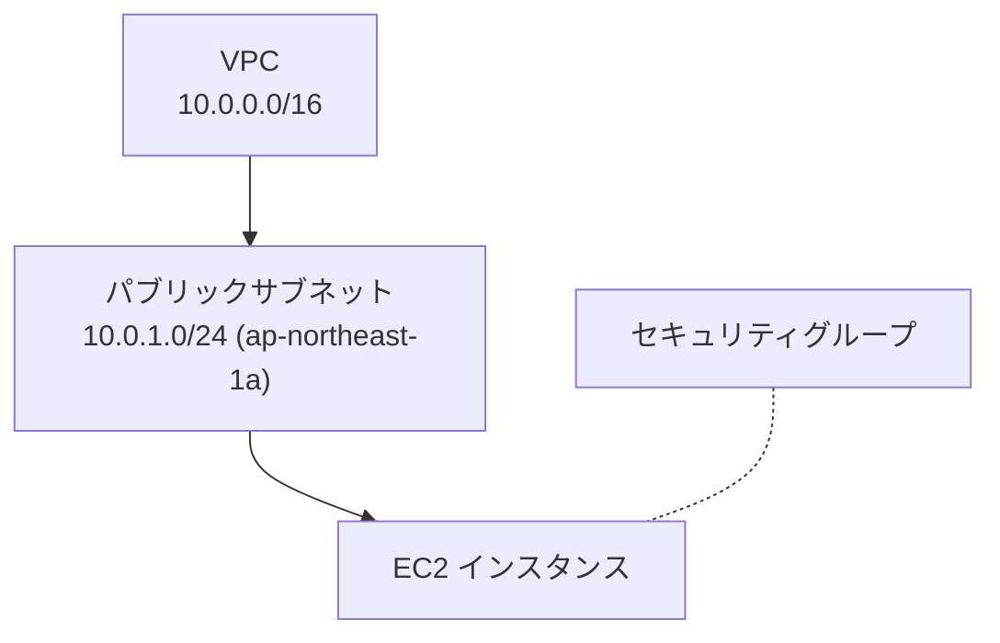

## このセクションで学ぶこと

- VPC とサブネットが AWS ネットワークの土台であることを理解する
- `aws_vpc` / `aws_subnet` リソースを HCL で記述できる
- CIDR と `availability_zone` の指定の意味を押さえる

## VPC とサブネット — ネットワークの土台

AWS で EC2 やデータベースを動かすには、まずそれらを置く「ネットワーク」が必要です。その最も外側の箱が **VPC(Virtual Private Cloud)** です。VPC は AWS アカウントの中に作る、論理的に隔離された自分専用の仮想ネットワークだと考えてください。VPC を作るときに決める一番大事な値が **CIDR ブロック**で、`10.0.0.0/16` のように、この VPC が使える IP アドレスの範囲を宣言します。`/16` であれば約 6.5 万個のアドレスを確保できます。

VPC をそのまま使うことはなく、内部を **サブネット**という単位にさらに区切ります。サブネットは VPC の CIDR の一部(例: `10.0.1.0/24`)を切り出した領域で、必ずひとつの **可用性ゾーン(AZ)** に属します。インターネットから直接アクセスさせたいサーバはパブリックサブネットに、データベースのように隠したいものはプライベートサブネットに置く、という設計の基本単位になります。

この章を通して組み上げる構成は、次のような入れ子の関係になっています。



VPC の中にサブネットがあり、その中に EC2 を置き、EC2 への通信をセキュリティグループで制御する、という重ね方です。本章ではこの図を一つずつ Terraform のコードに落としていきます。

## Terraform で書いてみる

VPC とサブネットを Terraform で定義すると次のようになります。

```hcl
resource "aws_vpc" "main" {
  cidr_block = "10.0.0.0/16"

  tags = {
    Name = "tf-handson-vpc"
  }
}

resource "aws_subnet" "public" {
  vpc_id            = aws_vpc.main.id
  cidr_block        = "10.0.1.0/24"
  availability_zone = "ap-northeast-1a"

  tags = {
    Name = "tf-handson-public"
  }
}
```

ポイントは `aws_subnet` の `vpc_id` に `aws_vpc.main.id` を渡している箇所です。これは「先に作る VPC の ID を、サブネットに教える」という **参照**で、Terraform はこの記述から「VPC を作ってからサブネットを作る」という順序を自動的に判断します(参照の詳細は 04-04 で扱います)。

## 注意点

- VPC の CIDR ブロックには `/16`〜`/28` の範囲しか指定できず、作成後にこのプライマリ CIDR を狭めたり広げたりはできません。`10.0.0.0/24` のように狭く作ると後で手狭になり、アドレスを足すには**セカンダリ CIDR ブロックの追加**という別作業が必要になります。最初から `/16` 程度の余裕を持って決めておくのが無難です。
- サブネットの CIDR は VPC の CIDR の **内側に収まる**必要があります。`10.1.0.0/24` のように VPC の範囲外を指定するとエラーになります。
- `availability_zone` はリージョンによって使える名前が異なります(東京は `ap-northeast-1a` など)。可搬性を高めたい場合は後述の variables で外から渡すと扱いやすくなります。

## まとめ

- VPC は隔離された仮想ネットワークの箱、サブネットはその中を AZ ごとに区切った領域です。
- `aws_vpc` の `cidr_block`、`aws_subnet` の `vpc_id` / `cidr_block` / `availability_zone` が要点です。
- VPC のプライマリ CIDR は後から変えられないので、最初の設計で余裕を持って決めます。
