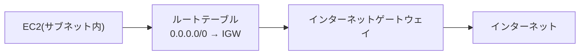

## このセクションで学ぶこと

- インターネットゲートウェイ(IGW)が VPC を外部とつなぐ出入口であることを理解する
- ルートテーブルとサブネットの関連付けで通信経路を制御する
- パブリックサブネットを成立させる構成要素を組める

## サブネットだけでは外に出られない

前のセクションで VPC とサブネットを作りましたが、実はこの状態ではサブネット内のリソースはインターネットと通信できません。VPC は隔離されたネットワークなので、外部とやり取りするには明示的に「出入口」と「道順」を用意する必要があります。この出入口が **インターネットゲートウェイ(IGW)** で、道順を定義するのが **ルートテーブル**です。

IGW は VPC に 1 つアタッチします。ルートテーブルには「`0.0.0.0/0`(=すべての宛先)行きの通信は IGW へ送る」という経路を書き、そのルートテーブルをサブネットに関連付けます。この関連付けがあって初めて、そのサブネットは「外と通信できるサブネット」=**パブリックサブネット**になります。

## Terraform で経路を組む

IGW・ルートテーブル・関連付けの 3 つを書きます。

```hcl
resource "aws_internet_gateway" "main" {
  vpc_id = aws_vpc.main.id

  tags = {
    Name = "tf-handson-igw"
  }
}

resource "aws_route_table" "public" {
  vpc_id = aws_vpc.main.id

  route {
    cidr_block = "0.0.0.0/0"
    gateway_id = aws_internet_gateway.main.id
  }

  tags = {
    Name = "tf-handson-public-rt"
  }
}

resource "aws_route_table_association" "public" {
  subnet_id      = aws_subnet.public.id
  route_table_id = aws_route_table.public.id
}
```

`aws_route_table` の `route` ブロックで「`0.0.0.0/0` は IGW 経由」と宣言し、`aws_route_table_association` でそのルートテーブルとサブネットを結び付けています。この 3 点セットがそろうことで、04-01 のサブネットが実際にパブリックサブネットとして機能します。



## 注意点

- IGW は **VPC に 1 つ**だけアタッチできます。VPC を作っただけでは IGW は付かないので、別リソースとして明示的に作成・関連付けします。
- ルートテーブルを関連付け忘れると、サブネットは VPC のデフォルトルートテーブル(外部経路なし)のままになり、EC2 に接続できません。「作ったのに繋がらない」原因の定番です。
- インターネットから EC2 にアクセスするには、これに加えて EC2 への **パブリック IP の割り当て**とセキュリティグループの許可が必要です。経路(本節)と入室許可(次節)は別物だと整理しておきましょう。

## まとめ

- VPC は隔離環境なので、外部通信には IGW(出入口)とルートテーブル(道順)が要ります。
- `0.0.0.0/0 → IGW` の経路を持つルートテーブルを関連付けたサブネットがパブリックサブネットです。
- 経路設定と、次節のセキュリティグループによる許可は役割が異なります。
