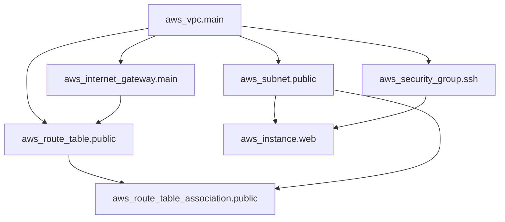

## このセクションで学ぶこと

- 参照(`resource.name.attribute`)が暗黙の依存関係を作ることを理解する
- Terraform が依存グラフから作成・削除の順序を決める仕組みを押さえる
- `depends_on` による明示的な依存指定の使いどころを知る

## 参照が依存関係を作る

ここまでの 3 セクションで、VPC・サブネット・IGW・ルートテーブル・セキュリティグループ・EC2 を書いてきました。これらのリソースには「先に作っておかないと困るもの」と「後から作るもの」の順序があります。たとえばサブネットは VPC がないと作れず、EC2 はサブネットとセキュリティグループがないと起動できません。

この順序を、私たちが手で並べる必要はありません。Terraform は HCL の中の **参照**を読み取って、自動的に順序を決めます。`aws_subnet` の `vpc_id = aws_vpc.main.id` のように、あるリソースが別のリソースの属性(`.id` など)を参照していると、Terraform は「`aws_vpc.main` を先に作らないと `aws_subnet.public` は作れない」と判断します。これを **暗黙の依存関係**と呼びます。コードで参照を書くだけで、依存は自動的に表現されるのです。

## 依存グラフと処理順序

Terraform は全リソースの参照関係から **依存グラフ**を内部に構築します。本章で組んだ構成をグラフにすると次のようになります。



矢印は「矢の根もとを先に作る」という依存です。Terraform はこのグラフをたどり、依存のないものから順に作成します。互いに依存しないリソース(たとえば IGW と SG)は **並列に**作成され、`apply` が速くなります。`destroy` のときはこの順序を逆にたどり、EC2 のように一番末端のものから先に削除していきます。

## depends_on — 参照で表せない依存を補う

ほとんどの依存は参照だけで表現できますが、属性を参照しないのに順序だけは守ってほしい、というケースがあります。たとえば「IAM ポリシーが有効になってから EC2 を作りたい」が、EC2 の引数にそのポリシーの属性を書く必要はない、という場合です。こうした **隠れた依存**は参照に現れないため Terraform が気づけません。

そのときに使うのが `depends_on` メタ引数です。

```hcl
resource "aws_instance" "web" {
  ami           = "ami-0abcdef1234567890"
  instance_type = "t3.micro"
  subnet_id     = aws_subnet.public.id

  depends_on = [aws_route_table_association.public]
}
```

この例では「ルートテーブルの関連付けが終わってから EC2 を作る」ことを明示しています。

## 注意点

- まず参照で依存を表すのが基本です。`depends_on` を多用すると依存が見えにくくなり、並列化も効かなくなるため、参照で表せない場合の最終手段と考えます。
- 参照を消すと依存も消えます。リファクタリングで `aws_vpc.main.id` を固定文字列に書き換えると、Terraform は順序を保証しなくなる点に注意します。
- グラフは `terraform graph` コマンドで出力でき、依存関係の確認やトラブルシュートに役立ちます。

## まとめ

- 別リソースの属性を参照すると、暗黙の依存関係が自動で作られます。
- Terraform は依存グラフから作成順を決め、独立したものは並列に、削除は逆順に処理します。
- 参照で表せない隠れた依存だけ `depends_on` で明示します。
