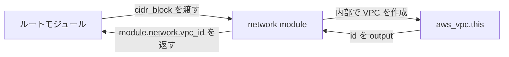

## このセクションで学ぶこと

- module は variables を入力・outputs を出力とする再利用可能な構成の単位
- module ブロックで呼び出し、source で参照先を指定する
- 同じ module を異なる入力で複数回呼び出して構成を量産する

## 同じ構成を繰り返し作りたい

ここまでで、変数で値を差し替え、出力で結果を取り出せるようになりました。次に出てくる悩みは「VPC とサブネットと EC2 のセットを、開発・ステージング・本番で 3 つ作りたい」といった **構成そのものの繰り返し** です。同じ `.tf` ファイル群をディレクトリごとコピーすると、修正のたびに全コピーに手を入れることになり、IaC の利点が失われます。

これを解決するのが **module** です。module は複数のリソースをひとまとめにした「部品」で、**variables を入力口、outputs を出力口** として持ちます。一度作った部品を、入力値だけ変えて何度でも呼び出せます。実は今まで書いてきた構成も、Terraform から見れば **ルートモジュール** と呼ばれる一番外側の module です。

## module を定義して呼び出す

module は単なるディレクトリです。例えば `modules/network/` に variables・resource・outputs を書いておきます。

```hcl
# modules/network/variables.tf
variable "cidr_block" {
  type = string
}

# modules/network/main.tf
resource "aws_vpc" "this" {
  cidr_block = var.cidr_block
}

# modules/network/outputs.tf
output "vpc_id" {
  value = aws_vpc.this.id
}
```

呼び出す側(ルートモジュール)では `module` ブロックを書き、`source` で場所を指定して、その module の変数に値を渡します。

```hcl
module "network" {
  source     = "./modules/network"
  cidr_block = "10.0.0.0/16"
}
```

module の出力は `module.<名前>.<出力名>` で参照できます。例えば上の VPC ID を別のリソースから使うなら `module.network.vpc_id` と書きます。なお、新しく module を追加・変更したときは `terraform init` を実行して module を読み込み直す必要があります。

## 入力と出力でつながる関係

呼び出し側が変数を渡し(入力)、module が結果を返す(出力)という関係を図にすると、データの流れがはっきりします。



この入出力の口がはっきりしているおかげで、同じ module を **入力だけ変えて複数回呼び出す** ことができます。

```hcl
module "network_dev" {
  source     = "./modules/network"
  cidr_block = "10.0.0.0/16"
}

module "network_prod" {
  source     = "./modules/network"
  cidr_block = "10.1.0.0/16"
}
```

このように、構成を部品化しておけば環境の追加が「呼び出しを 1 ブロック足す」だけで済みます。`source` にはローカルパスのほか、Terraform Registry やGit リポジトリの URL も指定でき、公開・社内共有された module をそのまま再利用することもできます。

## まとめ

- module は variables を入力・outputs を出力とする再利用可能な構成の部品で、ルートモジュールから呼び出す。
- `module` ブロックの source で参照先を指定し、出力は `module.<名前>.<出力名>` で受け取る。
- 同じ module を入力だけ変えて複数回呼び出せば、環境ごとの構成を少ない記述で量産できる。
